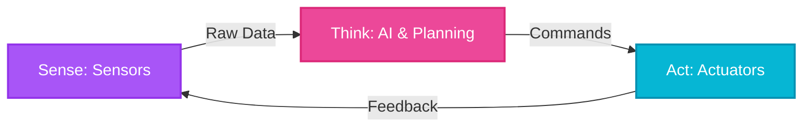

import Tabs from '@theme/Tabs';
import TabItem from '@theme/TabItem';

# Introduction to Physical AI

## Introduction

Welcome to the exciting world of **Physical AI**! While traditional AI systems operate purely in the digital realm—processing data, making predictions, and generating text or images—Physical AI represents a paradigm shift where intelligence meets the physical world. These systems don't just think; they sense, move, and interact with their environment in real-time.

Unlike digital AI (like ChatGPT) which operates in a world of text and tokens, Physical AI must deal with gravity, friction, and the unpredictability of the real world.

## Learning Objectives

By the end of this lesson, you will be able to:

- **Define** Physical AI and explain how it differs from traditional software-based AI systems.
- **Identify** the three core components of embodied intelligence: perception, cognition, and action.
- **Understand** the unique challenges that arise when AI systems interact with the physical world.
- **Explain** the importance of the sense-think-act loop in autonomous robotic systems.

## What is Physical AI?

**Physical AI** refers to artificial intelligence systems that are embodied in physical forms—typically robots—and can perceive, reason about, and interact with the real world.

### Physical AI vs. Digital AI

The transition from Digital AI to Physical AI involves moving from "The Cloud" to "The Edge".


| Feature | Digital AI | Physical AI |
| :--- | :--- | :--- |
| **Environment** | Static / Digital | Dynamic / Physical |
| **Input** | Text / Images | Sensor Data (LIDAR, IMU) |
| **Output** | Text / Pixels | Motor Torques / Action |
| **Cost of Failure** | Incorrect Text | Physical Damage |

## The Three Pillars of Physical AI

Physical AI systems are built on three interconnected pillars: **Perception**, **Cognition**, and **Action**.

### 1. Perception (Sensing)

To interact with the world, a robot needs senses. We call these **Sensors**.


Key sensors include:
- **LIDAR** (Light Detection and Ranging): Lasers used to measure precise distances and create 3D maps.
- **Cameras** (RGB & Depth): Provide visual context and depth perception.
- **IMU** (Inertial Measurement Unit): Measures acceleration and rotation (like an inner ear) for balance.
- **Proprioception**: Sensors measuring internal state, like joint angles and motor currents.

### 2. Cognition (Thinking)

Once sensory data is collected, the robot must process it to:
- **Localize** itself (Where am I?).
- **Map** the environment (What does the world look like?).
- **Plan** actions (How do I get to the goal?).
- **Reason** about uncertainty and making decisions.

### 3. Action (Actuation)

Finally, the robot must execute actions in the physical world through **Actuators** (motors, grippers, muscles). Actions range from simple locomotion (walking, rolling) to complex manipulation (grasping, assembling).

:::info Key Insight
Physical AI actions have consequences. Unlike a software undo button, a physical error (like dropping an object) cannot be easily reversed.
:::

## Challenges Unique to Physical AI

1.  **Real-World Complexity**: The real world is messy. Sensors have noise, lighting changes, and physics is unforgiving (friction, gravity).
2.  **Real-Time Capabilities**: A robot must react instantly. Latency can be dangerous—a delayed braking command could cause a crash.
3.  **Sim-to-Real Gap**: Models trained in perfect simulations often fail in the real world due to subtle physical differences.

## Real-World Applications

- **Manufacturing**: Collaborative robots (cobots) working alongside humans.
- **Healthcare**: Surgical robots and exoskeletons for rehabilitation.
- **Agriculture**: Autonomous harvesting and crop monitoring drones.
- **Exploration**: Rovers navigating Mars or underwater drones inspecting infrastructure.

## The Sense-Think-Act Loop

At the heart of every Physical AI system is the **sense-think-act loop**:

1.  **Sense**: Gather data from sensors.
2.  **Think**: Process data, update world model, plan action.
3.  **Act**: Execute motor commands.
4.  **Repeat**: This happens continuously, often at 10-100 times per second (Hz).



### Python Code Example: The Loop

Here is a conceptual example of this loop in code:

```python title="robot_control_loop.py"
import time
import random

class Robot:
    def __init__(self):
        # Initialize sensors and actuators
        self.lidar_range = 10.0
        
    def sense(self):
        """Gather sensor data (Sensors)"""
        # Simulate sensor noise and reading
        noise = random.uniform(-0.1, 0.1)
        actual_distance = 5.0 
        return max(0.0, actual_distance + noise)

    def think(self, sensor_data):
        """Process data and plan (Cognition)"""
        # Simple logic: avoid obstacles closer than 1 meter
        if sensor_data < 1.0:
            return "STOP"
        else:
            return "MOVE_FORWARD"

    def act(self, command):
        """Execute command (Actuators)"""
        print(f"Action: {command}")

    def run(self, frequency_hz=1):
        """Main control loop"""
        period = 1.0 / frequency_hz
        print(f"Starting Control Loop at {frequency_hz} Hz...")
        
        try:
            while True:
                start_time = time.time()

                # 1. SENSE
                data = self.sense()
                print(f"Sensor: {data:.2f}m", end=" | ")

                # 2. THINK
                decision = self.think(data)

                # 3. ACT
                self.act(decision)

                # Maintain loop frequency
                elapsed = time.time() - start_time
                if elapsed < period:
                    time.sleep(period - elapsed)
                    
        except KeyboardInterrupt:
            print("\nStopping robot.")

if __name__ == "__main__":
    bot = Robot()
    bot.run()
```

## Self-Assessment Questions

1. **What distinguishes Physical AI from traditional software-based AI?**
   <details>
   <summary>Answer</summary>
   Physical AI is embodied in robots and interacts with the real world, dealing with physics and real-time constraints. Traditional AI operates in digital, static environments.
   </details>

2. **Name the three pillars of Physical AI.**
   <details>
   <summary>Answer</summary>
   Perception (Sensing), Cognition (Thinking), and Action (Actuation).
   </details>

3. **Why is real-time processing critical?**
   <details>
   <summary>Answer</summary>
   Because physical events happen continuously. A delay in processing sensor data can lead to collisions or failures as the environment changes while the robot is "thinking".
   </details>

## Summary

Physical AI requires **Embodied Intelligence**—the ability to plan and act while respecting the constraints of the physical body and environment. It operates on a continuous **Sense-Think-Act** loop and is transforming how machines help us in the real world.
