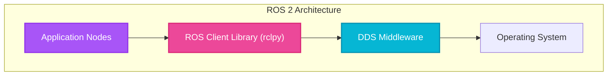

# ROS 2 Fundamentals

## Introduction

Welcome to the world of **ROS 2** (Robot Operating System 2)—the middleware that powers countless research and commercial robots worldwide. Think of ROS 2 as the "nervous system" of your robot: it connects sensors, algorithms, and actuators, enabling them to communicate seamlessly in real-time.

Unlike traditional monolithic software where everything runs in a single program, ROS 2 embraces a **distributed, modular architecture**. Individual components (called "nodes") run as separate processes, communicating over well-defined interfaces.

## Learning Objectives

By the end of this lesson, you will be able to:

- **Explain** the ROS 2 graph architecture and how nodes communicate.
- **Differentiate** between ROS 1 and ROS 2, understanding why ROS 2 is essential for modern robotics.
- **Create** a ROS 2 package with proper structure.
- **Implement** a simple ROS 2 node in Python.
- **Understand** the importance of Launch Files.

## What is ROS 2?

**ROS 2** is not actually an operating system like Windows or Linux. It is a **middleware**—a set of software libraries and tools that help you build robot applications.

### ROS 2 vs. Traditional Robotics Software

Imagine building a robot where the camera driver, path planner, and motor controller are all one big program. A bug in the camera code could crash the whole robot!

**ROS 2** solves this by providing:
1.  **Modular Architecture**: Each component is an independent node.
2.  **Standardized Communication**: Nodes talk via topics, services, and actions.
3.  **Language Flexibility**: Write nodes in Python, C++, and more.

### ROS 2 vs. ROS 1

ROS 1 (2007) was great for research but limited. ROS 2 brings:
- **Real-time capabilities** (vital for safety-critical robots).
- **No Master Node**: Fully distributed system (no single point of failure).
- **Security**: Built-in support for encryption and authentication via DDS.

## The ROS 2 Graph Architecture

### Nodes: The Building Blocks

A **Node** is a single-purpose process that performs a specific computation (e.g., "Read Camera", "Detect Face"). Nodes are independent; if one crashes, the others keep running.

### The Computation Graph

At runtime, ROS 2 creates a **computation graph** where:
- **Nodes** are the vertices.
- **Topics, Services, Actions** are the edges (communication channels).



### DDS: The Communication Layer

ROS 2 uses **DDS (Data Distribution Service)**, an industry-standard middleware. It handles **Discovery** (nodes finding each other) and ensures real-time performance.

## Creating Your First ROS 2 Package

A ROS 2 **Package** is a container for your ROS 2 code.

### Package Structure

```
my_robot_pkg/
├── package.xml          # Dependencies and metadata
├── setup.py             # Installation instructions
└── my_robot_pkg/        # Source code
    ├── __init__.py
    └── my_first_node.py
```

### Creating a Package

To create a new package in your workspace:

```bash
# Navigate to src folder
cd ~/ros2_ws/src

# Create package
ros2 pkg create --build-type ament_python my_robot_pkg \
  --dependencies rclpy std_msgs
```

## Writing Your First Node

Here is a complete example of a simple **Publisher Node** in Python.

```python title="minimal_publisher.py"
#!/usr/bin/env python3
import rclpy
from rclpy.node import Node
from std_msgs.msg import String

class MinimalPublisher(Node):
    """A simple ROS 2 node that publishes messages"""

    def __init__(self):
        # Initialize the node with a name
        super().__init__('minimal_publisher')

        # Create a publisher on topic '/chatter'
        self.publisher_ = self.create_publisher(String, '/chatter', 10)

        # Create a timer (2 Hz)
        timer_period = 0.5
        self.timer = self.create_timer(timer_period, self.timer_callback)
        self.i = 0

    def timer_callback(self):
        """Called by the timer every 0.5s"""
        msg = String()
        msg.data = 'Hello ROS 2: %d' % self.i
        
        # Publish the message
        self.publisher_.publish(msg)
        self.get_logger().info('Publishing: "%s"' % msg.data)
        self.i += 1

def main(args=None):
    # Initialize ROS 2
    rclpy.init(args=args)
    
    # Create and spin the node
    node = MinimalPublisher()
    try:
        rclpy.spin(node)
    except KeyboardInterrupt:
        pass
    
    # Clean up
    node.destroy_node()
    rclpy.shutdown()

if __name__ == '__main__':
    main()
```

### Building and Running

```bash
# In workspace root
colcon build --packages-select my_robot_pkg
source install/setup.bash
ros2 run my_robot_pkg minimal_publisher
```

## ROS 2 Command-Line Tools

Introspect your running system with these commands:

- **`ros2 node list`**: See all active nodes.
- **`ros2 topic list`**: See all topics.
- **`ros2 topic echo /topic_name`**: Inspect messages on a topic in real-time.
- **`rqt_graph`**: Visualize the network graph graphically.

## Quality of Service (QoS) Policies

DDS allows fine-grained control over communication:

- **Reliability**: `Reliable` (guaranteed like TCP) vs `Best Effort` (fast/lossy like UDP).
- **Durability**: `Volatile` (no history) vs `Transient Local` (late-joiners get data).
- **History**: `Keep Last (N)` stores only the N most recent messages.

## Node Lifecycle

Nodes have states: **Unconfigured** → **Inactive** → **Active** → **Finalized**. This allows for deterministic startup sequences (e.g., waiting for hardware to be ready before activating).

## Launch Files

In a real robot, we don't start 50 nodes manually. We use **Launch Files**.

```xml title="robot_launch.xml"
<launch>
    <!-- Start the Camera Driver Node -->
    <node pkg="camera_pkg" exec="camera_driver" name="camera_node">
        <param name="resolution" value="1080p"/>
    </node>

    <!-- Start the Brain Node -->
    <node pkg="brain_pkg" exec="object_detector" name="detector_node"/>
</launch>
```

:::warning Real-Time Constraints
ROS 2 is designed for real-time systems. Ensure your network (DDS) is configured correctly for low latency for safety-critical tasks.
:::

## Self-Assessment Questions

1. **What is the primary advantage of ROS 2's distributed architecture?**
   <details>
   <summary>Answer</summary>
   Modularity and fault isolation. If one node crashes, others survive. It also enables parallel development and code reuse.
   </details>

2. **Differentiate between Reliable and Best Effort QoS.**
   <details>
   <summary>Answer</summary>
   **Reliable** guarantees delivery (re-transmitting if needed), good for commands/params. **Best Effort** prioritizes speed, good for high-freq sensor data where dropping a frame is okay.
   </details>

3. **What does `colcon build` do?**
   <details>
   <summary>Answer</summary>
   It compiles and builds your ROS 2 packages, managing dependencies and creating the `install` directory.
   </details>

## Summary

In this lesson, you've learned:
- **ROS 2** is the middleware connecting independent **nodes**.
- **Nodes** communicate via **topics**, **services**, and **actions**.
- You create **Packages** to organize code and manage dependencies.
- **DDS** handles the underlying communication with configurable **QoS**.

