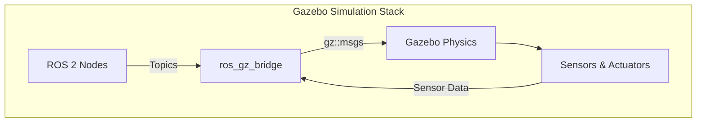

# Robot Simulation with Gazebo & URDF

## Introduction

Testing robotics algorithms on real hardware is expensive, time-consuming, and risky. **Simulation** solves this by creating virtual environments where you can test, iterate, and break things without consequences. This is the essence of the **Digital Twin**.

In this lesson, we will cover two critical skills:
1.  **Gazebo**: The physics engine and environment simulator.
2.  **URDF**: The standard way to describe a robot's physical structure.

## Learning Objectives

By the end of this lesson, you will be able to:
- **Understand** the Gazebo architecture and physics engines.
- **Create** custom Gazebo worlds with terrain and lighting.
- **Define** robot models using URDF (Links, Joints, Inertial properties).
- **Use XACRO** to create modular, maintainable robot descriptions.
- **Integrate** simulated sensors (Cameras, LIDAR) with ROS 2.

## Gazebo Simulation Fundamentals

**Gazebo** is the industry-standard robot simulator. It operates on a client-server architecture:

- **gzserver**: Runs the physics loop and sensor generation.
- **gzclient**: The graphical interface that renders the scene.

### Gazebo Architecture & The Bridge

Gazebo uses its own transport layer. To talk to ROS 2, we use the `ros_gz_bridge`.



### Physics Engines

Gazebo supports multiple physics backends:
- **ODE**: Fast, stable, good for general robotics (default).
- **Bullet**: Good for soft bodies.
- **DART**: High accuracy for manipulation and humanoids.

:::tip Physics Tuning
The `max_step_size` parameter defines the simulation accuracy. 1ms (0.001s) is standard. For fast robots, use 0.5ms.
:::

## URDF Modeling

To simulate a robot, we must describe it. We use **URDF** (Unified Robot Description Format). It is an XML file that defines the robot's physical properties.


### Links and Joints

- **Link**: A rigid body (e.g., forearm, wheel). Must have:
    - `<visual>`: How it looks.
    - `<collision>`: Physical shape for physics engine.
    - `<inertial>`: Mass and inertia tensor.
- **Joint**: Connection between links (revolute, continuous, fixed).

### Minimal URDF Example

```xml title="simple_bot.urdf"
<robot name="simple_bot">
  <!-- Base Link -->
  <link name="base_link">
    <visual>
      <geometry><box size="0.5 0.3 0.1"/></geometry>
    </visual>
    <collision>
      <geometry><box size="0.5 0.3 0.1"/></geometry>
    </collision>
    <inertial>
      <mass value="5.0"/>
      <inertia ixx="0.1" ixy="0" ixz="0" iyy="0.1" iyz="0" izz="0.1"/>
    </inertial>
  </link>
</robot>
```

:::warning Physics Matters
If you omit `<inertial>` tags, Gazebo will treat links as massless, causing the robot to float or fly away!
:::

## Using XACRO for Modularity

Writing raw URDF allows for duplication (e.g., defining 4 identical wheels). **XACRO** (XML Macros) solves this.

### Example: Parameterized Wheel Macro

```xml
<xacro:macro name="wheel" params="prefix reflect">
    <link name="${prefix}_wheel">
        <visual>
            <geometry><cylinder radius="0.1" length="0.05"/></geometry>
        </visual>
        <!-- Collision & Inertial omitted for brevity -->
    </link>
    <joint name="${prefix}_wheel_joint" type="continuous">
        <parent link="base_link"/>
        <child link="${prefix}_wheel"/>
        <origin xyz="0 ${reflect*0.2} 0" rpy="1.57 0 0"/>
    </joint>
</xacro:macro>

<!-- Create two wheels -->
<xacro:wheel prefix="left" reflect="1"/>
<xacro:wheel prefix="right" reflect="-1"/>
```

## Adding Sensors

Sensors in Gazebo require two parts:
1.  **URDF Definition**: Visual/Physical link + Joint.
2.  **Gazebo Plugin**: Logic to generate data and publish to ROS.

### Camera Sensor Example

```xml
<gazebo reference="camera_link">
  <sensor type="camera" name="front_camera">
    <update_rate>30.0</update_rate>
    <camera>
      <horizontal_fov>1.3962634</horizontal_fov>
      <image>
        <width>800</width>
        <height>600</height>
        <format>R8G8B8</format>
      </image>
    </camera>
    <plugin name="camera_controller" filename="libgazebo_ros_camera.so">
      <ros>
        <remapping>image_raw:=/camera/image_raw</remapping>
      </ros>
    </plugin>
  </sensor>
</gazebo>
```

## Visualizing and Simulating

### Validating in RViz
**RViz** visualizes what the robot *thinks* is happening. It uses the `robot_state_publisher` to read specific joint states.

```bash
ros2 launch urdf_tutorial display.launch.py model:=my_robot.urdf
```

### Spawning in Gazebo
To simulate physics, you spawn the model into a Gazebo world.

```bash
ros2 launch gazebo_ros gazebo.launch.py world:=empty_world.world
ros2 run gazebo_ros spawn_entity.py -entity my_bot -file my_robot.urdf
```

## Self-Assessment Questions

1.  **Why do we need `<collision>` geometries different from `<visual>`?**
    <details>
    <summary>Answer</summary>
    Performance. Physics engines work faster with simple shapes (boxes, cylinders) than complex meshes. Visuals can be high-poly matches, but collisions should be simple primitives.
    </details>

2.  **What is the role of `ros_gz_bridge`?**
    <details>
    <summary>Answer</summary>
    It translates messages between Gazebo's internal transport system and ROS 2 topics, allowing your ROS nodes to see Gazebo sensor data.
    </details>

3.  **Why use XACRO instead of URDF?**
    <details>
    <summary>Answer</summary>
    XACRO allows using variables, macros, and math to reduce code duplication and make maintainable, parameterized robot descriptions.
    </details>

## Summary

You have learned how to build the **Digital Twin** of a robot:
- **Gazebo** provides the physics and world simulation.
- **URDF** defines the robot's physical structure (Links/Joints).
- **XACRO** makes modeling modular.
- **Sensors** connect the virtual world to your ROS 2 algorithms.
