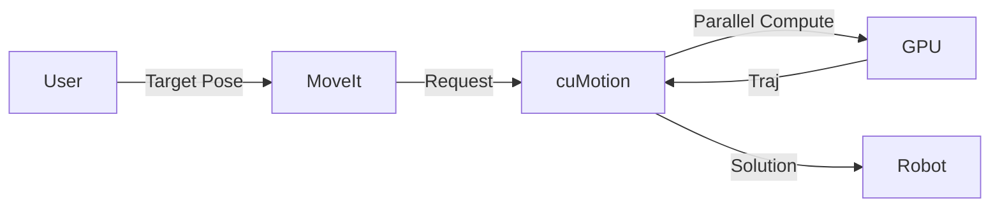

# The AI-Robot Brain (NVIDIA Isaac)

## Introduction

While Gazebo excels at general-purpose simulation, **NVIDIA Isaac** is purpose-built for AI-powered robotics at scale. It leverages the power of NVIDIA GPUs to provide photorealistic rendering (Ray Tracing) and massive parallel physics simulation.

But it's not just a simulator. The **Isaac Platform** includes **Isaac ROS**—a suite of hardware-accelerated packages that run on your robot's NVIDIA Jetson computer, making it essentially a "supercomputer on wheels".

## Learning Objectives

By the end of this module, you will be able to:
- **Understand** the Isaac ecosystem (Sim vs. ROS).
- **Generate** synthetic data to train AI models without manual labeling.
- **Deploy** GPU-accelerated perception pipelines (VSLAM, Object Detection).
- **Utilize** advanced motion planning with **cuMotion**.

## The Isaac Ecosystem

The platform consists of two main pillars:


1.  **Isaac Sim**: Built on NVIDIA Omniverse. Used for:
    -   **Digital Twins**: Photorealistic worlds.
    -   **Synthetic Data Generation**: Training AI models.
    -   **Reinforcement Learning**: Training robots to walk/grasp in sim.
2.  **Isaac SDK / Isaac ROS**: Hardware-accelerated ROS 2 packages. Used for:
    -   **Perception**: VSLAM, Depth estimation, Object detection.
    -   **Navigation**: High-speed path planning.

## Isaac Sim & Synthetic Data

Training computer vision models requires thousands of labeled images. Manual labeling is slow and expensive.

**Synthetic Data** solves this. Isaac Sim generates perfectly labeled data (Bounding boxes, Segmentation masks, Depth) instantly.

### Domain Randomization
To prevent the AI from "memorizing" the simulation, we use **Domain Randomization**:
- Randomize lighting (Sun position, color).
- Randomize textures (Walls, floors).
- Randomize camera noise.

This forces the AI to learn robust features that work in the messy real world.

## Isaac ROS: Perception Pipeline

**Isaac ROS** moves the heavy lifting from the CPU to the GPU (CUDA + TensorRT).


### Key Packages
-   **VSLAM (Visual SLAM)**: GPU-accelerated localization using stereo cameras.
-   **Nvblox**: Builds 3D maps for collision avoidance.
-   **TensorRT Inference**: Runs deep learning models (YOLO, PeopleNet) 10x faster than CPU.

### Code Example: Configuring VSLAM for Jetson

```python title="isaac_vslam_launch.py"
from launch import LaunchDescription
from launch_ros.actions import ComposableNodeContainer
from launch_ros.descriptions import ComposableNode

def generate_launch_description():
    vslam_node = ComposableNode(
        package='isaac_ros_visual_slam',
        plugin='nvidia::isaac_ros::visual_slam::VisualSlamNode',
        name='visual_slam_node',
        parameters=[{
            'enable_rectified_pose': True,
            'enable_imu_fusion': True, # Fuse IMU for better accuracy
            'denoise_input_images': False,
        }],
        remappings=[
            ('stereo_camera/left/image_rect', '/camera/left/image_rect'),
            ('stereo_camera/right/image_rect', '/camera/right/image_rect'),
        ]
    )
    # ... container setup ...
    return LaunchDescription([container])
```

## Advanced Features

### TensorRT Optimization
Neural networks are often trained in PyTorch or TensorFlow. **TensorRT** optimizes them for NVIDIA hardware by:
-   Fusing layers.
-   Calibrating precision (FP16 or INT8).
-   Tuning kernels for specific GPUs.

### cuMotion: Fast Motion Planning
Traditional planners (MoveIt/OMPL) run on CPU and can be slow for complex arms. **cuMotion** runs on GPU, checking thousands of collision paths in parallel. It can plan safe trajectories for a 7-DOF arm in milliseconds.



## Self-Assessment Questions

1.  **Why use Isaac Sim over Gazebo?**
    <details>
    <summary>Answer</summary>
    Isaac Sim offers photorealistic rendering (critical for vision training) and GPU-accelerated physics (simulating 100+ robots). Gazebo is better for general, low-fidelity simulation.
    </details>

2.  **What is the "Sim-to-Real" gap?**
    <details>
    <summary>Answer</summary>
    The difference between simulation and reality. Models trained in sim fail in real life due to perfect physics/lighting in sim. We use Domain Randomization to bridge this gap.
    </details>

3.  **Why is TensorRT important for robots?**
    <details>
    <summary>Answer</summary>
    Robots have limited compute/battery (like a Jetson Nano). TensorRT optimizes AI models to run faster and use less power, enabling real-time perception.
    </details>

## Summary

The **AI-Robot Brain** relies on high-performance compute:
-   **Isaac Sim** trains the brain in a virtual world.
-   **Isaac ROS** runs the brain on the physical robot using GPU acceleration.
-   **Synthetic Data** provides the fuel (labeled images) for learning.

