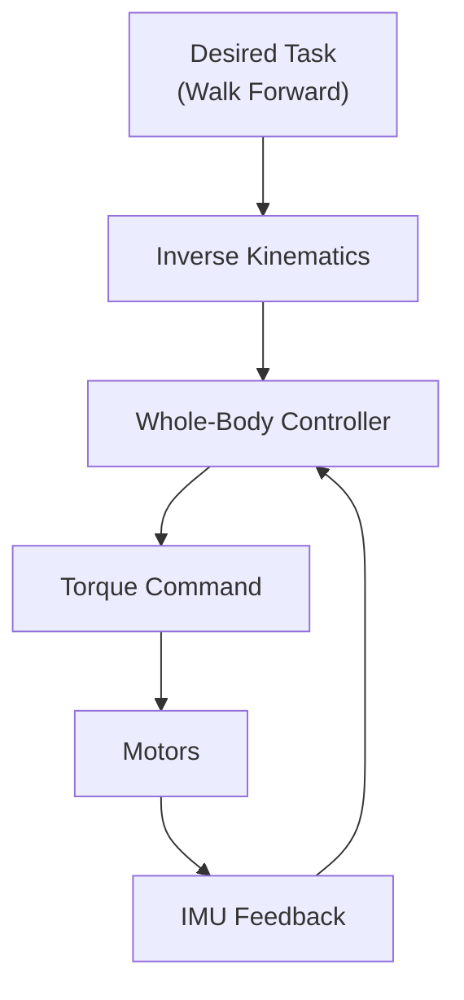

# Humanoid Robot Development

## Introduction

Building a humanoid robot is one of the grand challenges of robotics. Unlike wheeled robots, bipeds are inherently unstable. They must constantly fight gravity to stay upright.

In this lesson, we will focus on **Unitree G1**, a modern humanoid research platform, and the software stack required to make it walk, balance, and interact.

## Learning Objectives

By the end of this lesson, you will be able to:
- **Understand** humanoid architectures (23+ DoF).
- **Implement** Whole-Body Control (WBC) for balance.
- **Generate** stable walking gaits.
- **Configure** safety systems for real-world testing.

## Unitree G1 Platform Overview

The Unitree G1 is a capable humanoid platform with the following specs:

- **Height**: 130 cm
- **DoF**: 23-43 (Configurable)
- **Compute**: NVIDIA Jetson Orin (Perception) + Real-time Microcontrollers (Control)
- **Sensors**: 3D LIDAR, Depth Cameras, IMU, Force Sensors.

### Software Stack

The control stack is layered:

1.  **High-Level**: ROS 2 (Navigation, VLA) running on Jetson.
2.  **Mid-Level**: Whole-Body Controller (Walking, Balance) running on real-time PC.
3.  **Low-Level**: Motor bridging (Torque control) running on MCUs.

## Bipedal Locomotion

Walking is essentially "controlled falling". We use the **Zero Moment Point (ZMP)** concept to maintain stability.


### Control Loop Architecture



### Code Example: Balance Controller

A simple PID controller isn't enough for a full humanoid, but it illustrates the concept of correcting pitch errors.

```python title="balance_controller.py"
import rclpy
from rclpy.node import Node
from sensor_msgs.msg import Imu
from std_msgs.msg import Float64MultiArray
import numpy as np

class BalanceController(Node):
    def __init__(self):
        super().__init__('balance_controller')
        self.imu_sub = self.create_subscription(Imu, '/imu/data', self.imu_cb, 10)
        self.cmd_pub = self.create_publisher(Float64MultiArray, '/joint_commands', 10)
        
        self.kp = 50.0  # Proportional Limit
        self.kd = 10.0  # Damping
        self.target_pitch = 0.0

    def imu_cb(self, msg):
        # Extract pitch (simplified)
        current_pitch = 2 * np.arcsin(msg.orientation.y)
        pitch_rate = msg.angular_velocity.y

        # PD Control
        error = self.target_pitch - current_pitch
        torque = (self.kp * error) + (self.kd * (-pitch_rate))
        
        # Publish torque to ankles
        self.publish_torque(torque)

    def publish_torque(self, torque):
        msg = Float64MultiArray()
        msg.data = [0.0] * 23 # Initialize all joints
        msg.data[12] = torque # Left Ankle
        msg.data[18] = torque # Right Ankle
        self.cmd_pub.publish(msg)
```

## Safety Systems

Real robots are dangerous. You need layers of safety:

1.  **Fall Detection**: If pitch > 30 degrees, kill motors immediately.
2.  **Self-Collision**: Use URDF to check if arms will hit legs.
3.  **Emergency Stop**: Physical button and software service.

:::warning Safety First
Humanoid robots are heavy and can fall unexpectedly. Always use a gantry or safety harness when testing balance algorithms on real hardware.
:::

## Summary

Humanoid development combines high-level AI with low-level physics:
-   **WBC** keeps the robot upright.
-   **ZMP** ensures dynamic stability during walking.
-   **Safety** is paramount when code meets 35kg of metal.
