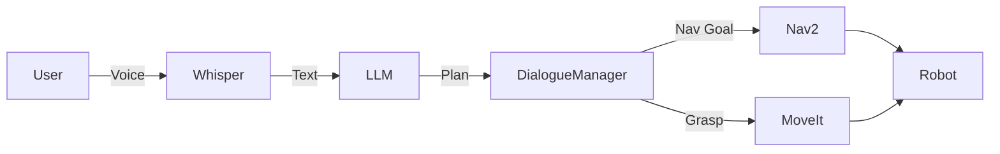

# Conversational Robotics (VLA)

## Introduction

The final frontier of Physical AI is the integration of **Large Language Models (LLMs)** with robotic control. We call this **Vision-Language-Action (VLA)**. It allows us to talk to robots in plain English, and for them to understand the world visually and act upon it.

This lesson doubles as the guide for the **Course Capstone Project**: Building an Intelligent Fetch Robot.

## VLA Architecture

A VLA system translates natural language into robot actions (e.g., ROS 2 service calls).


### Core Components

1.  **Ears (Whisper)**: OpenAI's Whisper model converts speech to text with near-human accuracy.
2.  **Eyes (CLIP / GPT-4 Vision)**: Understands the visual scene. "Is that a red apple or a ball?"
3.  **Brain (LLM)**: GPT-4 or local Llama models parse the user's intent and generate a plan.
4.  **Body (ROS 2)**: Executes the planned actions (Navigate, Grasp).

## Implementation Details

### 1. Speech Recognition (Whisper)
Traditional speech recognition fails in noisy environments. Whisper works robustly.

```python
import whisper
model = whisper.load_model("base")
result = model.transcribe("audio.wav")
print(result["text"])
```

### 2. Vision (CLIP)
**CLIP** connects text and images. You can ask it to find "a red cup" in an image, and it returns the probability. It enables **Zero-Shot Detection**.

## Capstone Project: Intelligent Fetch Robot

**Goal**: Build a robot that obeys the command: *"Hey robot, bring me the blue bottle from the kitchen."*

### System Architecture



### Dialogue Manager Node

This ROS 2 node is the conductor of the orchestra. It takes text, asks the LLM for a plan (JSON), and triggers ROS 2 actions.

```python title="dialogue_manager.py"
import rclpy
from rclpy.node import Node
import openai
import json
from std_msgs.msg import String

class DialogueManager(Node):
    def __init__(self):
        super().__init__('dialogue_manager')
        self.speech_sub = self.create_subscription(String, '/speech/text', self.handle_speech, 10)
        
        # System prompt defines the robot's API
        self.system_prompt = """
        You are a robot assistant. Convert commands into JSON.
        Available actions:
        - navigate(location_name)
        - pick_up(object_name)
        Example: {"actions": [{"cmd": "navigate", "arg": "kitchen"}]}
        """

    def handle_speech(self, msg):
        self.get_logger().info(f"User said: {msg.data}")
        
        # Call LLM
        response = openai.ChatCompletion.create(
            model="gpt-4",
            messages=[
                {"role": "system", "content": self.system_prompt},
                {"role": "user", "content": msg.data}
            ]
        )
        
        plan_json = response.choices[0].message.content
        self.execute_plan(json.loads(plan_json))

    def execute_plan(self, plan):
        for action in plan['actions']:
            cmd = action['cmd']
            arg = action['arg']
            self.get_logger().info(f"Executing: {cmd} -> {arg}")
            # Trigger ROS 2 Action Clients here...

def main():
    rclpy.init()
    node = DialogueManager()
    rclpy.spin(node)
    rclpy.shutdown()
```

## The Future of Work

We are moving from "programming" robots (defining every step) to "teaching" them. VLA models enable robots to learn from demonstration and natural language instruction. This is the skill set you have now mastered.

## Summary

Congratulations! You have reached the end of the course. You now understand:
-   **The Nervous System**: ROS 2.
-   **The Body**: Digital Twins & URDF.
-   **The Brain**: Isaac AI & Perception.
-   **The Soul**: VLA & Human-Robot Interaction.

Go build the future.
