# Week 1: Introduction to Physical AI

## Introduction

Welcome to the exciting world of Physical AI! While traditional AI systems operate purely in the digital realm—processing data, making predictions, and generating text or images—Physical AI represents a paradigm shift where intelligence meets the physical world. These systems don't just think; they sense, move, and interact with their environment in real-time.

In this first week, you'll explore what makes Physical AI fundamentally different from conventional AI, understand the concept of embodied intelligence, and discover why the convergence of AI and robotics is reshaping industries from manufacturing to healthcare. By the end of this week, you'll have a solid foundation for understanding how robots perceive, reason, and act in the real world.

## Learning Objectives

By the end of this week, you will be able to:

- **Define** Physical AI and explain how it differs from traditional software-based AI systems
- **Identify** the three core components of embodied intelligence: perception, cognition, and action
- **Understand** the unique challenges that arise when AI systems interact with the physical world
- **Recognize** real-world applications of Physical AI across different industries
- **Explain** the importance of the sense-think-act loop in autonomous robotic systems

## What is Physical AI?

### Defining Physical AI

<span className="highlight-purple">**Physical AI**</span> refers to artificial intelligence systems that are embodied in physical forms—typically robots—and can perceive, reason about, and interact with the real world. Unlike traditional AI that processes data in isolated digital environments, Physical AI must:

- **Sense** the environment through cameras, LIDAR, tactile sensors, and other modalities
- **Process** sensory information in real-time to build a world model
- **Act** on the environment through actuators, motors, and manipulators
- **Adapt** to dynamic, unpredictable conditions that don't exist in simulated environments

### The Embodied Intelligence Paradigm

Traditional AI systems, such as language models or recommendation engines, exist purely in software. They process inputs (text, images, structured data) and produce outputs (predictions, classifications, generated content) without any physical manifestation.

**Embodied intelligence**, in contrast, recognizes that intelligence cannot be fully separated from physical interaction. Consider how a child learns to grasp objects: they don't simply learn the physics equations governing friction and force. Instead, they develop an intuitive understanding through repeated physical interaction—feeling textures, experiencing failures, and adapting their grip.

This is the essence of embodied intelligence: <span className="highlight-purple">cognition that emerges from the interplay between perception, action, and the physical world</span>.

### Visual Aid: Physical AI vs Traditional AI

```mermaid
flowchart TB
    subgraph Traditional["Traditional AI (Software-Only)"]
        TInput[Digital Input<br/>Text, Images, Data]
        TProcess[AI Model<br/>Pure Computation]
        TOutput[Digital Output<br/>Predictions, Text]

        TInput --> TProcess
        TProcess --> TOutput
    end

    subgraph Physical["Physical AI (Embodied)"]
        PInput[Physical Sensors<br/>Cameras, LIDAR, IMU]
        PProcess[AI + Planning<br/>Real-time Processing]
        POutput[Actuators<br/>Motors, Grippers]
        PWorld[Physical World<br/>Interaction]

        PInput -->|Sense| PProcess
        PProcess -->|Think| POutput
        POutput -->|Act| PWorld
        PWorld -->|Feedback| PInput
    end

    style Traditional fill:#1a1a2e,stroke:#9333ea,stroke-width:2px
    style Physical fill:#1a1a2e,stroke:#a855f7,stroke-width:2px
    style PWorld fill:#ec4899,stroke:#db2777,stroke-width:2px,color:#fff
```



**Diagram:** Traditional AI operates purely in digital space with no physical embodiment, while Physical AI continuously interacts with the real world through sensors and actuators.

## The Three Pillars of Physical AI

Physical AI systems are built on three interconnected pillars:

### 1. Perception (Sensing)

Robots must perceive their environment through a variety of sensors:

- **Vision**: RGB cameras, depth cameras (stereo, ToF, structured light)
- **Range Sensing**: LIDAR (Light Detection and Ranging) for 3D mapping
- **Inertial Measurement**: IMUs (Inertial Measurement Units) for orientation and acceleration
- **Proprioception**: Joint encoders and force/torque sensors for self-awareness
- **Tactile Sensing**: Pressure sensors, skin sensors for contact detection

Each sensor modality provides complementary information. For example, cameras provide rich visual detail but struggle in darkness, while LIDAR works regardless of lighting conditions but provides less semantic information.

### 2. Cognition (Thinking)

Once sensory data is collected, the robot must:

- **Interpret** raw sensor readings (e.g., convert point clouds into object representations)
- **Localize** itself in space (Where am I?)
- **Map** the environment (What does the world around me look like?)
- **Plan** actions to achieve goals (How do I navigate from A to B?)
- **Reason** about uncertainty (How confident am I in my perception?)

This is where AI/ML models, classical algorithms, and domain knowledge converge to create intelligent behavior.

### 3. Action (Actuation)

Finally, the robot must execute actions in the physical world:

- **Locomotion**: Walking, rolling, flying, or swimming
- **Manipulation**: Grasping, placing, assembling objects
- **Expression**: Communicating intent through movement, lights, or displays

Crucially, actions have consequences: a poorly planned grasp can drop an object, an incorrect step can cause a fall. This feedback loop between action and perception is what makes Physical AI challenging and fascinating.

<div className="neon-border">
<p><strong>Key Insight</strong>: Physical AI systems operate in a continuous sense-think-act loop. Unlike software AI, which can "undo" mistakes with a database rollback, physical errors can have irreversible consequences—a robot that falls may damage itself or its surroundings.</p>
</div>

## Challenges Unique to Physical AI

### 1. Real-World Complexity

The physical world is far messier than digital environments:

- **Sensor noise**: Cameras have motion blur, LIDAR has reflections
- **Partial observability**: Robots can only see part of their environment at once
- **Dynamic changes**: People move, lighting changes, objects are rearranged
- **Physical constraints**: Gravity, friction, actuator limits

### 2. Real-Time Requirements

Unlike a chatbot that can take a few seconds to generate a response, a robot navigating at 1 meter/second must process sensor data, plan movements, and send actuator commands at rates of 10-100 Hz or faster. **Latency kills** in robotics—a delayed response to an obstacle can result in a collision.

### 3. Safety and Reliability

When AI systems interact with the physical world, failures aren't just inconvenient—they can be dangerous. A humanoid robot working alongside humans must:

- Detect and avoid collisions in real-time
- Handle unexpected failures gracefully (e.g., a motor malfunction)
- Operate predictably so humans can anticipate its behavior

### 4. Sim-to-Real Gap

Many AI models are trained in simulation, where physics can be perfect and data is infinite. When deployed to real robots, these models often fail due to:

- **Inaccurate physics**: Simulations approximate reality
- **Visual discrepancies**: Rendered images don't match real cameras
- **Unmodeled effects**: Friction, wear, environmental variability

Bridging this gap is an active area of research.

## Real-World Applications of Physical AI

### Manufacturing and Logistics

- **Warehouse Automation**: Robots like those from Boston Dynamics navigate warehouses, pick items, and load trucks
- **Assembly Lines**: Collaborative robots (cobots) work alongside humans to assemble products
- **Quality Inspection**: Vision-equipped robots inspect parts for defects

### Healthcare

- **Surgical Assistance**: Robots like the Da Vinci system enable minimally invasive surgery with enhanced precision
- **Rehabilitation**: Exoskeletons and assistive devices help patients regain mobility
- **Elder Care**: Humanoid robots provide companionship and assistance with daily tasks

### Agriculture

- **Harvesting Robots**: Identify ripe produce, grasp delicately, and harvest autonomously
- **Precision Agriculture**: Drones and ground robots monitor crop health and apply targeted treatments

### Exploration

- **Space Exploration**: Mars rovers like Perseverance navigate alien terrain autonomously
- **Deep Sea**: Underwater robots explore environments too dangerous for humans

## The Sense-Think-Act Loop

At the heart of every Physical AI system is the <span className="highlight-purple">**sense-think-act loop**</span>:

1. **Sense**: Gather data from sensors (cameras, LIDAR, IMUs)
2. **Think**: Process sensory information, build world models, plan actions
3. **Act**: Execute motor commands to manipulate or navigate the environment
4. **Repeat**: Continuously iterate at high frequency (10-100+ Hz)

This loop operates continuously, adapting to new information as it arrives. Unlike traditional AI workflows that process batches of data offline, Physical AI must operate in real-time with streaming sensor inputs.


**Diagram 1:** The continuous Sense-Think-Act loop that drives all Physical AI systems. Sensors provide input, AI models process and decide, actuators execute actions, and feedback returns to sensors.

### Code Example: Conceptual Sense-Think-Act Loop

```python
# Conceptual pseudocode for a robot's main control loop
import time

class Robot:
    def __init__(self):
        self.sensors = SensorSuite()  # Cameras, LIDAR, IMU
        self.brain = CognitionModule()  # AI/ML models, planning algorithms
        self.actuators = ActuatorController()  # Motors, servos

    def run(self, frequency_hz=10):
        """Main control loop running at specified frequency"""
        period = 1.0 / frequency_hz

        while True:
            start_time = time.time()

            # 1. SENSE: Gather sensor data
            sensor_data = self.sensors.read_all()

            # 2. THINK: Process and plan
            world_model = self.brain.process_sensors(sensor_data)
            action_plan = self.brain.plan_next_action(world_model)

            # 3. ACT: Execute motor commands
            self.actuators.execute(action_plan)

            # Maintain consistent loop frequency
            elapsed = time.time() - start_time
            if elapsed < period:
                time.sleep(period - elapsed)

# Example usage
robot = Robot()
robot.run(frequency_hz=10)  # Run at 10 Hz (10 iterations per second)
```

## Self-Assessment Questions

1. **What distinguishes Physical AI from traditional software-based AI?**
   <details>
   <summary>Answer</summary>
   Physical AI is embodied in physical forms (robots) and interacts with the real world through sensors and actuators, whereas traditional AI operates purely in digital environments without physical embodiment. Physical AI must handle real-time constraints, sensor noise, and the consequences of physical actions, while traditional AI processes data in a more controlled, often batch-oriented manner.
   </details>

2. **Name and explain the three pillars of Physical AI.**
   <details>
   <summary>Answer</summary>
   The three pillars are: (1) **Perception** - sensing the environment through cameras, LIDAR, IMUs, and other sensors; (2) **Cognition** - interpreting sensor data, localizing, mapping, planning, and reasoning about the environment; (3) **Action** - executing physical movements through actuators to achieve goals. These three pillars work together in a continuous sense-think-act loop.
   </details>

3. **Why is real-time processing critical for Physical AI systems?**
   <details>
   <summary>Answer</summary>
   Real-time processing is critical because robots interact with dynamic environments where delays can lead to failures or safety hazards. For example, a robot moving at 1 m/s must detect obstacles and adjust its path within milliseconds to avoid collisions. Unlike software systems where latency might only degrade user experience, in robotics, latency can result in physical damage to the robot, its environment, or people nearby.
   </details>

4. **What is the "sim-to-real gap" and why is it challenging?**
   <details>
   <summary>Answer</summary>
   The sim-to-real gap refers to the difference between simulated and real-world environments. Models trained in simulation often fail when deployed to real robots because simulations cannot perfectly replicate real-world physics, sensor characteristics, and environmental variability. Challenges include inaccurate physics models, visual discrepancies between rendered and real images, and unmodeled effects like friction and wear.
   </details>

5. **Describe one real-world application of Physical AI and explain how it uses the sense-think-act loop.**
   <details>
   <summary>Answer</summary>
   One example is a warehouse robot for package sorting. **Sense**: The robot uses cameras and LIDAR to detect packages on a conveyor belt. **Think**: Computer vision models identify the package size and destination label, while planning algorithms determine the optimal grasp pose and placement location. **Act**: The robot extends its arm, closes its gripper around the package, and places it in the correct bin. This loop repeats continuously as new packages arrive.
   </details>

## Summary

In this first week, we've established the foundational concepts of Physical AI:

- Physical AI systems are embodied in robots that sense, think, and act in the real world
- Embodied intelligence emerges from the interplay between perception, cognition, and action
- The sense-think-act loop is the fundamental operating principle of autonomous robots
- Physical AI faces unique challenges including real-time constraints, sensor noise, safety requirements, and the sim-to-real gap
- Applications span manufacturing, healthcare, agriculture, and exploration

## Next Steps

In Week 2, we'll explore the **Physical AI Landscape** in depth, examining the sensor modalities, actuator types, and humanoid robotics platforms that bring Physical AI to life. You'll learn about LIDAR, RGB-D cameras, IMUs, and discover the cutting-edge humanoid robots like Unitree G1 that are pushing the boundaries of what's possible.
