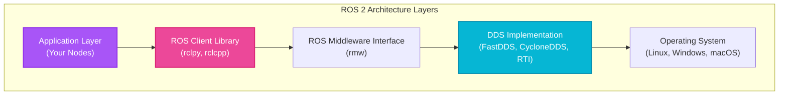

# Week 3: ROS 2 Architecture and Nodes

## Introduction

Welcome to the world of **ROS 2** (Robot Operating System 2)—the middleware that powers countless research and commercial robots worldwide. Think of ROS 2 as the nervous system of your robot: it connects sensors, algorithms, and actuators, enabling them to communicate seamlessly in real-time.

Unlike traditional monolithic software where everything runs in a single program, ROS 2 embraces a **distributed, modular architecture**. Individual components (called "nodes") run as separate processes, communicating over well-defined interfaces. This design enables code reuse, parallel development, and runtime flexibility—you can swap out a camera driver without touching your navigation code.

This week, you'll learn the foundational architecture of ROS 2, understand what nodes are, create your first ROS 2 package, and build a simple publisher-subscriber system. By the end, you'll have hands-on experience with the core building blocks that will support everything from SLAM to VLA systems in later weeks.

## Learning Objectives

By the end of this week, you will be able to:

- **Explain** the ROS 2 graph architecture and how nodes communicate
- **Differentiate** between ROS 1 and ROS 2, understanding why ROS 2 is essential for modern robotics
- **Create** a ROS 2 package with proper structure and dependencies
- **Implement** a simple ROS 2 node in Python with lifecycle management
- **Understand** the DDS middleware layer and Quality of Service (QoS) settings

## What is ROS 2?

### ROS 2 vs Traditional Robotics Software

Imagine building a robot where the camera driver, the path planning algorithm, the motor controller, and the logging system are all tightly coupled in a single executable. Any bug in one component could crash the entire system. Updating one component requires recompiling everything. Testing in isolation is nearly impossible.

<span className="highlight-purple">**ROS 2**</span> solves this by providing:

1. **Modular Architecture**: Each component is an independent node
2. **Standardized Communication**: Nodes talk via topics, services, and actions
3. **Language Flexibility**: Write nodes in Python, C++, or other supported languages
4. **Ecosystem**: Thousands of pre-built packages (navigation, manipulation, perception)
5. **Tooling**: Visualization (RViz), logging (rosbag), introspection (ros2 CLI)

ROS 2 isn't an operating system—it's middleware that sits between your application code and the OS (typically Ubuntu Linux).

### ROS 1 vs ROS 2: Why the Upgrade?

ROS 1 (introduced in 2007) served the robotics community well but had fundamental limitations:

| Limitation | ROS 1 | ROS 2 |
|------------|-------|-------|
| **Real-time** | Not real-time capable | Real-time support via DDS |
| **Security** | No built-in security | DDS-Security for encryption/authentication |
| **Multi-platform** | Primarily Linux | Linux, Windows, macOS, RTOS |
| **Communication** | Custom TCPROS/UDPROS | Industry-standard DDS |
| **Master Node** | Single point of failure (roscore) | Fully distributed (no master) |
| **Embedded Systems** | Limited support | Works on resource-constrained systems |

<div className="neon-border">
<p><strong>Why This Matters</strong>: ROS 2's real-time capabilities and security make it suitable for commercial products (autonomous vehicles, surgical robots), not just research. The distributed architecture eliminates the single point of failure (no more roscore crashes!).</p>
</div>

## The ROS 2 Graph Architecture

### Nodes: The Building Blocks

A <span className="highlight-purple">**node**</span> is a single-purpose process that performs a specific computation. Examples:

- A node that reads camera data and publishes images
- A node that subscribes to images and detects objects
- A node that plans paths from current location to goal
- A node that sends motor commands to wheel controllers

Nodes are **independent**—each runs in its own process (or can share a process for efficiency). If one node crashes, others continue running.



**Diagram:** ROS 2's layered architecture. Your application nodes use client libraries (Python/C++), which communicate through the middleware abstraction layer (rmw) to DDS implementations.

### The Computation Graph

At runtime, ROS 2 creates a **computation graph** where:

- **Nodes** are vertices (independent processes)
- **Topics, Services, Actions** are edges (communication channels)

Here's a simple example:

```
┌──────────────┐       /camera/image        ┌──────────────┐
│ Camera Driver│ ────────────────────────> │Object Detector│
│     Node     │       (topic)              │     Node     │
└──────────────┘                            └──────────────┘
                                                    │
                                                    │ /detected_objects
                                                    │ (topic)
                                                    ↓
                                            ┌──────────────┐
                                            │  Planner     │
                                            │     Node     │
                                            └──────────────┘
```

This graph is **dynamic**—nodes can join or leave at runtime, and you can query the graph to see what's currently running.

### DDS: The Communication Layer

ROS 2 uses <span className="highlight-purple">**DDS (Data Distribution Service)**</span>, an industry-standard middleware for real-time distributed systems. DDS provides:

- **Discovery**: Nodes automatically find each other on the network (no central broker)
- **Quality of Service**: Configure reliability, latency, durability per connection
- **Scalability**: Efficient multicast for one-to-many communication
- **Interoperability**: Different DDS vendors (FastDDS, CycloneDDS, RTI Connext) can interoperate

You don't need to understand DDS internals to use ROS 2, but knowing it exists helps when tuning performance or debugging network issues.

## Creating Your First ROS 2 Package

### Prerequisites

Ensure you have ROS 2 installed (Humble or newer recommended):

```bash
# Check ROS 2 installation
source /opt/ros/humble/setup.bash
ros2 --version  # Should show "ros2 cli version 0.18.x"
```

### Package Structure

A ROS 2 Python package follows this structure:

```
my_robot_pkg/
├── package.xml          # Package metadata and dependencies
├── setup.py             # Python package installation script
├── setup.cfg            # Python package configuration
├── resource/            # Resource marker file
│   └── my_robot_pkg
└── my_robot_pkg/        # Python source code directory
    ├── __init__.py
    └── my_first_node.py
```

### Creating a Package

```bash
# Navigate to your ROS 2 workspace source directory
cd ~/ros2_ws/src

# Create a new Python package
ros2 pkg create --build-type ament_python my_robot_pkg \
  --dependencies rclpy std_msgs

# Explanation:
# --build-type ament_python: Use Python (alternatives: ament_cmake for C++)
# --dependencies: List packages this package depends on
#   - rclpy: ROS 2 Python client library
#   - std_msgs: Standard message types
```

This command generates the package structure automatically.

### Understanding package.xml

The `package.xml` file describes your package:

```xml
<?xml version="1.0"?>
<?xml-model href="http://download.ros.org/schema/package_format3.xsd" schematypens="http://www.w3.org/2001/XMLSchema"?>
<package format="3">
  <name>my_robot_pkg</name>
  <version>0.0.1</version>
  <description>My first ROS 2 package</description>
  <maintainer email="you@example.com">Your Name</maintainer>
  <license>MIT</license>

  <!-- Build tool dependency -->
  <buildtool_depend>ament_python</buildtool_depend>

  <!-- Runtime dependencies -->
  <exec_depend>rclpy</exec_depend>
  <exec_depend>std_msgs</exec_depend>

  <!-- Test dependencies -->
  <test_depend>ament_copyright</test_depend>
  <test_depend>ament_flake8</test_depend>
  <test_depend>ament_pep257</test_depend>
  <test_depend>python3-pytest</test_depend>

  <export>
    <build_type>ament_python</build_type>
  </export>
</package>
```

:::tip
Always specify dependencies in `package.xml`. ROS 2's build system (colcon) uses this to determine build order and check for missing dependencies.
:::

### Understanding setup.py

The `setup.py` file tells Python how to install your package:

```python
from setuptools import setup

package_name = 'my_robot_pkg'

setup(
    name=package_name,
    version='0.0.1',
    packages=[package_name],
    data_files=[
        ('share/ament_index/resource_index/packages',
            ['resource/' + package_name]),
        ('share/' + package_name, ['package.xml']),
    ],
    install_requires=['setuptools'],
    zip_safe=True,
    maintainer='Your Name',
    maintainer_email='you@example.com',
    description='My first ROS 2 package',
    license='MIT',
    tests_require=['pytest'],
    entry_points={
        'console_scripts': [
            # Format: 'executable_name = package_name.module:function'
            'my_node = my_robot_pkg.my_first_node:main',
        ],
    },
)
```

The `entry_points` section is crucial—it defines executable scripts that will be installed to your ROS 2 workspace.

## Writing Your First Node

### Code Example: Simple Publisher Node

Create `my_robot_pkg/my_first_node.py`:

```python
#!/usr/bin/env python3

import rclpy
from rclpy.node import Node
from std_msgs.msg import String


class MinimalPublisher(Node):
    """A simple ROS 2 node that publishes messages"""

    def __init__(self):
        # Initialize the node with a name
        super().__init__('minimal_publisher')

        # Create a publisher
        # - Message type: String
        # - Topic name: '/chatter'
        # - Queue size: 10 (how many messages to buffer)
        self.publisher_ = self.create_publisher(String, '/chatter', 10)

        # Create a timer that calls the callback every 0.5 seconds
        timer_period = 0.5  # seconds
        self.timer = self.create_timer(timer_period, self.timer_callback)

        # Counter for message numbering
        self.counter = 0

        self.get_logger().info('Minimal Publisher Node has been started')

    def timer_callback(self):
        """Called by the timer at regular intervals"""
        # Create a message
        msg = String()
        msg.data = f'Hello ROS 2! Message #{self.counter}'

        # Publish the message
        self.publisher_.publish(msg)

        # Log to console
        self.get_logger().info(f'Publishing: "{msg.data}"')

        # Increment counter
        self.counter += 1


def main(args=None):
    # Initialize the ROS 2 Python client library
    rclpy.init(args=args)

    # Create the node
    minimal_publisher = MinimalPublisher()

    # Keep the node running (blocking call)
    # This spins the node, processing callbacks
    try:
        rclpy.spin(minimal_publisher)
    except KeyboardInterrupt:
        pass

    # Clean up
    minimal_publisher.destroy_node()
    rclpy.shutdown()


if __name__ == '__main__':
    main()
```

### Building and Running Your Node

```bash
# Navigate to workspace root
cd ~/ros2_ws

# Build the package
colcon build --packages-select my_robot_pkg

# Source the workspace (makes your package discoverable)
source install/setup.bash

# Run the node
ros2 run my_robot_pkg my_node

# Expected output:
# [INFO] [minimal_publisher]: Minimal Publisher Node has been started
# [INFO] [minimal_publisher]: Publishing: "Hello ROS 2! Message #0"
# [INFO] [minimal_publisher]: Publishing: "Hello ROS 2! Message #1"
# ...
```

:::warning
After modifying Python code, you must rebuild with `colcon build`. For faster development, you can build with symlinks: `colcon build --symlink-install`, which allows Python changes without rebuilding (C++ still requires rebuild).
:::

## ROS 2 Command-Line Tools

### Introspecting the Graph

While your node is running (in another terminal):

```bash
# Source ROS 2 setup
source /opt/ros/humble/setup.bash

# List all running nodes
ros2 node list
# Output: /minimal_publisher

# Get information about a node
ros2 node info /minimal_publisher
# Shows publishers, subscribers, services, actions

# List all topics
ros2 topic list
# Output: /chatter, /rosout (logging topic)

# See messages on a topic
ros2 topic echo /chatter
# Output: Real-time messages as they're published

# Get topic info (publishers, subscribers, message type)
ros2 topic info /chatter

# Measure topic frequency and bandwidth
ros2 topic hz /chatter  # Shows publishing rate (should be ~2 Hz)
ros2 topic bw /chatter  # Shows bandwidth usage
```

### Visualizing the Graph

```bash
# Install rqt_graph if not already installed
sudo apt install ros-humble-rqt-graph

# Launch the graph visualization
rqt_graph
```

This opens a GUI showing nodes (ovals) and topics (edges) in real-time—incredibly useful for debugging complex systems.

## Quality of Service (QoS) Policies

DDS allows fine-grained control over communication reliability and performance through <span className="highlight-purple">**QoS (Quality of Service)**</span> policies.

### Key QoS Settings

1. **Reliability**
   - **Reliable**: Guaranteed delivery (like TCP) - use for critical data
   - **Best Effort**: May drop messages (like UDP) - use for high-frequency sensor data

2. **Durability**
   - **Volatile**: New subscribers don't get old messages
   - **Transient Local**: New subscribers receive last published message (useful for configuration)

3. **History**
   - **Keep Last (N)**: Store only last N messages in queue
   - **Keep All**: Store all messages (until queue fills)

4. **Deadline**: Expected maximum time between messages
5. **Lifespan**: How long messages remain valid

### Code Example: Custom QoS Profile

```python
from rclpy.qos import QoSProfile, ReliabilityPolicy, DurabilityPolicy, HistoryPolicy

# Create a QoS profile for sensor data (best effort, keep last 10)
sensor_qos = QoSProfile(
    reliability=ReliabilityPolicy.BEST_EFFORT,
    durability=DurabilityPolicy.VOLATILE,
    history=HistoryPolicy.KEEP_LAST,
    depth=10
)

# Use the custom QoS when creating a publisher
self.publisher_ = self.create_publisher(
    String,
    '/sensor_data',
    sensor_qos  # Apply custom QoS
)
```

:::note
QoS policies must be compatible between publishers and subscribers. For example, a Reliable publisher cannot communicate with a Best Effort subscriber unless you explicitly configure compatibility.
:::

## Node Lifecycle

ROS 2 supports **managed nodes** with explicit lifecycle states:

```
Unconfigured → Inactive → Active → Finalized
      ↑            ↓         ↓
      └────────────┴─────────┘
```

- **Unconfigured**: Node exists but not initialized
- **Inactive**: Configured but not processing data
- **Active**: Fully operational
- **Finalized**: Cleaned up and ready to destroy

This is useful for nodes that require multi-stage initialization (e.g., load config → allocate resources → start processing).

## Self-Assessment Questions

1. **What is the primary advantage of ROS 2's distributed architecture compared to a monolithic program?**
   <details>
   <summary>Answer</summary>
   ROS 2's distributed architecture allows independent nodes to run as separate processes, enabling modularity, fault isolation, code reuse, and parallel development. If one node crashes, other nodes continue running (fault isolation). Developers can work on different nodes simultaneously without conflicts. Pre-built nodes (e.g., camera drivers) can be reused across projects without modification. You can also test individual nodes in isolation, making debugging easier than in a monolithic system where all components are tightly coupled.
   </details>

2. **Explain the difference between Reliable and Best Effort QoS policies, and provide an example of when to use each.**
   <details>
   <summary>Answer</summary>
   **Reliable**: Guarantees message delivery (like TCP), retransmitting if packets are lost. Use for critical data where missing messages would cause failures—e.g., goal commands for navigation, safety stop signals, configuration parameters.<br/><br/>
   **Best Effort**: Does not guarantee delivery (like UDP), prioritizing low latency over reliability. Use for high-frequency sensor data where occasional dropped messages are acceptable—e.g., camera images at 30 FPS, LIDAR scans, IMU data. Missing one frame out of 30 usually doesn't impact performance, and retransmitting would introduce latency.
   </details>

3. **Why does ROS 2 use DDS instead of creating its own communication protocol?**
   <details>
   <summary>Answer</summary>
   DDS (Data Distribution Service) is an industry-standard middleware that's been battle-tested in aerospace, defense, and industrial automation for decades. By adopting DDS, ROS 2 gains: (1) Real-time performance with deterministic latency, (2) Built-in security (DDS-Security), (3) Interoperability with non-ROS systems, (4) Vendor choice (multiple DDS implementations available), (5) Automatic discovery without a central broker, (6) Quality of Service fine-tuning. Creating a custom protocol would require years of development and wouldn't match DDS's maturity.
   </details>

4. **What is the purpose of the `rclpy.spin()` function in a ROS 2 node?**
   <details>
   <summary>Answer</summary>
   `rclpy.spin()` is a blocking call that keeps the node alive and processes callbacks (timers, subscriptions, services, actions). Without spin, the node would execute the `main()` function and immediately exit. Spin continuously checks for incoming messages, timer expirations, and service requests, then calls the appropriate callback functions (e.g., `timer_callback()` when a timer fires). It essentially implements the event loop that makes the node responsive to external events.
   </details>

5. **How would you find out what topics a running node is publishing, without looking at the source code?**
   <details>
   <summary>Answer</summary>
   Use the ROS 2 command-line introspection tools:<br/><br/>
   `ros2 node info /node_name` - Shows all publishers, subscribers, services, and actions for that node<br/>
   `ros2 topic list` - Lists all active topics (though doesn't show which node publishes each)<br/>
   `rqt_graph` - Visualizes the graph showing nodes and topics with directional arrows<br/><br/>
   You can also echo messages from a topic to verify it's publishing: `ros2 topic echo /topic_name`
   </details>

## Summary

This week, you've learned the foundational architecture of ROS 2:

- **ROS 2** is middleware that enables modular, distributed robotic systems
- **Nodes** are independent processes that communicate via DDS
- **Packages** organize code with metadata (package.xml) and installation scripts (setup.py)
- **QoS policies** allow fine-tuned control over communication reliability and performance
- **Command-line tools** (`ros2 node`, `ros2 topic`, `rqt_graph`) enable runtime introspection

## Next Steps

In Week 4, we'll dive into **ROS 2 Topics and Services**, exploring how nodes exchange data through publish-subscribe patterns (topics) and request-reply patterns (services). You'll build a subscriber node to receive messages and create your first service for on-demand computation.
