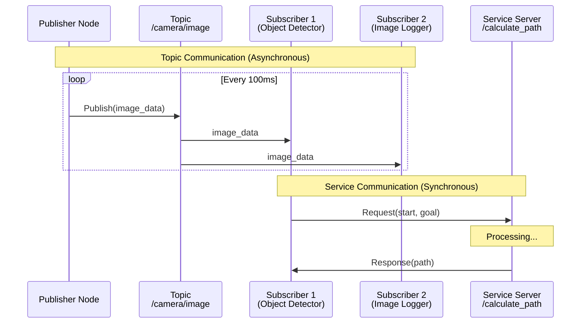

# Week 4: ROS 2 Topics and Services

## Introduction

In Week 3, you learned that ROS 2 nodes communicate through well-defined interfaces. This week, we dive deep into the two most fundamental communication patterns: **topics** (for streaming data) and **services** (for request-reply interactions).

Topics are the workhorses of ROS 2—they enable asynchronous, many-to-many communication perfect for sensor data, status updates, and continuous data streams. Services, on the other hand, provide synchronous request-reply communication for on-demand tasks like triggering a calculation, querying a state, or requesting a resource.

Understanding when to use topics versus services is crucial for designing efficient robotic systems. By the end of this week, you'll build a complete pub-sub system, create custom message types, implement service servers and clients, and know which pattern to apply in different scenarios.

## Learning Objectives

By the end of this week, you will be able to:

- **Implement** both publisher and subscriber nodes for topic-based communication
- **Create** custom message definitions for domain-specific data
- **Design** service definitions with request and response fields
- **Develop** service servers that process requests and return responses
- **Choose** appropriately between topics and services based on use case requirements

## Topics: Asynchronous Publish-Subscribe

### What Are Topics?

A <span className="highlight-purple">**topic**</span> is a named bus over which nodes exchange messages. Topics follow the publish-subscribe pattern:

- **Publishers** send messages to a topic (one-to-many)
- **Subscribers** receive messages from a topic (many-to-one)
- Publishers and subscribers are **decoupled**—they don't know about each other



**Diagram:** Topics enable asynchronous many-to-many communication (top), while services provide synchronous request-reply patterns (bottom).

### When to Use Topics

Use topics for:

- **Sensor data streams**: Camera images, LIDAR scans, IMU readings
- **Status updates**: Battery level, robot pose, system health
- **Continuous data**: Joint states, velocity commands
- **One-to-many communication**: One sensor serving multiple processing nodes

**Key characteristics**:
- Asynchronous (fire-and-forget)
- No return value
- Can have 0 to N subscribers
- Data flows continuously or at regular intervals

### Creating a Subscriber Node

Last week, you created a publisher. Now let's build a subscriber to receive those messages:

```python
#!/usr/bin/env python3

import rclpy
from rclpy.node import Node
from std_msgs.msg import String


class MinimalSubscriber(Node):
    """A simple ROS 2 node that subscribes to messages"""

    def __init__(self):
        super().__init__('minimal_subscriber')

        # Create a subscription
        # - Message type: String
        # - Topic name: '/chatter' (must match publisher)
        # - Callback function: called when message arrives
        # - Queue size: 10
        self.subscription = self.create_subscription(
            String,
            '/chatter',
            self.listener_callback,
            10
        )

        self.get_logger().info('Minimal Subscriber Node has been started')

    def listener_callback(self, msg):
        """Called whenever a message is received on /chatter"""
        self.get_logger().info(f'I heard: "{msg.data}"')


def main(args=None):
    rclpy.init(args=args)
    minimal_subscriber = MinimalSubscriber()

    try:
        rclpy.spin(minimal_subscriber)
    except KeyboardInterrupt:
        pass

    minimal_subscriber.destroy_node()
    rclpy.shutdown()


if __name__ == '__main__':
    main()
```

### Running Publisher and Subscriber Together

```bash
# Terminal 1: Start the publisher
source ~/ros2_ws/install/setup.bash
ros2 run my_robot_pkg my_node

# Terminal 2: Start the subscriber
source ~/ros2_ws/install/setup.bash
ros2 run my_robot_pkg subscriber_node

# Terminal 2 output:
# [INFO] [minimal_subscriber]: I heard: "Hello ROS 2! Message #5"
# [INFO] [minimal_subscriber]: I heard: "Hello ROS 2! Message #6"
```

:::tip
You can run multiple subscribers on the same topic—they'll all receive copies of every message. This is useful for parallel processing (e.g., one node saves images, another detects objects, another compresses for network transmission).
:::

## Custom Message Types

While `std_msgs` provides basic types (String, Int32, Float64), real robots need domain-specific messages.

### Creating a Custom Message

1. **Create a message directory** in your package:

```bash
cd ~/ros2_ws/src/my_robot_pkg
mkdir msg
```

2. **Define a message** in `msg/RobotStatus.msg`:

```
# RobotStatus.msg - Custom message for robot status

# Header with timestamp
std_msgs/Header header

# Battery information
float32 battery_voltage       # Voltage in volts
float32 battery_percentage    # Percentage remaining (0.0 - 100.0)

# Localization confidence
float32 localization_confidence  # 0.0 (no idea) to 1.0 (certain)

# Current task
string current_task           # e.g., "navigating", "idle", "charging"

# Error flags
bool obstacle_detected
bool low_battery_warning
```

3. **Update package.xml** to include message dependencies:

```xml
<!-- Add these lines to package.xml -->
<buildtool_depend>rosidl_default_generators</buildtool_depend>
<exec_depend>rosidl_default_runtime</exec_depend>
<member_of_group>rosidl_interface_packages</member_of_group>
```

4. **Update setup.py** to declare message files:

```python
import os
from glob import glob
from setuptools import setup

package_name = 'my_robot_pkg'

setup(
    name=package_name,
    version='0.0.1',
    packages=[package_name],
    data_files=[
        ('share/ament_index/resource_index/packages',
            ['resource/' + package_name]),
        ('share/' + package_name, ['package.xml']),
        # Include message files
        (os.path.join('share', package_name, 'msg'),
            glob('msg/*.msg')),
    ],
    install_requires=['setuptools'],
    zip_safe=True,
    maintainer='Your Name',
    maintainer_email='you@example.com',
    description='My first ROS 2 package',
    license='MIT',
    tests_require=['pytest'],
    entry_points={
        'console_scripts': [
            'my_node = my_robot_pkg.my_first_node:main',
            'subscriber_node = my_robot_pkg.subscriber_node:main',
        ],
    },
)
```

5. **Build the package** to generate message code:

```bash
cd ~/ros2_ws
colcon build --packages-select my_robot_pkg
source install/setup.bash
```

The build system automatically generates Python classes from `.msg` files.

### Using Custom Messages

```python
#!/usr/bin/env python3

import rclpy
from rclpy.node import Node
from my_robot_pkg.msg import RobotStatus  # Import custom message
from std_msgs.msg import Header


class RobotStatusPublisher(Node):
    def __init__(self):
        super().__init__('robot_status_publisher')

        self.publisher_ = self.create_publisher(RobotStatus, '/robot/status', 10)
        self.timer = self.create_timer(1.0, self.publish_status)

        self.battery_voltage = 12.6  # Simulated battery

    def publish_status(self):
        msg = RobotStatus()

        # Populate header with timestamp
        msg.header = Header()
        msg.header.stamp = self.get_clock().now().to_msg()
        msg.header.frame_id = 'base_link'

        # Battery information
        msg.battery_voltage = self.battery_voltage
        msg.battery_percentage = (self.battery_voltage - 10.0) / 2.6 * 100.0

        # Localization
        msg.localization_confidence = 0.95

        # Task
        msg.current_task = 'navigating'

        # Flags
        msg.obstacle_detected = False
        msg.low_battery_warning = msg.battery_voltage < 11.0

        self.publisher_.publish(msg)
        self.get_logger().info(
            f'Status: {msg.battery_percentage:.1f}% battery, task: {msg.current_task}'
        )

        # Simulate battery drain
        self.battery_voltage -= 0.01


def main(args=None):
    rclpy.init(args=args)
    node = RobotStatusPublisher()
    rclpy.spin(node)
    node.destroy_node()
    rclpy.shutdown()


if __name__ == '__main__':
    main()
```

:::note
The `Header` type includes a timestamp and frame ID (coordinate frame reference). This is standard practice for messages representing physical quantities or sensor data—it allows time synchronization and spatial transforms.
:::

## Services: Request-Reply Communication

### What Are Services?

A <span className="highlight-purple">**service**</span> provides synchronous request-reply communication:

- **Client** sends a request and waits for a response
- **Server** receives the request, processes it, and returns a response
- Communication is **one-to-one** and **blocking** (client waits)

```
┌─────────┐        Request         ┌─────────┐
│ Client  │ ──────────────────────>│ Server  │
│  Node   │                        │  Node   │
└─────────┘<────────────────────── └─────────┘
               Response
```

### When to Use Services

Use services for:

- **On-demand computation**: "Calculate path from A to B"
- **State queries**: "What is the current robot pose?"
- **Triggering actions**: "Start mapping", "Save map"
- **Resource requests**: "Allocate processing power", "Lock mutex"

**Key characteristics**:
- Synchronous (client blocks until response)
- One-to-one communication
- Suitable for infrequent requests
- Not for high-frequency or streaming data

### Creating a Service Definition

Similar to messages, services are defined in `.srv` files:

1. **Create a service directory**:

```bash
cd ~/ros2_ws/src/my_robot_pkg
mkdir srv
```

2. **Define a service** in `srv/AddTwoInts.srv`:

```
# Request: two integers to add
int64 a
int64 b
---
# Response: sum of the two integers
int64 sum
```

The `---` separator divides request (above) from response (below).

3. **Update package.xml** (same as for messages—already done if you created custom messages).

4. **Update setup.py** to include service files:

```python
(os.path.join('share', package_name, 'srv'),
    glob('srv/*.srv')),
```

5. **Build**:

```bash
cd ~/ros2_ws
colcon build --packages-select my_robot_pkg
source install/setup.bash
```

### Implementing a Service Server

```python
#!/usr/bin/env python3

import rclpy
from rclpy.node import Node
from my_robot_pkg.srv import AddTwoInts  # Import custom service


class AddTwoIntsServer(Node):
    def __init__(self):
        super().__init__('add_two_ints_server')

        # Create a service
        # - Service type: AddTwoInts
        # - Service name: '/add_two_ints'
        # - Callback: handle_add_two_ints
        self.srv = self.create_service(
            AddTwoInts,
            '/add_two_ints',
            self.handle_add_two_ints
        )

        self.get_logger().info('Add Two Ints Service is ready')

    def handle_add_two_ints(self, request, response):
        """Service callback: receives request, returns response"""

        # Access request fields
        a = request.a
        b = request.b

        # Perform computation
        response.sum = a + b

        self.get_logger().info(f'Request: {a} + {b} = {response.sum}')

        # Return the response
        return response


def main(args=None):
    rclpy.init(args=args)
    service_node = AddTwoIntsServer()
    rclpy.spin(service_node)
    service_node.destroy_node()
    rclpy.shutdown()


if __name__ == '__main__':
    main()
```

### Implementing a Service Client

```python
#!/usr/bin/env python3

import sys
import rclpy
from rclpy.node import Node
from my_robot_pkg.srv import AddTwoInts


class AddTwoIntsClient(Node):
    def __init__(self):
        super().__init__('add_two_ints_client')

        # Create a client
        self.client = self.create_client(AddTwoInts, '/add_two_ints')

        # Wait for service to become available
        while not self.client.wait_for_service(timeout_sec=1.0):
            self.get_logger().info('Waiting for service to become available...')

        self.get_logger().info('Service is available')

    def send_request(self, a, b):
        """Send a request to the service"""

        # Create a request object
        request = AddTwoInts.Request()
        request.a = a
        request.b = b

        # Call the service asynchronously
        self.future = self.client.call_async(request)


def main(args=None):
    rclpy.init(args=args)

    # Get numbers from command line
    if len(sys.argv) != 3:
        print('Usage: ros2 run my_robot_pkg client_node <a> <b>')
        return

    a = int(sys.argv[1])
    b = int(sys.argv[2])

    client_node = AddTwoIntsClient()
    client_node.send_request(a, b)

    # Spin until response is received
    while rclpy.ok():
        rclpy.spin_once(client_node)
        if client_node.future.done():
            try:
                response = client_node.future.result()
                client_node.get_logger().info(f'Result: {a} + {b} = {response.sum}')
            except Exception as e:
                client_node.get_logger().error(f'Service call failed: {e}')
            break

    client_node.destroy_node()
    rclpy.shutdown()


if __name__ == '__main__':
    main()
```

### Running Service Server and Client

```bash
# Terminal 1: Start the service server
ros2 run my_robot_pkg service_server_node

# Terminal 2: Call the service
ros2 run my_robot_pkg client_node 10 25

# Terminal 2 output:
# [INFO] [add_two_ints_client]: Result: 10 + 25 = 35
```

You can also call services from the command line:

```bash
# Command-line service call
ros2 service call /add_two_ints my_robot_pkg/srv/AddTwoInts "{a: 10, b: 25}"

# Output: sum: 35
```

<div className="neon-border">
<p><strong>Best Practice</strong>: Always check if a service is available before calling it. Services may not be ready immediately after startup, or the server node might crash. Use <code>wait_for_service()</code> with a timeout to handle this gracefully.</p>
</div>

## Topics vs Services: Decision Matrix

| Criterion | Topics | Services |
|-----------|--------|----------|
| **Communication Pattern** | Publish-Subscribe (many-to-many) | Request-Reply (one-to-one) |
| **Frequency** | Continuous/high-frequency | Occasional/on-demand |
| **Blocking** | Non-blocking (asynchronous) | Blocking (client waits) |
| **Return Value** | No | Yes |
| **Example Use Cases** | Sensor data, status updates | Trigger action, query state |

**Example: Camera Images**
- **Topic**: Stream images at 30 FPS to all subscribers
- **Service**: "Capture one high-res image now" (on-demand)

**Example: Path Planning**
- **Topic**: Publish current path continuously as it's replanned
- **Service**: "Calculate path from A to B" (request-response)

## Practical Example: Robot Controller

Let's combine topics and services in a realistic scenario:

### Scenario

A mobile robot has:
- **Status topic** (`/robot/status`): Publishes battery, pose, task status at 1 Hz
- **Velocity command topic** (`/cmd_vel`): Receives movement commands at 10 Hz
- **Start task service** (`/start_task`): Starts a new task when requested
- **Stop service** (`/emergency_stop`): Immediately halts the robot

```python
#!/usr/bin/env python3

import rclpy
from rclpy.node import Node
from geometry_msgs.msg import Twist
from std_srvs.srv import Trigger
from my_robot_pkg.msg import RobotStatus


class RobotController(Node):
    def __init__(self):
        super().__init__('robot_controller')

        # Publishers
        self.status_pub = self.create_publisher(RobotStatus, '/robot/status', 10)
        self.status_timer = self.create_timer(1.0, self.publish_status)

        # Subscribers
        self.cmd_vel_sub = self.create_subscription(
            Twist, '/cmd_vel', self.cmd_vel_callback, 10
        )

        # Services
        self.emergency_stop_srv = self.create_service(
            Trigger, '/emergency_stop', self.handle_emergency_stop
        )

        self.is_moving = False
        self.current_velocity = Twist()

        self.get_logger().info('Robot Controller is running')

    def publish_status(self):
        """Publish robot status at 1 Hz"""
        msg = RobotStatus()
        # ... populate status fields ...
        self.status_pub.publish(msg)

    def cmd_vel_callback(self, msg):
        """Receive velocity commands at high frequency"""
        self.current_velocity = msg
        self.is_moving = (msg.linear.x != 0.0 or msg.angular.z != 0.0)
        # Send commands to motor controller...

    def handle_emergency_stop(self, request, response):
        """Service to immediately stop the robot"""
        self.get_logger().warn('EMERGENCY STOP TRIGGERED')

        # Stop all motors
        stop_cmd = Twist()  # All zeros
        self.current_velocity = stop_cmd
        self.is_moving = False

        response.success = True
        response.message = 'Robot stopped successfully'
        return response


def main(args=None):
    rclpy.init(args=args)
    controller = RobotController()
    rclpy.spin(controller)
    controller.destroy_node()
    rclpy.shutdown()


if __name__ == '__main__':
    main()
```

## Self-Assessment Questions

1. **Why are topics better than services for streaming sensor data like camera images?**
   <details>
   <summary>Answer</summary>
   Topics are asynchronous and non-blocking, allowing publishers to send data continuously without waiting for acknowledgment. Multiple subscribers can receive the same camera stream simultaneously (e.g., one for object detection, one for recording). Services are synchronous and block until a response is returned, making them unsuitable for high-frequency data (30+ FPS). If a service client takes 1 second to process an image, the publisher would be blocked for that entire second, creating a bottleneck.
   </details>

2. **What happens if a subscriber starts after the publisher has already sent messages?**
   <details>
   <summary>Answer</summary>
   By default (with Volatile durability QoS), the subscriber will only receive messages published after it connects—past messages are lost. If you want late-joining subscribers to receive the last published message, use Transient Local durability QoS. This is useful for configuration data (e.g., robot calibration parameters) where new nodes need the latest state immediately upon connecting.
   </details>

3. **When would you choose a service over a topic for robot navigation?**
   <details>
   <summary>Answer</summary>
   Use a service when you need request-reply semantics, such as: "Calculate a path from current position to goal position"—you send the goal as a request and wait for the computed path as a response. Use a topic when you want continuous updates, such as publishing the current planned path as the robot moves and the path is dynamically replanned. Many navigation systems use both: a service to request initial path computation and a topic to stream updates.
   </details>

4. **How can you verify that a custom message definition was built correctly?**
   <details>
   <summary>Answer</summary>
   After building with `colcon build`, check:<br/>
   1. `ros2 interface list | grep my_robot_pkg` - Should show your message/service types<br/>
   2. `ros2 interface show my_robot_pkg/msg/RobotStatus` - Displays the message structure<br/>
   3. `ros2 topic echo /robot/status` (if a node is publishing) - Shows live messages<br/>
   If these commands fail, ensure `package.xml` includes `rosidl_default_generators` and `setup.py` includes message files in `data_files`.
   </details>

5. **What is the purpose of the `---` separator in a service definition?**
   <details>
   <summary>Answer</summary>
   The `---` separator divides the service definition into two parts: request (above) and response (below). Everything above `---` defines the fields the client sends to the server (the request). Everything below defines the fields the server returns to the client (the response). This structure allows bidirectional data exchange in a single service call, unlike topics which are unidirectional.
   </details>

## Summary

This week, you mastered the two fundamental communication patterns in ROS 2:

- **Topics** enable asynchronous, many-to-many communication for streaming data
- **Subscribers** receive messages via callback functions
- **Custom messages** allow domain-specific data structures
- **Services** provide synchronous, request-reply communication
- **Service servers** process requests and return responses
- **Choosing the right pattern** depends on frequency, blocking behavior, and return values

## Next Steps

In Week 5, we'll explore **ROS 2 Advanced Patterns**, including actions (for long-running tasks with feedback), parameters (for runtime configuration), and launch files (for starting multiple nodes simultaneously). You'll also learn about transforms (tf2) for managing coordinate frames—essential for sensor fusion and manipulation.
