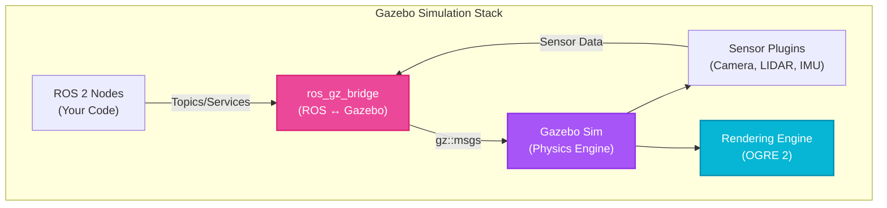

# Week 6: Robot Simulation Fundamentals with Gazebo

## Introduction

Testing robotics algorithms on real hardware is expensive, time-consuming, and risky. A single bug in your navigation code could send a $50,000 robot crashing into a wall. **Simulation** solves this by creating virtual environments where you can test, iterate, and break things without consequences.

**Gazebo** is the industry-standard robot simulator, offering photorealistic 3D rendering, accurate physics simulation, and seamless ROS 2 integration. From autonomous vehicles to humanoid robots, Gazebo enables rapid prototyping and validation before hardware deployment.

This week, you'll create your first Gazebo world, spawn robots, configure physics engines, add sensors (cameras, LIDAR), and integrate everything with ROS 2. By the end, you'll have a complete simulation pipeline for testing algorithms in safe, repeatable virtual environments.

## Learning Objectives

By the end of this week, you will be able to:

- **Set up** Gazebo Classic and Gazebo Fortress/Ignition for ROS 2 Humble
- **Create** custom world files with terrain, lighting, and environmental objects
- **Configure** physics engines (ODE, Bullet, Dart) and tune simulation parameters
- **Add** sensor plugins (camera, LIDAR, IMU) to simulated robots
- **Integrate** Gazebo with ROS 2 using ros_gz_bridge for topic communication

## Gazebo vs Gazebo Ignition (Fortress)

### Two Versions, One Ecosystem

- **Gazebo Classic** (v11): Older, stable, widely used, good documentation
- **Gazebo Fortress/Garden/Harmonic** (formerly "Ignition"): Modern rewrite, better performance, modular architecture

For ROS 2 Humble, **Gazebo Fortress** is recommended, but Gazebo Classic still works. We'll focus on **Gazebo Fortress** (now officially called "Gazebo" as of 2022).



**Diagram:** Gazebo simulation architecture showing integration with ROS 2 through the bridge, physics simulation, sensor plugins, and rendering.

### Installation

```bash
# Install Gazebo Fortress (for ROS 2 Humble)
sudo apt install ros-humble-ros-gz

# Install Gazebo Classic (alternative)
sudo apt install ros-humble-gazebo-ros-pkgs

# Verify installation
gz sim --version  # Should show "Gazebo Sim, version X.X.X"

# Test Gazebo
gz sim shapes.sdf  # Launches demo world with basic shapes
```

## Creating Your First World

### World File Structure (SDF)

Gazebo uses **SDF (Simulation Description Format)** for world and model definitions. Create `worlds/empty_world.sdf`:

```xml
<?xml version="1.0"?>
<sdf version="1.8">
  <world name="empty_world">

    <!-- Physics engine configuration -->
    <physics name="1ms" type="ignored">
      <max_step_size>0.001</max_step_size>
      <real_time_factor>1</real_time_factor>
    </physics>

    <!-- Plugins for ROS 2 integration -->
    <plugin filename="libignition-gazebo-physics-system.so" name="ignition::gazebo::systems::Physics"/>
    <plugin filename="libignition-gazebo-user-commands-system.so" name="ignition::gazebo::systems::UserCommands"/>
    <plugin filename="libignition-gazebo-scene-broadcaster-system.so" name="ignition::gazebo::systems::SceneBroadcaster"/>

    <!-- Lighting -->
    <light type="directional" name="sun">
      <cast_shadows>true</cast_shadows>
      <pose>0 0 10 0 0 0</pose>
      <diffuse>0.8 0.8 0.8 1</diffuse>
      <specular>0.2 0.2 0.2 1</specular>
      <attenuation>
        <range>1000</range>
        <constant>0.9</constant>
        <linear>0.01</linear>
        <quadratic>0.001</quadratic>
      </attenuation>
      <direction>-0.5 0.1 -0.9</direction>
    </light>

    <!-- Ground plane -->
    <model name="ground_plane">
      <static>true</static>
      <link name="link">
        <collision name="collision">
          <geometry>
            <plane>
              <normal>0 0 1</normal>
              <size>100 100</size>
            </plane>
          </geometry>
        </collision>
        <visual name="visual">
          <geometry>
            <plane>
              <normal>0 0 1</normal>
              <size>100 100</size>
            </plane>
          </geometry>
          <material>
            <ambient>0.8 0.8 0.8 1</ambient>
            <diffuse>0.8 0.8 0.8 1</diffuse>
            <specular>0.8 0.8 0.8 1</specular>
          </material>
        </visual>
      </link>
    </model>

  </world>
</sdf>
```

### Launching Your World

```bash
gz sim empty_world.sdf
```

You should see a 3D window with a gray ground plane and directional lighting.

## Adding Objects and Models

### Spawning Basic Shapes

```xml
<!-- Add this inside <world> tag -->
<model name="box">
  <pose>0 0 0.5 0 0 0</pose>  <!-- x y z roll pitch yaw -->
  <link name="box_link">
    <collision name="collision">
      <geometry>
        <box>
          <size>1 1 1</size>  <!-- 1m cube -->
        </box>
      </geometry>
    </collision>
    <visual name="visual">
      <geometry>
        <box>
          <size>1 1 1</size>
        </box>
      </geometry>
      <material>
        <ambient>1 0 0 1</ambient>  <!-- Red color -->
        <diffuse>1 0 0 1</diffuse>
      </material>
    </visual>
    <!-- Make it dynamic (affected by physics) -->
    <inertial>
      <mass>10</mass>
      <inertia>
        <ixx>1.67</ixx>
        <iyy>1.67</iyy>
        <izz>1.67</izz>
      </inertia>
    </inertial>
  </link>
</model>
```

### Using Model Database

Gazebo has a built-in model database (or you can use Fuel, the online repository):

```xml
<!-- Include a model from the database -->
<include>
  <uri>https://fuel.ignitionrobotics.org/1.0/OpenRobotics/models/Cafe</uri>
  <pose>5 5 0 0 0 0</pose>
</include>
```

## Physics Engine Configuration

### Choosing a Physics Engine

Gazebo supports multiple physics backends:

| Engine | Pros | Cons | Use Case |
|--------|------|------|----------|
| **ODE** | Fast, stable, default | Less accurate contacts | General robotics |
| **Bullet** | Fast, good for soft bodies | Less deterministic | Deformable objects |
| **DART** | Accurate, handles complex constraints | Slower | Manipulation, humanoids |

### Tuning Physics Parameters

```xml
<physics name="1ms" type="ode">  <!-- or "bullet", "dart" -->
  <max_step_size>0.001</max_step_size>  <!-- 1ms time steps -->
  <real_time_factor>1</real_time_factor>  <!-- 1x speed (real-time) -->

  <!-- ODE-specific settings -->
  <ode>
    <solver>
      <type>quick</type>  <!-- "quick" or "world" -->
      <iters>50</iters>  <!-- Solver iterations (higher = more accurate) -->
      <sor>1.3</sor>  <!-- Successive over-relaxation -->
    </solver>
    <constraints>
      <cfm>0</cfm>  <!-- Constraint force mixing (softness) -->
      <erp>0.2</erp>  <!-- Error reduction parameter (how fast to correct errors) -->
      <contact_max_correcting_vel>100</contact_max_correcting_vel>
      <contact_surface_layer>0.001</contact_surface_layer>
    </constraints>
  </ode>
</physics>
```

:::warning
Smaller `max_step_size` increases accuracy but slows simulation. Start with 0.001 (1ms). For fast robots or precise manipulation, use 0.0005 (0.5ms). For slower systems, 0.01 (10ms) is acceptable.
:::

## Adding Sensors

### Camera Sensor

```xml
<sensor name="camera" type="camera">
  <camera>
    <horizontal_fov>1.047</horizontal_fov>  <!-- 60 degrees -->
    <image>
      <width>1920</width>
      <height>1080</height>
      <format>R8G8B8</format>  <!-- RGB -->
    </image>
    <clip>
      <near>0.1</near>
      <far>100</far>
    </clip>
  </camera>
  <always_on>1</always_on>
  <update_rate>30</update_rate>
  <visualize>true</visualize>  <!-- Show camera frustum in GUI -->

  <!-- Topic publishing plugin -->
  <plugin filename="libignition-gazebo-camera-system.so" name="ignition::gazebo::systems::Camera"/>
</sensor>
```

### LIDAR Sensor (2D/3D)

```xml
<sensor name="lidar" type="gpu_lidar">
  <pose>0 0 0.5 0 0 0</pose>
  <lidar>
    <scan>
      <horizontal>
        <samples>640</samples>  <!-- Number of beams -->
        <resolution>1</resolution>
        <min_angle>-1.57</min_angle>  <!-- -90 degrees -->
        <max_angle>1.57</max_angle>   <!-- +90 degrees -->
      </horizontal>
      <vertical>
        <samples>16</samples>  <!-- 16 vertical layers (3D LIDAR) -->
        <resolution>1</resolution>
        <min_angle>-0.26</min_angle>  <!-- -15 degrees -->
        <max_angle>0.26</max_angle>   <!-- +15 degrees -->
      </vertical>
    </scan>
    <range>
      <min>0.1</min>
      <max>30.0</max>
      <resolution>0.01</resolution>
    </range>
  </lidar>
  <always_on>1</always_on>
  <update_rate>10</update_rate>
  <visualize>true</visualize>

  <plugin filename="libignition-gazebo-lidar-system.so" name="ignition::gazebo::systems::Lidar"/>
</sensor>
```

### IMU Sensor

```xml
<sensor name="imu" type="imu">
  <always_on>1</always_on>
  <update_rate>100</update_rate>  <!-- 100 Hz -->
  <imu>
    <angular_velocity>
      <x>
        <noise type="gaussian">
          <mean>0.0</mean>
          <stddev>0.0002</stddev>
        </noise>
      </x>
      <y>
        <noise type="gaussian">
          <mean>0.0</mean>
          <stddev>0.0002</stddev>
        </noise>
      </y>
      <z>
        <noise type="gaussian">
          <mean>0.0</mean>
          <stddev>0.0002</stddev>
        </noise>
      </z>
    </angular_velocity>
    <linear_acceleration>
      <x>
        <noise type="gaussian">
          <mean>0.0</mean>
          <stddev>0.017</stddev>
        </noise>
      </x>
      <y>
        <noise type="gaussian">
          <mean>0.0</mean>
          <stddev>0.017</stddev>
        </noise>
      </y>
      <z>
        <noise type="gaussian">
          <mean>0.0</mean>
          <stddev>0.017</stddev>
        </noise>
      </z>
    </linear_acceleration>
  </imu>

  <plugin filename="libignition-gazebo-imu-system.so" name="ignition::gazebo::systems::Imu"/>
</sensor>
```

## ROS 2 Integration with ros_gz_bridge

### Bridging Gazebo Topics to ROS 2

Gazebo publishes sensor data on its own topics (Ignition Transport). To use them in ROS 2, we need a bridge:

```python
# launch/gazebo_ros2_bridge.launch.py

from launch import LaunchDescription
from launch_ros.actions import Node

def generate_launch_description():
    return LaunchDescription([
        # Bridge camera topic
        Node(
            package='ros_gz_bridge',
            executable='parameter_bridge',
            arguments=[
                '/camera@sensor_msgs/msg/Image[ignition.msgs.Image',
                '/camera_info@sensor_msgs/msg/CameraInfo[ignition.msgs.CameraInfo',
            ],
            output='screen'
        ),

        # Bridge LIDAR topic
        Node(
            package='ros_gz_bridge',
            executable='parameter_bridge',
            arguments=[
                '/lidar@sensor_msgs/msg/LaserScan[ignition.msgs.LaserScan',
            ],
            output='screen'
        ),

        # Bridge IMU topic
        Node(
            package='ros_gz_bridge',
            executable='parameter_bridge',
            arguments=[
                '/imu@sensor_msgs/msg/Imu[ignition.msgs.IMU',
            ],
            output='screen'
        ),
    ])
```

Now sensor data appears on ROS 2 topics:

```bash
ros2 topic list
# Output:
# /camera
# /camera_info
# /lidar
# /imu
# ...

ros2 topic echo /lidar
```

### Sending Commands from ROS 2 to Gazebo

To control a robot, bridge command topics:

```python
# Bidirectional bridge for velocity commands
Node(
    package='ros_gz_bridge',
    executable='parameter_bridge',
    arguments=[
        '/cmd_vel@geometry_msgs/msg/Twist]ignition.msgs.Twist',
    ],
    output='screen'
),
```

Now you can publish to `/cmd_vel` from ROS 2 and the robot in Gazebo will move!

## Code Example: Teleoperation in Simulation

```python
#!/usr/bin/env python3

import rclpy
from rclpy.node import Node
from geometry_msgs.msg import Twist
import sys
import termios
import tty


class TeleopKey(Node):
    def __init__(self):
        super().__init__('teleop_key')

        self.publisher_ = self.create_publisher(Twist, '/cmd_vel', 10)

        self.get_logger().info('Teleop started. Use WASD to move, Q to quit.')

        self.settings = termios.tcgetattr(sys.stdin)
        self.run()

    def get_key(self):
        tty.setraw(sys.stdin.fileno())
        key = sys.stdin.read(1)
        termios.tcsetattr(sys.stdin, termios.TCSADRAIN, self.settings)
        return key

    def run(self):
        try:
            while rclpy.ok():
                key = self.get_key()

                twist = Twist()

                if key == 'w':
                    twist.linear.x = 0.5  # Forward
                elif key == 's':
                    twist.linear.x = -0.5  # Backward
                elif key == 'a':
                    twist.angular.z = 0.5  # Turn left
                elif key == 'd':
                    twist.angular.z = -0.5  # Turn right
                elif key == 'q':
                    break

                self.publisher_.publish(twist)

        finally:
            termios.tcsetattr(sys.stdin, termios.TCSADRAIN, self.settings)


def main(args=None):
    rclpy.init(args=args)
    node = TeleopKey()
    node.destroy_node()
    rclpy.shutdown()


if __name__ == '__main__':
    main()
```

## Self-Assessment Questions

1. **What is the purpose of the `max_step_size` parameter in Gazebo physics configuration?**
   <details>
   <summary>Answer</summary>
   `max_step_size` defines the time step for physics simulation (in seconds). Smaller values (e.g., 0.001s = 1ms) increase accuracy but require more computation. Larger values (e.g., 0.01s = 10ms) run faster but may miss fast collisions or introduce instability. For robots with fast dynamics (quadcopters, high-speed wheels), use 1ms or smaller. For slow robots, 10ms is acceptable.
   </details>

2. **Why do we need ros_gz_bridge instead of directly using Gazebo topics in ROS 2?**
   <details>
   <summary>Answer</summary>
   Gazebo uses its own middleware (Ignition Transport) which is separate from ROS 2's DDS middleware. The two systems cannot directly communicate. `ros_gz_bridge` translates messages between Ignition Transport topics and ROS 2 topics, allowing sensor data from Gazebo (e.g., camera images) to be published as ROS 2 messages that other ROS 2 nodes can subscribe to. Without the bridge, ROS 2 nodes wouldn't see Gazebo's sensor data.
   </details>

3. **How does adding Gaussian noise to an IMU sensor in simulation help prepare for real-world deployment?**
   <details>
   <summary>Answer</summary>
   Real IMUs have noise due to electronic interference, thermal drift, and manufacturing imperfections. Algorithms tested only on perfect simulated IMU data often fail on real hardware because they don't handle noise. By adding realistic noise models (Gaussian with appropriate mean/stddev based on real sensor specs), algorithms learn to be robust—e.g., using filtering (Kalman filter) to smooth noisy data. This reduces the sim-to-real gap.
   </details>

4. **What is the difference between `<collision>` and `<visual>` geometries in SDF?**
   <details>
   <summary>Answer</summary>
   `<collision>` defines the shape used for physics calculations (contact detection, collisions). `<visual>` defines the shape rendered in the 3D view. They can differ: for performance, collision geometry is often simpler (e.g., a box approximating a detailed mesh). For example, a robot might have a detailed visual mesh for realism but use simple collision boxes for faster physics computation. Complex collision geometry slows down simulation significantly.
   </details>

5. **When would you choose DART physics engine over ODE?**
   <details>
   <summary>Answer</summary>
   Choose DART when you need: (1) highly accurate contact dynamics for manipulation (grasping, pushing), (2) complex kinematic constraints (closed loops, parallel mechanisms), or (3) humanoid robotics with many joints and contacts (bipedal walking). DART is more accurate but slower than ODE. Use ODE for faster simulation when accuracy requirements are moderate, such as wheeled robots or aerial vehicles where contact dynamics are less critical.
   </details>

## Summary

This week, you learned the fundamentals of robot simulation with Gazebo:

- **Gazebo Fortress** is the modern simulator integrated with ROS 2 Humble
- **SDF files** define worlds, models, physics, and sensors
- **Physics engines** (ODE, Bullet, DART) can be tuned for accuracy vs speed
- **Sensors** (camera, LIDAR, IMU) can be added with plugins
- **ros_gz_bridge** connects Gazebo topics to ROS 2 for seamless integration

## Next Steps

In Week 7, we dive deeper into **URDF Modeling and Simulation**, where you'll create custom robot models with joints, links, and sensors. You'll learn URDF syntax, XACRO macros for modularity, and integrate your robot models with Gazebo and RViz for visualization.
