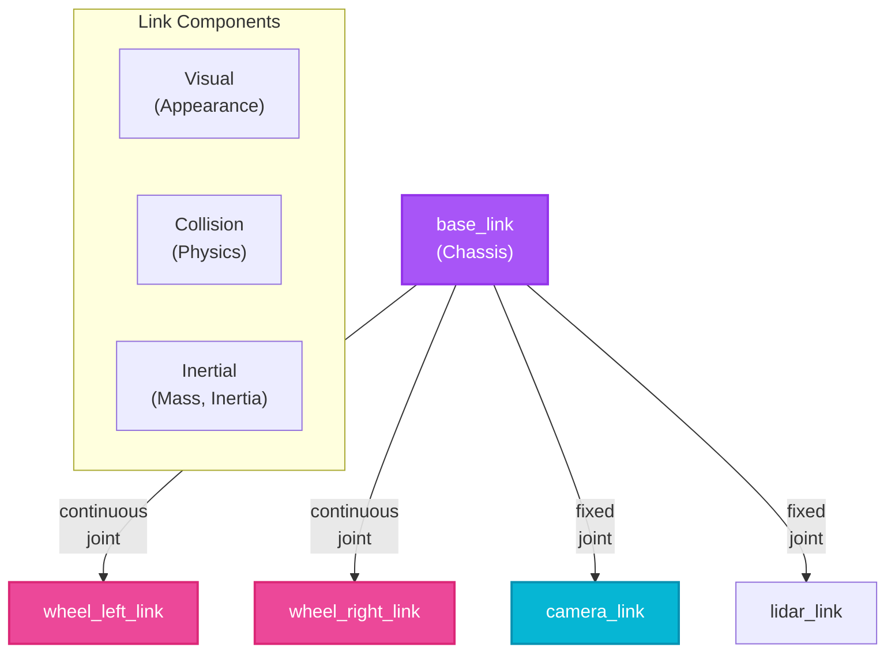

# Week 7: URDF Modeling and Simulation

## Introduction

Every robot needs a digital twin—a precise 3D model describing its physical structure, sensor placements, and motion capabilities. <span className="highlight-purple">**URDF (Unified Robot Description Format)**</span> is the standard language for defining robot models in ROS.

Whether you're building a wheeled rover, manipulator arm, or humanoid robot, URDF captures the geometry, kinematics, dynamics, and sensor configuration. Combined with **XACRO** (XML Macros), you can create modular, reusable robot descriptions that scale from simple prototypes to complex systems.

This week, you'll master URDF syntax, create a mobile robot from scratch, add sensors, visualize in RViz, simulate in Gazebo, and learn best practices for maintainable robot models.

## Learning Objectives

By the end of this week, you will be able to:

- **Define** robot models using URDF with links, joints, and collision/visual geometries
- **Use** XACRO macros to create reusable, parameterized robot components
- **Calculate** inertial properties for realistic physics simulation
- **Integrate** sensors (cameras, LIDAR) into URDF models
- **Visualize** robots in RViz and simulate in Gazebo with proper physics

## URDF Fundamentals

### Core Concepts

A robot in URDF is a tree structure of **links** connected by **joints**:

- **Link**: A rigid body (wheel, arm segment, sensor mount)
- **Joint**: Connection between two links (revolute, continuous, prismatic, fixed)



**Diagram:** URDF robot model structure showing base_link connected to wheels (continuous joints) and sensors (fixed joints), with each link containing visual, collision, and inertial properties.

### Minimal URDF Example

```xml
<?xml version="1.0"?>
<robot name="simple_bot">

  <!-- Base link (robot chassis) -->
  <link name="base_link">
    <visual>
      <geometry>
        <box size="0.6 0.4 0.2"/>  <!-- 60cm x 40cm x 20cm -->
      </geometry>
      <material name="blue">
        <color rgba="0 0 1 1"/>
      </material>
    </visual>
    <collision>
      <geometry>
        <box size="0.6 0.4 0.2"/>
      </geometry>
    </collision>
    <inertial>
      <mass value="10"/>  <!-- 10 kg -->
      <inertia ixx="0.15" ixy="0.0" ixz="0.0"
               iyy="0.35" iyz="0.0"
               izz="0.45"/>
    </inertial>
  </link>

  <!-- Left wheel -->
  <link name="wheel_left">
    <visual>
      <geometry>
        <cylinder radius="0.1" length="0.05"/>
      </geometry>
      <material name="black">
        <color rgba="0 0 0 1"/>
      </material>
    </visual>
    <collision>
      <geometry>
        <cylinder radius="0.1" length="0.05"/>
      </geometry>
    </collision>
    <inertial>
      <mass value="1"/>
      <inertia ixx="0.001" ixy="0.0" ixz="0.0"
               iyy="0.001" iyz="0.0"
               izz="0.002"/>
    </inertial>
  </link>

  <!-- Joint connecting base to left wheel -->
  <joint name="wheel_left_joint" type="continuous">
    <parent link="base_link"/>
    <child link="wheel_left"/>
    <origin xyz="0 0.225 -0.05" rpy="1.5708 0 0"/>  <!-- Position and rotation -->
    <axis xyz="0 0 1"/>  <!-- Rotation axis (Z-axis in wheel frame) -->
  </joint>

  <!-- Right wheel (similar structure, omitted for brevity) -->

</robot>
```

### Joint Types

| Type | Description | Use Case |
|------|-------------|----------|
| **fixed** | No movement | Attach sensors, static mounts |
| **revolute** | Rotates around axis with limits | Robot arm joints |
| **continuous** | Rotates indefinitely | Wheels, spinning sensors |
| **prismatic** | Slides along axis | Linear actuators, lifts |
| **floating** | 6-DoF free movement | Rarely used (flying robots) |
| **planar** | Moves in a plane | Rarely used |

## Using XACRO for Modularity

### Why XACRO?

Pure URDF becomes repetitive for symmetric structures (wheels, legs). <span className="highlight-purple">**XACRO**</span> adds:

- **Properties**: Variables (constants)
- **Macros**: Reusable templates
- **Math**: Calculations (e.g., `${PI/2}`)
- **Includes**: Split large files

### XACRO Example: Parameterized Wheel

```xml
<?xml version="1.0"?>
<robot xmlns:xacro="http://www.ros.org/wiki/xacro" name="robot_with_xacro">

  <!-- Properties (constants) -->
  <xacro:property name="wheel_radius" value="0.1"/>
  <xacro:property name="wheel_length" value="0.05"/>
  <xacro:property name="wheel_mass" value="1.0"/>

  <!-- Macro for creating a wheel -->
  <xacro:macro name="wheel" params="prefix reflect">
    <link name="wheel_${prefix}">
      <visual>
        <geometry>
          <cylinder radius="${wheel_radius}" length="${wheel_length}"/>
        </geometry>
        <material name="black">
          <color rgba="0 0 0 1"/>
        </material>
      </visual>
      <collision>
        <geometry>
          <cylinder radius="${wheel_radius}" length="${wheel_length}"/>
        </geometry>
      </collision>
      <inertial>
        <mass value="${wheel_mass}"/>
        <!-- Cylinder inertia formula: I = m*r^2/2 -->
        <inertia ixx="${wheel_mass * wheel_radius * wheel_radius / 2.0}"
                 ixy="0.0" ixz="0.0"
                 iyy="${wheel_mass * wheel_radius * wheel_radius / 2.0}"
                 iyz="0.0"
                 izz="${wheel_mass * wheel_radius * wheel_radius / 2.0}"/>
      </inertial>
    </link>

    <joint name="wheel_${prefix}_joint" type="continuous">
      <parent link="base_link"/>
      <child link="wheel_${prefix}"/>
      <!-- reflect = 1 for left, -1 for right (mirror position) -->
      <origin xyz="0 ${reflect * 0.225} -0.05" rpy="1.5708 0 0"/>
      <axis xyz="0 0 1"/>
    </joint>
  </xacro:macro>

  <!-- Use the macro to create left and right wheels -->
  <xacro:wheel prefix="left" reflect="1"/>
  <xacro:wheel prefix="right" reflect="-1"/>

</robot>
```

### Converting XACRO to URDF

```bash
# Process XACRO file to generate pure URDF
xacro robot.urdf.xacro > robot.urdf

# Or use within a launch file (automatic conversion)
```

:::tip
Always use XACRO for production robots. It dramatically reduces duplication and makes updating parameters (e.g., wheel radius) trivial—change one property instead of 20 hardcoded values.
:::

## Calculating Inertial Properties

### Why Accurate Inertia Matters

Incorrect inertial values cause unrealistic physics:
- Too low mass: Robot floats or flies away
- Wrong inertia tensor: Robot wobbles or spins unnaturally
- Missing `<inertial>`: Gazebo treats link as massless (bad!)

### Inertia Formulas for Common Shapes

**Box** (width `w`, depth `d`, height `h`, mass `m`):
```xml
<inertia ixx="${m * (h*h + d*d) / 12.0}"
         iyy="${m * (w*w + d*d) / 12.0}"
         izz="${m * (w*w + h*h) / 12.0}"
         ixy="0" ixz="0" iyz="0"/>
```

**Cylinder** (radius `r`, length `l`, mass `m`):
```xml
<!-- Cylinder along Z-axis -->
<inertia ixx="${m * (3*r*r + l*l) / 12.0}"
         iyy="${m * (3*r*r + l*l) / 12.0}"
         izz="${m * r*r / 2.0}"
         ixy="0" ixz="0" iyz="0"/>
```

**Sphere** (radius `r`, mass `m`):
```xml
<inertia ixx="${2 * m * r*r / 5.0}"
         iyy="${2 * m * r*r / 5.0}"
         izz="${2 * m * r*r / 5.0}"
         ixy="0" ixz="0" iyz="0"/>
```

:::warning
Use meshes (`.stl`, `.dae`) for complex shapes, but simplify collision geometry. Detailed collision meshes slow simulation. Visual geometry can be detailed; collision should be simple primitives (boxes, cylinders).
:::

## Adding Sensors to URDF

### Camera Sensor

```xml
<!-- Camera link -->
<link name="camera_link">
  <visual>
    <geometry>
      <box size="0.05 0.05 0.05"/>
    </geometry>
  </visual>
  <collision>
    <geometry>
      <box size="0.05 0.05 0.05"/>
    </geometry>
  </collision>
  <inertial>
    <mass value="0.1"/>
    <inertia ixx="0.0001" ixy="0" ixz="0" iyy="0.0001" iyz="0" izz="0.0001"/>
  </inertial>
</link>

<!-- Joint to attach camera to base -->
<joint name="camera_joint" type="fixed">
  <parent link="base_link"/>
  <child link="camera_link"/>
  <origin xyz="0.3 0 0.1" rpy="0 0 0"/>  <!-- Front of robot, looking forward -->
</joint>

<!-- Gazebo plugin for camera -->
<gazebo reference="camera_link">
  <sensor type="camera" name="camera">
    <update_rate>30.0</update_rate>
    <camera name="front_camera">
      <horizontal_fov>1.3962634</horizontal_fov>  <!-- 80 degrees -->
      <image>
        <width>1920</width>
        <height>1080</height>
        <format>R8G8B8</format>
      </image>
      <clip>
        <near>0.02</near>
        <far>300</far>
      </clip>
    </camera>
    <plugin name="camera_controller" filename="libgazebo_ros_camera.so">
      <ros>
        <namespace>/robot</namespace>
        <remapping>image_raw:=camera/image</remapping>
        <remapping>camera_info:=camera/info</remapping>
      </ros>
    </plugin>
  </sensor>
</gazebo>
```

### LIDAR Sensor

```xml
<!-- LIDAR link -->
<link name="lidar_link">
  <visual>
    <geometry>
      <cylinder radius="0.05" length="0.07"/>
    </geometry>
  </visual>
  <inertial>
    <mass value="0.2"/>
    <inertia ixx="0.0001" ixy="0" ixz="0" iyy="0.0001" iyz="0" izz="0.0001"/>
  </inertial>
</link>

<joint name="lidar_joint" type="fixed">
  <parent link="base_link"/>
  <child link="lidar_link"/>
  <origin xyz="0 0 0.2" rpy="0 0 0"/>  <!-- Top of robot -->
</joint>

<gazebo reference="lidar_link">
  <sensor type="ray" name="lidar">
    <pose>0 0 0 0 0 0</pose>
    <update_rate>10</update_rate>
    <ray>
      <scan>
        <horizontal>
          <samples>720</samples>
          <resolution>1</resolution>
          <min_angle>-3.14159</min_angle>  <!-- -180 degrees -->
          <max_angle>3.14159</max_angle>   <!-- +180 degrees -->
        </horizontal>
      </scan>
      <range>
        <min>0.1</min>
        <max>30.0</max>
        <resolution>0.01</resolution>
      </range>
    </ray>
    <plugin name="lidar_controller" filename="libgazebo_ros_ray_sensor.so">
      <ros>
        <namespace>/robot</namespace>
        <remapping>~/out:=lidar/scan</remapping>
      </ros>
      <output_type>sensor_msgs/LaserScan</output_type>
      <frame_name>lidar_link</frame_name>
    </plugin>
  </sensor>
</gazebo>
```

## Visualizing in RViz

### Publishing Robot State

```python
# launch/robot_state_publisher.launch.py

from launch import LaunchDescription
from launch_ros.actions import Node
import os
from ament_index_python.packages import get_package_share_directory


def generate_launch_description():
    urdf_file = os.path.join(
        get_package_share_directory('my_robot_pkg'),
        'urdf',
        'robot.urdf.xacro'
    )

    return LaunchDescription([
        # Robot State Publisher (publishes transforms from URDF)
        Node(
            package='robot_state_publisher',
            executable='robot_state_publisher',
            name='robot_state_publisher',
            output='screen',
            parameters=[{'robot_description': open(urdf_file).read()}]
        ),

        # Joint State Publisher (publishes joint positions)
        Node(
            package='joint_state_publisher_gui',
            executable='joint_state_publisher_gui',
            name='joint_state_publisher_gui',
            output='screen'
        ),

        # RViz
        Node(
            package='rviz2',
            executable='rviz2',
            name='rviz2',
            output='screen'
        ),
    ])
```

**In RViz**:
1. Set Fixed Frame to `base_link`
2. Add → RobotModel (displays URDF)
3. Add → TF (shows coordinate frames)
4. Use joint_state_publisher_gui sliders to move joints

## Simulating in Gazebo

### Gazebo Launch File

```python
# launch/gazebo_spawn.launch.py

from launch import LaunchDescription
from launch.actions import IncludeLaunchDescription
from launch.launch_description_sources import PythonLaunchDescriptionSource
from launch_ros.actions import Node
import os
from ament_index_python.packages import get_package_share_directory


def generate_launch_description():
    pkg_gazebo_ros = get_package_share_directory('gazebo_ros')
    pkg_my_robot = get_package_share_directory('my_robot_pkg')

    # Gazebo server
    gzserver = IncludeLaunchDescription(
        PythonLaunchDescriptionSource(
            os.path.join(pkg_gazebo_ros, 'launch', 'gzserver.launch.py')
        ),
        launch_arguments={'world': os.path.join(pkg_my_robot, 'worlds', 'empty_world.world')}.items()
    )

    # Gazebo client (GUI)
    gzclient = IncludeLaunchDescription(
        PythonLaunchDescriptionSource(
            os.path.join(pkg_gazebo_ros, 'launch', 'gzclient.launch.py')
        )
    )

    # Spawn robot in Gazebo
    spawn_robot = Node(
        package='gazebo_ros',
        executable='spawn_entity.py',
        arguments=[
            '-entity', 'my_robot',
            '-file', os.path.join(pkg_my_robot, 'urdf', 'robot.urdf'),
            '-x', '0', '-y', '0', '-z', '0.5'
        ],
        output='screen'
    )

    return LaunchDescription([
        gzserver,
        gzclient,
        spawn_robot,
    ])
```

## Self-Assessment Questions

1. **What is the difference between `<visual>` and `<collision>` geometries in URDF, and why use different geometries?**
   <details>
   <summary>Answer</summary>
   `<visual>` defines how the link looks in visualization (RViz, Gazebo GUI). `<collision>` defines the shape used for physics collision detection. They can differ because: (1) Visual geometry can be complex meshes for realism without slowing physics, (2) Collision geometry should be simple primitives (boxes, cylinders) for fast physics computation. Example: A robot might have a detailed visual mesh with 10,000 triangles but use a simple box collision shape for 100x faster collision checks.
   </details>

2. **Why is it critical to include `<inertial>` properties for links that will be simulated in Gazebo?**
   <details>
   <summary>Answer</summary>
   Without `<inertial>` properties, Gazebo treats links as massless, causing unrealistic physics: links float, ignore gravity, or behave erratically. Correct mass and inertia tensor values enable realistic dynamics (acceleration, momentum, torque response). Incorrect values lead to unstable simulation (wobbling, flying robots). Always calculate inertia using proper formulas for the shape or use MeshLab/CAD tools to compute from mesh geometry.
   </details>

3. **How does XACRO's macro feature reduce errors in robot models with symmetric components?**
   <details>
   <summary>Answer</summary>
   Macros define a component once and instantiate it multiple times with different parameters. For example, a robot with 4 identical wheels: write the wheel macro once, call it 4 times with different positions. If you need to change the wheel radius, you update one property instead of 4 separate link definitions. This prevents copy-paste errors (e.g., forgetting to update one wheel's mass), ensures consistency (all wheels have identical properties), and makes models easier to maintain.
   </details>

4. **When defining a camera sensor in URDF for Gazebo, why must you specify both the `<sensor>` tag and a Gazebo plugin?**
   <details>
   <summary>Answer</summary>
   The `<sensor>` tag (in `<gazebo>` block) defines the sensor's physical properties (resolution, FOV, update rate). The Gazebo plugin (`libgazebo_ros_camera.so`) implements the functionality: it reads the simulated camera pixels and publishes them as ROS 2 messages on topics. Without the sensor definition, there's no camera to simulate. Without the plugin, the data stays in Gazebo and isn't published to ROS 2 topics that your nodes can subscribe to.
   </details>

5. **What is the purpose of the `robot_state_publisher` node, and when do you need it?**
   <details>
   <summary>Answer</summary>
   `robot_state_publisher` reads the URDF/XACRO file and the current joint states (from `/joint_states` topic), then publishes TF transforms for all links in the robot. It's needed whenever you want to: (1) Visualize the robot in RViz (RViz needs TF to position each link), (2) Transform sensor data between frames (e.g., camera to base_link), or (3) Use navigation/manipulation stacks that require knowing where each part of the robot is in space. Without it, TF tree is incomplete and many ROS 2 features fail.
   </details>

## Summary

This week, you mastered robot modeling with URDF and XACRO:

- **URDF** defines robot structure with links and joints
- **XACRO** adds macros, properties, and math for maintainable models
- **Inertial properties** are critical for realistic physics simulation
- **Sensors** integrate into URDF via Gazebo plugins
- **RViz** visualizes robots; **Gazebo** simulates physics

## Next Steps

In Week 8, we transition to **NVIDIA Isaac Platform Introduction**, exploring Isaac Sim for photorealistic simulation, Isaac SDK for perception and navigation, and the powerful synthetic data generation capabilities that make Isaac the go-to platform for industrial Physical AI applications.
