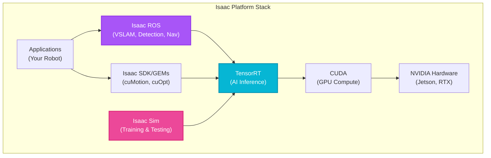

# Week 8: NVIDIA Isaac Platform Introduction

## Introduction

While Gazebo excels at general-purpose robot simulation, **NVIDIA Isaac** is purpose-built for AI-powered robotics at scale. Isaac Sim delivers photorealistic rendering, accurate physics, and massive parallelization on NVIDIA GPUs. Isaac SDK provides production-ready perception, navigation, and manipulation algorithms optimized for NVIDIA hardware.

The Isaac platform is NVIDIA's answer to the question: "How do we train, simulate, and deploy millions of robots with AI perception?" From warehouse automation to humanoid robots, Isaac powers the next generation of intelligent physical systems.

This week introduces the Isaac ecosystem, installation, Isaac Sim basics, and synthetic data generation—the secret weapon for training robust vision models without manual labeling.

## Learning Objectives

By the end of this week, you will be able to:

- **Understand** the Isaac ecosystem (Sim, SDK, ROS/ROS 2 integration)
- **Install** Isaac Sim on Ubuntu 22.04 with RTX 4070 Ti GPU support
- **Create** simple scenes in Isaac Sim with USD (Universal Scene Description)
- **Generate** synthetic datasets for object detection and segmentation
- **Integrate** Isaac Sim with ROS 2 for sensor data streaming

## The NVIDIA Isaac Ecosystem

### Three Pillars

1. **Isaac Sim**: Photorealistic robot simulator built on Omniverse
   - Physically accurate rendering (ray tracing, global illumination)
   - RTX-accelerated physics (PhysX 5)
   - Domain randomization for robust AI training
   - Multi-robot simulation (hundreds of robots in parallel)

2. **Isaac SDK/GEMs**: Perception and navigation libraries
   - Isaac ROS: ROS 2 packages (VSLAM, depth perception, object detection)
   - Pre-trained AI models (PeopleNet, TrafficCamNet)
   - Optimized for Jetson (edge) and RTX (workstation)

3. **Isaac Manipulator/Navigation**: Application frameworks
   - cuRobot: GPU-accelerated motion planning
   - cuMotion: Collision-free trajectory optimization
   - cuOpt: Fleet management and task allocation



**Diagram:** NVIDIA Isaac platform architecture showing how applications leverage Isaac ROS and SDK components, all optimized through TensorRT and CUDA for NVIDIA hardware.

### Why Isaac Over Gazebo?

| Feature | Gazebo | Isaac Sim |
|---------|--------|-----------|
| **Rendering** | Basic (OpenGL) | Photorealistic (RTX ray tracing) |
| **Physics** | CPU (ODE/Bullet) | GPU-accelerated (PhysX 5) |
| **Scale** | ~10 robots | 100+ robots (GPU parallelization) |
| **AI Training** | Limited | Synthetic data generation, domain randomization |
| **Hardware Req** | Modest | NVIDIA RTX GPU (2070+) |
| **Use Case** | General robotics | AI-heavy, large-scale deployments |

<div className="neon-border">
<p><strong>Key Insight</strong>: Isaac Sim's photorealistic rendering enables training vision models on synthetic data that generalize to the real world. This dramatically reduces the need for manual data labeling—a bottleneck in traditional robotics development.</p>
</div>

## Installing Isaac Sim

### System Requirements

- **OS**: Ubuntu 20.04/22.04 (Linux required)
- **GPU**: NVIDIA RTX 2070 or better (RTX 4070 Ti recommended)
- **VRAM**: 8GB minimum (16GB+ for complex scenes)
- **RAM**: 32GB recommended
- **Storage**: 50GB+ for Isaac Sim and assets

### Installation Steps

```bash
# 1. Install NVIDIA Driver (if not already installed)
sudo apt install nvidia-driver-535  # Or latest stable version
nvidia-smi  # Verify GPU is detected

# 2. Download Isaac Sim from NVIDIA
# Visit: https://developer.nvidia.com/isaac-sim
# Download "Isaac Sim 2023.1.1" (or latest) Workstation version

# 3. Extract and run installer
cd ~/Downloads
tar -xf isaac-sim-2023.1.1-ubuntu22.04.tar.gz
cd isaac-sim-2023.1.1
./isaac-sim.sh  # First launch takes 5-10 minutes (downloads assets)

# 4. Install Isaac ROS (for ROS 2 Humble integration)
sudo apt install ros-humble-isaac-ros-common
```

:::warning
Isaac Sim requires an NVIDIA GPU. It will not run on AMD/Intel GPUs or in CPU-only mode. If you don't have an RTX GPU, use NVIDIA Omniverse Cloud for remote access (requires account).
:::

### Verifying Installation

```bash
# Launch Isaac Sim
./isaac-sim.sh

# In Isaac Sim GUI:
# File → Open → Select "simple_warehouse.usd" example
# Press Play (bottom-left) to start simulation
# You should see physics running at 60 FPS
```

## Isaac Sim Basics

### USD: Universal Scene Description

Isaac Sim uses **USD (Universal Scene Description)**, Pixar's open-source framework for 3D scenes. Unlike URDF (XML), USD is:

- **Composable**: Layers combine to form final scene
- **Non-destructive**: Edit without modifying original files
- **High-performance**: Optimized for large scenes

### Creating a Simple Scene

```python
# simple_scene.py - Create a scene programmatically

from omni.isaac.kit import SimulationApp

# Start Isaac Sim headless (no GUI) or with GUI
simulation_app = SimulationApp({"headless": False})

from omni.isaac.core import World
from omni.isaac.core.objects import DynamicCuboid
from omni.isaac.core.prims import XFormPrim
import numpy as np

# Create a simulation world
world = World(stage_units_in_meters=1.0)

# Add ground plane
world.scene.add_default_ground_plane()

# Add a dynamic cube (will fall due to gravity)
cube = world.scene.add(
    DynamicCuboid(
        prim_path="/World/Cube",
        name="red_cube",
        position=np.array([0, 0, 2.0]),  # 2 meters above ground
        scale=np.array([0.5, 0.5, 0.5]),  # 50cm cube
        color=np.array([1.0, 0.0, 0.0])   # Red
    )
)

# Reset simulation
world.reset()

# Run simulation for 500 steps
for i in range(500):
    world.step(render=True)  # Step physics and render

# Clean up
simulation_app.close()
```

Run with:

```bash
./isaac-sim.sh --python simple_scene.py
```

You'll see a red cube fall and bounce on the ground plane!

### Adding a Robot

```python
from omni.isaac.core.robots import Robot
from omni.isaac.core.utils.stage import add_reference_to_stage

# Load a robot from USD file
add_reference_to_stage(
    usd_path="/Isaac/Robots/Carter/carter_v2.usd",  # Built-in Carter robot
    prim_path="/World/Carter"
)

# Create robot object
carter = world.scene.add(Robot(prim_path="/World/Carter", name="carter_robot"))

world.reset()

# Apply velocity command
carter.set_joint_velocities(velocities=[1.0, 1.0])  # Move forward

for i in range(1000):
    world.step(render=True)
```

## Synthetic Data Generation

### Why Synthetic Data?

Training object detection models requires thousands of labeled images. Manual labeling is:
- **Expensive**: $0.10-$1.00 per image
- **Time-consuming**: Weeks to months
- **Limited**: Hard to cover edge cases (rain, night, occlusions)

**Synthetic data** in Isaac Sim:
- Generate 10,000 labeled images in hours
- Perfect labels (bounding boxes, segmentation masks, depth)
- Infinite variety (lighting, textures, poses)

### Domain Randomization

<span className="highlight-purple">**Domain randomization**</span> varies scene properties to prevent overfitting:

- **Lighting**: Vary intensity, color temperature, shadows
- **Textures**: Random materials on objects
- **Camera**: Different angles, exposures, noise
- **Backgrounds**: Change wall colors, add clutter

This forces models to learn robust features that work in the real world.

### Code Example: Generating a Dataset

```python
from omni.isaac.kit import SimulationApp
simulation_app = SimulationApp({"headless": True})  # No GUI for faster generation

from omni.isaac.core import World
from omni.isaac.core.objects import DynamicCuboid
from omni.isaac.synthetic_utils import SyntheticDataHelper
from omni.replicator.core import AnnotatorRegistry
import omni.replicator.core as rep
import numpy as np

world = World()
world.scene.add_default_ground_plane()

# Add camera
camera_prim = rep.create.camera(position=(3, 0, 1), look_at=(0, 0, 0.5))

# Add objects with random positions
for i in range(10):
    cube = world.scene.add(
        DynamicCuboid(
            prim_path=f"/World/Cube_{i}",
            position=np.random.uniform(-2, 2, size=3),
            scale=np.random.uniform(0.1, 0.5, size=3),
            color=np.random.rand(3)
        )
    )

# Set up synthetic data writer
output_dir = "/tmp/synthetic_data"
writer = rep.WriterRegistry.get("BasicWriter")
writer.initialize(output_dir=output_dir, rgb=True, bounding_box_2d_tight=True)

# Generate 100 frames with domain randomization
for i in range(100):
    # Randomize lighting
    rep.randomizer.set_lights(
        intensity=np.random.uniform(500, 2000),
        temperature=np.random.uniform(3000, 6500)
    )

    # Step simulation
    world.step(render=True)

    # Capture annotated data
    writer.write({"step": i})

    if i % 10 == 0:
        print(f"Generated {i}/100 images")

print(f"Dataset saved to {output_dir}")
simulation_app.close()
```

Output includes:
- `rgb_0000.png`, `rgb_0001.png`, ... (color images)
- `bounding_box_2d_tight_0000.json` (object detection labels)
- `semantic_segmentation_0000.png` (pixel-wise labels)

## ROS 2 Integration

### Isaac ROS Bridge

Isaac Sim can publish sensor data directly to ROS 2 topics:

```python
from omni.isaac.core.utils.extensions import enable_extension

# Enable ROS 2 bridge extension
enable_extension("omni.isaac.ros2_bridge")

# In Isaac Sim GUI:
# Add camera to robot
# Right-click camera → Add → Isaac → ROS 2 → RGB
# This creates a ROS 2 publisher for /camera/image_raw

# Now in a separate terminal:
ros2 topic echo /camera/image_raw  # See images from Isaac Sim!
```

### Launch File for Isaac Sim + ROS 2

```python
# launch/isaac_sim_ros2.launch.py

from launch import LaunchDescription
from launch.actions import ExecuteProcess
from launch_ros.actions import Node


def generate_launch_description():
    return LaunchDescription([
        # Start Isaac Sim with specific scene
        ExecuteProcess(
            cmd=[
                '/path/to/isaac-sim.sh',
                '--python', '/path/to/scene.py'
            ],
            output='screen'
        ),

        # Start image processing node
        Node(
            package='my_robot_pkg',
            executable='object_detector',
            name='detector',
            remappings=[('/image', '/camera/image_raw')],
            output='screen'
        ),
    ])
```

## Isaac Sim vs Real World: Sim-to-Real

### Bridging the Gap

Even with photorealistic rendering, sim-to-real transfer requires:

1. **Accurate sensor models**: Add noise, motion blur, lens distortion
2. **Physics tuning**: Match friction, contact parameters to real hardware
3. **Domain randomization**: Cover full range of real-world variation
4. **Progressive training**: Train in sim → fine-tune on small real dataset

### Code Example: Adding Realistic Camera Noise

```python
from omni.isaac.sensor import Camera

camera = Camera(
    prim_path="/World/Camera",
    position=[2, 0, 1],
    frequency=30,  # 30 FPS
    resolution=(1920, 1080)
)

# Add realistic noise and blur
camera.add_motion_blur(intensity=0.5)
camera.add_noise(mean=0.0, stddev=0.02)  # Gaussian noise
camera.set_lens_distortion(k1=-0.1, k2=0.05)  # Barrel distortion
```

## Self-Assessment Questions

1. **Why does Isaac Sim require an NVIDIA RTX GPU, whereas Gazebo can run on integrated graphics?**
   <details>
   <summary>Answer</summary>
   Isaac Sim uses RTX-accelerated ray tracing for photorealistic rendering and GPU-accelerated PhysX 5 for physics simulation. Ray tracing requires dedicated RT cores (found in RTX GPUs) for real-time performance. GPU physics allows simulating hundreds of objects in parallel, which is impossible on CPU. Gazebo uses CPU-based physics (ODE/Bullet) and basic OpenGL rendering, which runs on any graphics card but limits visual fidelity and simulation scale.
   </details>

2. **What is domain randomization, and how does it improve sim-to-real transfer?**
   <details>
   <summary>Answer</summary>
   Domain randomization varies simulation parameters (lighting, textures, object poses, sensor noise) during training to create diverse synthetic data. Models trained on randomized data learn robust features that work across environments instead of overfitting to specific sim conditions. For example, if trained only on perfect lighting, a detector fails in shadows. By randomizing lighting intensity/color/direction, the model learns to detect objects regardless of illumination, improving real-world performance.
   </details>

3. **How does USD differ from URDF, and why does Isaac Sim use USD instead?**
   <details>
   <summary>Answer</summary>
   USD (Universal Scene Description) is a composable, layered scene format designed for film/VFX workflows, supporting complex scenes with millions of objects. URDF is robot-specific, limited to kinematic trees, and doesn't scale to large environments. USD allows non-destructive editing (layers override base assets without modification), handles massive datasets, and supports photorealistic materials/lighting. Isaac Sim uses USD because it targets large-scale simulations (warehouses with 100+ robots, detailed objects) which would be impractical in URDF/SDF.
   </details>

4. **What types of synthetic data can Isaac Sim generate, and why is "perfect labeling" valuable?**
   <details>
   <summary>Answer</summary>
   Isaac Sim generates: (1) RGB images, (2) 2D/3D bounding boxes, (3) Semantic/instance segmentation masks, (4) Depth maps, (5) Surface normals, (6) Optical flow. "Perfect labeling" means ground truth is exact (no human error), which is impossible with manual annotation. For segmentation, every pixel is correctly labeled. For depth, values are physically accurate. This enables training on millions of labeled examples quickly and cheaply, whereas manual labeling is expensive ($0.10-$1/image) and error-prone.
   </details>

5. **When would you choose Isaac Sim over Gazebo for a robotics project?**
   <details>
   <summary>Answer</summary>
   Choose Isaac Sim when: (1) **Training vision models**—need photorealistic rendering and synthetic data generation, (2) **Large-scale simulation**—simulating 10+ robots simultaneously (Isaac's GPU physics scales better), (3) **Perception-heavy tasks**—object detection, segmentation, depth estimation where visual fidelity matters, (4) **Commercial deployment**—Isaac SDK provides production-ready, optimized perception stacks. Choose Gazebo for: (1) **Lightweight prototyping**, (2) **Non-vision tasks** (path planning, control), (3) **Limited hardware** (no RTX GPU), (4) **Open-source requirement** (Isaac Sim is proprietary, though free).
   </details>

## Summary

This week, you discovered the NVIDIA Isaac platform:

- **Isaac Sim** offers photorealistic, GPU-accelerated simulation
- **USD** is the scene format enabling large-scale environments
- **Synthetic data generation** with domain randomization reduces manual labeling
- **ROS 2 integration** bridges Isaac Sim with existing ROS workflows
- **Sim-to-real** requires careful sensor modeling and domain randomization

## Next Steps

In Week 9, we dive deeper into **Isaac SDK and Sim Integration**, exploring Isaac ROS packages for VSLAM (visual SLAM), object detection with pre-trained models, and GPU-accelerated image processing with CUDA-based ROS 2 nodes.
