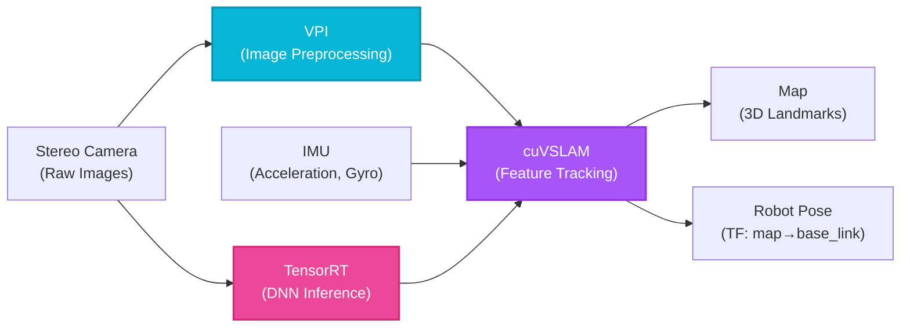

# Week 9: Isaac SDK and Sim Integration

## Introduction

NVIDIA Isaac SDK transforms raw sensor data into actionable intelligence. While Isaac Sim provides the training ground, **Isaac ROS** delivers production-ready perception algorithms optimized for NVIDIA GPUs. From visual SLAM to object detection, Isaac ROS packages leverage CUDA acceleration to process data 10-100x faster than CPU implementations.

This week focuses on integrating Isaac ROS with your robots—both in simulation (Isaac Sim) and on real hardware (Jetson Orin Nano). You'll deploy pre-trained AI models, implement VSLAM for localization, and build GPU-accelerated perception pipelines.

## Learning Objectives

- **Install** Isaac ROS packages on Ubuntu 22.04 with ROS 2 Humble
- **Implement** visual SLAM using Isaac ROS VSLAM (cuVSLAM)
- **Deploy** pre-trained object detection models (PeopleNet, DOPE)
- **Understand** GPU-accelerated image processing with NVIDIA VPI
- **Optimize** perception pipelines for Jetson Orin Nano deployment

## Isaac ROS Overview

### Key Packages

| Package | Function | Hardware Acceleration |
|---------|----------|----------------------|
| **isaac_ros_visual_slam** | Visual-inertial SLAM | CUDA + TensorRT |
| **isaac_ros_dnn_inference** | Deep learning inference | TensorRT |
| **isaac_ros_image_proc** | Image preprocessing | VPI (Vision Programming Interface) |
| **isaac_ros_depth_segmentation** | Depth-based segmentation | CUDA |
| **isaac_ros_object_detection** | 2D/3D object detection | TensorRT |
| **isaac_ros_apriltag** | AprilTag detection | CUDA |

### Installation

```bash
# Install Isaac ROS packages
sudo apt install ros-humble-isaac-ros-visual-slam \
                 ros-humble-isaac-ros-dnn-inference \
                 ros-humble-isaac-ros-image-proc

# Verify CUDA is available
nvidia-smi  # Should show GPU

# Test Isaac ROS
ros2 run isaac_ros_visual_slam isaac_ros_visual_slam  # Should launch without errors
```

## Visual SLAM with cuVSLAM

### What is VSLAM?

<span className="highlight-purple">**Visual SLAM (Simultaneous Localization and Mapping)**</span> uses camera and IMU data to:
- Build a map of the environment
- Localize the robot within that map
- All without GPS or external landmarks

**cuVSLAM** is NVIDIA's GPU-accelerated VSLAM, running 10x faster than CPU alternatives.



**Diagram:** Isaac ROS perception pipeline showing stereo camera and IMU data flowing through VPI preprocessing, cuVSLAM for localization, and TensorRT for object detection.

### Launch File for cuVSLAM

```python
# launch/vslam.launch.py

from launch import LaunchDescription
from launch_ros.actions import Node, ComposableNodeContainer
from launch_ros.descriptions import ComposableNode


def generate_launch_description():
    return LaunchDescription([
        ComposableNodeContainer(
            name='vslam_container',
            namespace='',
            package='rclcpp_components',
            executable='component_container',
            composable_node_descriptions=[
                # Visual SLAM node
                ComposableNode(
                    package='isaac_ros_visual_slam',
                    plugin='nvidia::isaac_ros::visual_slam::VisualSlamNode',
                    name='visual_slam',
                    parameters=[{
                        'enable_rectified_pose': True,
                        'denoise_input_images': False,
                        'rectified_images': True,
                        'enable_debug_mode': False,
                        'debug_dump_path': '/tmp/cuvslam',
                        'enable_slam_visualization': True,
                        'enable_landmarks_view': True,
                        'enable_observations_view': True,
                        'map_frame': 'map',
                        'odom_frame': 'odom',
                        'base_frame': 'base_link',
                        'input_camera_frame': 'camera_link',
                        'enable_imu_fusion': True,
                    }],
                    remappings=[
                        ('/visual_slam/image_0', '/camera/left/image_raw'),
                        ('/visual_slam/camera_info_0', '/camera/left/camera_info'),
                        ('/visual_slam/image_1', '/camera/right/image_raw'),
                        ('/visual_slam/camera_info_1', '/camera/right/camera_info'),
                        ('/visual_slam/imu', '/imu/data'),
                    ]
                ),
            ],
            output='screen'
        ),
    ])
```

### Running VSLAM in Isaac Sim

```bash
# Terminal 1: Start Isaac Sim with stereo camera robot
./isaac-sim.sh --python stereo_robot.py

# Terminal 2: Launch VSLAM
ros2 launch my_robot_pkg vslam.launch.py

# Terminal 3: Visualize in RViz
rviz2

# In RViz:
# Add -> TF (see map -> odom -> base_link frames)
# Add -> PointCloud2 (/visual_slam/vis/landmarks) - see SLAM map points
# Add -> Odometry (/visual_slam/tracking/odometry) - see robot path
```

## Object Detection with TensorRT

### Pre-trained Models

Isaac ROS provides models for common tasks:

- **PeopleNet**: Detect people in images
- **DOPE (Deep Object Pose Estimation)**: Detect 3D poses of known objects
- **TrafficCamNet**: Detect vehicles, pedestrians, road signs

### Deploying PeopleNet

```python
# launch/peopl enet_detection.launch.py

from launch import LaunchDescription
from launch_ros.actions import ComposableNodeContainer
from launch_ros.descriptions import ComposableNode


def generate_launch_description():
    return LaunchDescription([
        ComposableNodeContainer(
            name='detection_container',
            namespace='',
            package='rclcpp_components',
            executable='component_container',
            composable_node_descriptions=[
                # TensorRT inference node
                ComposableNode(
                    package='isaac_ros_dnn_inference',
                    plugin='nvidia::isaac_ros::dnn_inference::TensorRTInferenceNode',
                    name='tensorrt_inference',
                    parameters=[{
                        'model_file_path': '/workspaces/isaac_ros-dev/models/peoplenet/1/model.onnx',
                        'engine_file_path': '/tmp/peoplenet.plan',
                        'input_tensor_names': ['input_tensor'],
                        'input_binding_names': ['input_1'],
                        'output_tensor_names': ['output_cov', 'output_bbox'],
                        'output_binding_names': ['output_cov/Sigmoid', 'output_bbox/BiasAdd'],
                        'verbose': False,
                        'force_engine_update': False
                    }],
                    remappings=[
                        ('/tensor_pub', '/image_tensor'),
                    ]
                ),

                # Detection decoder
                ComposableNode(
                    package='isaac_ros_detectnet',
                    plugin='nvidia::isaac_ros::detectnet::DetectNetDecoderNode',
                    name='detectnet_decoder',
                    parameters=[{
                        'label_list': ['person'],
                        'confidence_threshold': 0.35,
                    }],
                ),
            ],
            output='screen'
        ),
    ])
```

### Custom Object Detection Training

```bash
# 1. Generate synthetic data in Isaac Sim (Week 8)
# 2. Export to COCO format
# 3. Train DetectNet model using TAO Toolkit

# Install TAO Toolkit
docker pull nvcr.io/nvidia/tao/tao-toolkit:4.0.0-tf2.11.0

# Train (simplified - see NVIDIA TAO docs for full pipeline)
tao detectnet_v2 train -e /workspace/spec.txt \
                        -r /workspace/output \
                        -k $API_KEY

# Export to TensorRT
tao detectnet_v2 export -m /workspace/model.hdf5 \
                         -o /workspace/model.onnx \
                         -k $API_KEY
```

## GPU-Accelerated Image Processing

### NVIDIA VPI (Vision Programming Interface)

VPI offloads image processing to GPU/VIC (Vision Image Compositor):

```python
from isaac_ros_image_proc import ImageFlipNode, ImageFormatConverterNode

# In your launch file:
ComposableNode(
    package='isaac_ros_image_proc',
    plugin='nvidia::isaac_ros::image_proc::ImageFlipNode',
    name='image_flip',
    parameters=[{
        'flip_mode': 'HORIZONTAL',  # HORIZONTAL, VERTICAL, BOTH
    }],
    remappings=[
        ('/image', '/camera/image_raw'),
        ('/flipped_image', '/camera/image_flipped'),
    ]
),
```

### Stereo Depth Estimation

```python
ComposableNode(
    package='isaac_ros_stereo_image_proc',
    plugin='nvidia::isaac_ros::stereo_image_proc::DisparityNode',
    name='disparity',
    parameters=[{
        'backends': 'CUDA',  # Use GPU acceleration
        'max_disparity': 64.0,
    }],
),
```

## Jetson Orin Nano Deployment

### Optimizing for Edge Hardware

Jetson Orin Nano has limited power (15W mode) compared to RTX workstations. Optimizations:

1. **Reduce Resolution**: 640x480 instead of 1920x1080
2. **Lower Frame Rate**: 10 FPS for detection (30 FPS not needed)
3. **TensorRT INT8**: Use 8-bit quantization (4x faster than FP16)
4. **Disable Debug Outputs**: Reduce CPU overhead

```python
# Jetson-optimized parameters
parameters=[{
    'image_width': 640,
    'image_height': 480,
    'frame_rate': 10,
    'use_tensorrt_int8': True,  # Enable INT8 quantization
    'dla_core': 0,  # Use Deep Learning Accelerator
}],
```

### Monitoring Performance

```bash
# Check Jetson stats
sudo jetson_stats  # or 'jtop'

# Expected on Orin Nano (15W):
# - PeopleNet: 15-20 FPS at 640x480
# - VSLAM: 30 FPS stereo processing
# - Power: 10-12W
```

## Self-Assessment Questions

1. **Why is cuVSLAM faster than CPU-based SLAM (e.g., ORB-SLAM)?**
   <details>
   <summary>Answer</summary>
   cuVSLAM parallelizes feature detection, matching, and bundle adjustment on thousands of GPU cores, whereas CPU-based SLAM is limited to sequential processing on 4-16 cores. GPUs excel at the massively parallel operations in SLAM: extracting features from every pixel, matching thousands of feature points, and solving large optimization problems. This results in 10-20x speedups, enabling real-time SLAM on high-resolution images (1920x1080) where CPU implementations would drop to 1-5 FPS.
   </details>

2. **What is TensorRT, and why is it critical for deploying AI models on Jetson?**
   <details>
   <summary>Answer</summary>
   TensorRT is NVIDIA's inference optimizer that converts trained models (ONNX, TensorFlow) into highly optimized engines for NVIDIA hardware. It applies: (1) **Layer fusion** (combine operations to reduce memory reads), (2) **Precision calibration** (FP32 → FP16 → INT8 quantization), (3) **Kernel tuning** (optimize for specific GPU architecture). On Jetson, this means 3-10x faster inference and 50% less power consumption compared to unoptimized models—critical for battery-powered robots where every watt matters.
   </details>

3. **How does stereo depth estimation differ from structured light (RealSense)?**
   <details>
   <summary>Answer</summary>
   **Stereo** uses two cameras (like human eyes) to compute depth via triangulation—finding corresponding points in left/right images. **Structured light** projects an infrared pattern and measures distortion. Stereo: works outdoors (sunlight doesn't interfere), longer range, no projector needed, but requires textured surfaces for matching. Structured light: works on textureless surfaces, higher accuracy at close range (&lt;5m), but fails outdoors due to IR interference. Isaac ROS stereo is GPU-accelerated for real-time performance (30+ FPS).
   </details>

4. **Why use composable nodes instead of separate node executables in Isaac ROS?**
   <details>
   <summary>Answer</summary>
   Composable nodes run in a single process with shared memory (zero-copy communication), whereas separate executables communicate via DDS (serialization/deserialization overhead). For high-bandwidth data like images (1920x1080 RGB = 6MB per frame at 30 FPS = 180 MB/s), avoiding copies is critical. Composable nodes reduce latency by 50-80% and CPU usage significantly. This is essential on Jetson where CPU is limited and every millisecond counts for real-time perception.
   </details>

5. **What is INT8 quantization, and what tradeoff does it involve?**
   <details>
   <summary>Answer</summary>
   INT8 quantization converts model weights from 32-bit floating point (FP32) to 8-bit integers, reducing model size by 75% and speeding up inference 2-4x. The tradeoff is reduced precision—INT8 can represent fewer distinct values (256 vs 4 billion for FP32), potentially decreasing accuracy by 0.5-2%. TensorRT minimizes this via calibration (finding optimal scale factors) using a calibration dataset. For most perception tasks (detection, segmentation), accuracy loss is negligible (&lt;1%), making INT8 ideal for edge deployment.
   </details>

## Summary

- **Isaac ROS** provides GPU-accelerated perception packages
- **cuVSLAM** enables real-time visual SLAM on NVIDIA hardware
- **TensorRT** optimizes AI models for edge deployment
- **VPI** accelerates image processing on GPU/VIC
- **Jetson Orin Nano** runs production perception pipelines at 10-30 FPS

## Next Steps

Week 10 explores **Advanced Isaac Features**: Nav2 integration for autonomous navigation, cuMotion for collision-free path planning, and multi-robot simulation at scale.
