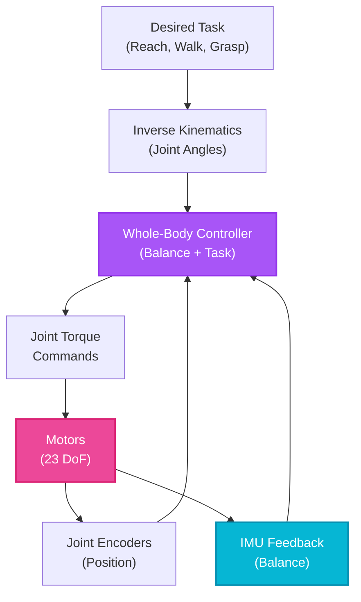

# Week 11: Humanoid Robot Development

## Introduction

Everything converges this week: ROS 2, Isaac perception, and real hardware. You'll work with humanoid platforms like **Unitree G1**—23+ degrees of freedom, bipedal locomotion, dexterous manipulation—deploying the perception and control stacks you've built throughout this course.

Humanoid robots represent the frontier of Physical AI: they navigate human environments, use human tools, and interact naturally with people. From warehouse logistics to elder care, humanoids are poised to transform how robots integrate into society.

## Learning Objectives

- **Understand** humanoid robot architectures (sensing, computing, actuation)
- **Deploy** Isaac ROS on Jetson Orin Nano for onboard perception
- **Implement** whole-body control for coordinated locomotion and manipulation
- **Configure** safety systems (collision detection, emergency stop)
- **Integrate** IMU-based balance control for stable bipedal walking

## Unitree G1 Platform Overview

### Hardware Specifications

| Component | Specification |
|-----------|---------------|
| **Height** | 130 cm (adjustable) |
| **Weight** | 35 kg |
| **DoF** | 23-43 (configurable) |
| **Actuators** | Quasi-direct-drive motors (high torque density) |
| **Compute** | NVIDIA Jetson Orin (32GB) + STM32 microcontrollers |
| **Sensors** | 3D LIDAR, Depth cameras (RealSense), IMU, force/torque sensors |
| **Battery** | Li-ion, 2-4 hour runtime |
| **Communication** | Ethernet (control), WiFi (telemetry) |

### Software Stack

```
┌─────────────────────────────────────────┐
│    High-Level Planning (ROS 2)          │ ← Your code
│  (Navigation, Task Planning, VLA)       │
├─────────────────────────────────────────┤
│    Perception (Isaac ROS on Jetson)     │ ← Week 9
│  (VSLAM, Object Detection, Depth)       │
├─────────────────────────────────────────┤
│    Whole-Body Controller                │ ← This week
│  (Balance, Locomotion, Manipulation)    │
├─────────────────────────────────────────┤
│    Motor Controllers (STM32 Real-Time)  │ ← Firmware
│  (PID, Torque Control, Safety)          │
└─────────────────────────────────────────┘
```

## Setting Up Jetson Orin Nano

### Installation

```bash
# 1. Flash Jetson with Ubuntu 22.04 + ROS 2 Humble
# Download JetPack 6.0 from NVIDIA Developer

# 2. Install Isaac ROS
sudo apt install ros-humble-isaac-ros-visual-slam \
                 ros-humble-isaac-ros-dnn-inference

# 3. Install Unitree SDK
git clone https://github.com/unitreerobotics/unitree_ros2.git ~/ros2_ws/src/
cd ~/ros2_ws
colcon build --packages-select unitree_ros2

# 4. Test connection to robot
ros2 topic list  # Should show /joint_states, /imu, /camera/* if robot is powered on
```

### Network Configuration

```bash
# Jetson IP: 192.168.123.161 (default)
# Robot control board: 192.168.123.10

# Test connection
ping 192.168.123.10

# SSH into Jetson from workstation
ssh unitree@192.168.123.161  # Password: unitree (change immediately!)
```

## Whole-Body Control

### What is Whole-Body Control?

<span className="highlight-purple">**Whole-body control**</span> coordinates all joints simultaneously to achieve:
- Balance (keep center of mass over support polygon)
- Locomotion (walking, turning, climbing stairs)
- Manipulation (reaching, grasping while balancing)

Unlike fixed-base manipulators, humanoids must continuously adjust posture to avoid falling.

### Control Architecture



**Diagram:** Humanoid whole-body control architecture with feedback loops from IMU and joint encoders to maintain balance while executing tasks.

### Code Example: Simple Balance Controller

```python
#!/usr/bin/env python3

import rclpy
from rclpy.node import Node
from sensor_msgs.msg import Imu, JointState
from std_msgs.msg import Float64MultiArray
import numpy as np


class BalanceController(Node):
    def __init__(self):
        super().__init__('balance_controller')

        # Subscribe to IMU (balance feedback)
        self.imu_sub = self.create_subscription(
            Imu, '/imu/data', self.imu_callback, 10
        )

        # Subscribe to joint states
        self.joint_sub = self.create_subscription(
            JointState, '/joint_states', self.joint_callback, 10
        )

        # Publish joint commands
        self.cmd_pub = self.create_publisher(
            Float64MultiArray, '/joint_commands', 10
        )

        # Control gains
        self.kp_pitch = 50.0  # Proportional gain for pitch correction
        self.kd_pitch = 10.0  # Derivative gain

        self.pitch = 0.0
        self.pitch_rate = 0.0

        # Control loop at 100 Hz
        self.create_timer(0.01, self.control_loop)

    def imu_callback(self, msg):
        """Extract pitch angle from IMU orientation"""
        # Convert quaternion to Euler angles
        # (Simplified - use tf_transformations in production)
        self.pitch = 2 * np.arcsin(msg.orientation.y)  # Approximate

        # Angular velocity (pitch rate)
        self.pitch_rate = msg.angular_velocity.y

    def joint_callback(self, msg):
        # Store current joint positions for safety checks
        pass

    def control_loop(self):
        """PD controller to maintain upright posture"""

        # Desired pitch: 0 radians (upright)
        pitch_error = 0.0 - self.pitch

        # PD control law
        ankle_torque = (self.kp_pitch * pitch_error +
                        self.kd_pitch * (-self.pitch_rate))

        # Limit torque (safety)
        ankle_torque = np.clip(ankle_torque, -50.0, 50.0)  # Nm

        # Publish command
        cmd = Float64MultiArray()
        cmd.data = [0.0] * 23  # 23 joints (example)
        cmd.data[12] = ankle_torque  # Left ankle pitch
        cmd.data[18] = ankle_torque  # Right ankle pitch

        self.cmd_pub.publish(cmd)


def main():
    rclpy.init()
    controller = BalanceController()
    rclpy.spin(controller)
    controller.destroy_node()
    rclpy.shutdown()


if __name__ == '__main__':
    main()
```

:::warning
This is a simplified example. Production balance controllers use model predictive control (MPC), center of mass (CoM) tracking, and zero-moment point (ZMP) stabilization. Never deploy untested controllers—robots can fall and damage themselves!
:::

## Locomotion Patterns

### Gait Generation

Bipedal walking requires coordinated foot placement:

```python
class GaitGenerator:
    def __init__(self):
        self.step_length = 0.3  # 30 cm steps
        self.step_height = 0.05  # 5 cm foot clearance
        self.step_period = 1.0  # 1 second per step
        self.phase = 0.0  # Current gait phase [0, 1]

    def update(self, dt):
        """Update gait phase"""
        self.phase += dt / self.step_period
        if self.phase > 1.0:
            self.phase -= 1.0

    def get_foot_position(self, is_left_foot):
        """Compute foot position in gait cycle"""

        if self.phase < 0.5:
            # Left foot swing, right foot support
            if is_left_foot:
                # Swing trajectory (parabolic arc)
                x = self.step_length * (self.phase * 2)
                z = self.step_height * np.sin(np.pi * self.phase * 2)
            else:
                # Support foot (stationary)
                x = 0.0
                z = 0.0
        else:
            # Right foot swing, left foot support
            if not is_left_foot:
                x = self.step_length * ((self.phase - 0.5) * 2)
                z = self.step_height * np.sin(np.pi * (self.phase - 0.5) * 2)
            else:
                x = 0.0
                z = 0.0

        return [x, 0.0, z]
```

### Terrain Adaptation

```python
def adapt_gait_to_terrain(self, lidar_scan):
    """Adjust step length/height based on terrain"""

    # Analyze LIDAR to detect obstacles
    min_distance = np.min(lidar_scan.ranges)

    if min_distance < 0.5:  # Obstacle within 50cm
        self.step_length = 0.2  # Shorter steps
        self.step_height = 0.1  # Higher clearance
    elif min_distance < 1.0:  # Caution zone
        self.step_length = 0.25
        self.step_height = 0.07
    else:  # Clear path
        self.step_length = 0.3
        self.step_height = 0.05
```

## Safety Systems

### Emergency Stop

```python
class SafetyMonitor(Node):
    def __init__(self):
        super().__init__('safety_monitor')

        # Subscribe to IMU for fall detection
        self.imu_sub = self.create_subscription(
            Imu, '/imu/data', self.check_fall, 10
        )

        # Emergency stop service
        self.estop_srv = self.create_service(
            Trigger, '/emergency_stop', self.emergency_stop_callback
        )

        self.estop_triggered = False

    def check_fall(self, msg):
        """Detect if robot is falling"""

        # Check if pitch or roll exceeds threshold
        pitch = 2 * np.arcsin(msg.orientation.y)
        roll = 2 * np.arcsin(msg.orientation.x)

        if abs(pitch) > 0.5 or abs(roll) > 0.5:  # ~30 degrees
            self.get_logger().error('FALL DETECTED! Triggering E-STOP')
            self.trigger_estop()

    def trigger_estop(self):
        """Immediately halt all motors"""
        if not self.estop_triggered:
            self.estop_triggered = True

            # Publish zero velocity command
            zero_cmd = Float64MultiArray()
            zero_cmd.data = [0.0] * 23
            # (publish to motor controller)

            # Log event
            self.get_logger().fatal('E-STOP ACTIVATED')

    def emergency_stop_callback(self, request, response):
        self.trigger_estop()
        response.success = True
        response.message = "Emergency stop activated"
        return response
```

### Collision Detection

```python
def check_self_collision(self, joint_states):
    """Detect if robot limbs are colliding"""

    # Use forward kinematics to compute link positions
    link_positions = self.compute_fk(joint_states)

    # Check distance between non-adjacent links
    for i in range(len(link_positions)):
        for j in range(i + 2, len(link_positions)):
            distance = np.linalg.norm(
                link_positions[i] - link_positions[j]
            )

            if distance < 0.05:  # 5cm minimum clearance
                self.get_logger().warn(
                    f'Self-collision detected: Link {i} and {j}'
                )
                return True

    return False
```

## Deploying Perception on Jetson

### Optimized Launch File

```python
# launch/jetson_perception.launch.py

from launch import LaunchDescription
from launch_ros.actions import ComposableNodeContainer
from launch_ros.descriptions import ComposableNode


def generate_launch_description():
    return LaunchDescription([
        ComposableNodeContainer(
            name='perception_container',
            namespace='',
            package='rclcpp_components',
            executable='component_container',
            composable_node_descriptions=[
                # VSLAM for localization
                ComposableNode(
                    package='isaac_ros_visual_slam',
                    plugin='nvidia::isaac_ros::visual_slam::VisualSlamNode',
                    name='visual_slam',
                    parameters=[{
                        'enable_imu_fusion': True,
                        'enable_slam_visualization': False,  # Reduce CPU load
                    }],
                ),

                # Object detection (INT8 for efficiency)
                ComposableNode(
                    package='isaac_ros_dnn_inference',
                    plugin='nvidia::isaac_ros::dnn_inference::TensorRTInferenceNode',
                    name='object_detector',
                    parameters=[{
                        'use_tensorrt_int8': True,  # 4x faster on Jetson
                        'dla_core': 0,  # Use DLA (Deep Learning Accelerator)
                    }],
                ),
            ],
            output='screen'
        ),
    ])
```

### Performance Monitoring

```bash
# Monitor Jetson stats in real-time
sudo jtop

# Expected performance on Orin Nano (15W mode):
# - VSLAM: 20-30 FPS (stereo 640x480)
# - Object detection: 15 FPS (640x480 INT8)
# - Power: 10-12W
# - Temperature: 50-60°C
```

## Self-Assessment Questions

1. **Why do humanoid robots require whole-body control instead of independent joint control?**
   <details>
   <summary>Answer</summary>
   Humanoids are underactuated systems (cannot directly control center of mass position) and must maintain balance via coordinated joint movements. Independent joint control doesn't account for coupling—moving an arm shifts the center of mass, requiring leg adjustments to prevent falling. Whole-body control solves a unified optimization problem: achieve task objectives (e.g., reach) while satisfying balance constraints (keep CoM over support polygon). This coordination is critical for dynamic tasks like walking while carrying objects.
   </details>

2. **How does IMU-based fall detection differ from vision-based fall detection?**
   <details>
   <summary>Answer</summary>
   IMU-based detection measures orientation and acceleration directly at high frequency (100-1000 Hz), providing immediate feedback for balance control. It works regardless of lighting and has low latency. Vision-based detection (analyzing camera images) is slower (30 FPS typical), computationally expensive, and can fail in poor lighting. However, vision can predict falls by detecting uneven terrain ahead, whereas IMU only reacts after the robot starts tilting. Best practice: Use IMU for reactive control and vision for predictive planning.
   </details>

3. **Why is INT8 quantization especially important for humanoid robots?**
   <details>
   <summary>Answer</summary>
   Humanoids are battery-powered with strict power budgets (10-15W for compute). INT8 reduces inference time by 3-4x and power consumption by ~50% compared to FP16, extending battery life from 2 hours to 3-4 hours. The accuracy tradeoff (typically &lt;1% for well-calibrated models) is acceptable for most perception tasks. On Jetson Orin Nano, INT8 enables running VSLAM + object detection + depth processing simultaneously—impossible at FP32 due to thermal and power limits.
   </details>

4. **What is the zero-moment point (ZMP), and why is it critical for bipedal stability?**
   <details>
   <summary>Answer</summary>
   The ZMP is the point on the ground where the sum of horizontal moments equals zero. For stable walking, the ZMP must lie within the support polygon (footprint on the ground). If ZMP moves outside, the robot begins to tip. Balance controllers compute foot placements and CoM trajectories to keep ZMP within bounds. This is a fundamental constraint in bipedal locomotion—violated ZMP leads to falls. ZMP is used in model predictive control to plan stable walking gaits.
   </details>

5. **How would you tune gait parameters for a humanoid climbing stairs versus walking on flat ground?**
   <details>
   <summary>Answer</summary>
   **Stairs**: (1) Reduce step length (15-20cm vs 30cm), (2) Increase step height (15-20cm vs 5cm) to clear stair risers, (3) Slow down step period (1.5-2s vs 1s) for stability, (4) Increase ankle torque limits for pushing off higher steps, (5) Add vision-based stair detection to align foot placement with stair edges. **Flat ground**: Optimize for speed and efficiency with longer, faster steps and minimal foot clearance. Stair climbing requires conservative, deliberate movements; flat ground allows aggressive gaits.
   </details>

## Summary

- **Unitree G1** exemplifies modern humanoid platforms (23+ DoF, Jetson Orin, LIDAR/cameras)
- **Whole-body control** coordinates all joints for balance and task execution
- **Gait generation** produces stable bipedal walking patterns
- **Safety systems** (E-STOP, fall detection, self-collision) prevent damage
- **Jetson deployment** requires optimizations (INT8, reduced resolution, DLA)

## Next Steps

Week 12 explores **Multi-modal Interactions**: integrating vision, language, and action for natural human-robot collaboration. You'll implement vision-language models for object understanding and gesture recognition for intuitive control.
