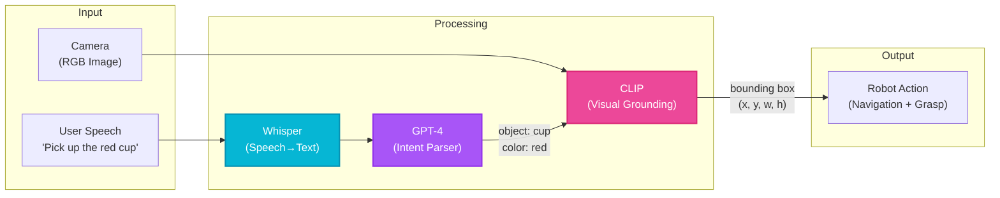

# Week 12: Multi-modal Interactions

## Introduction

The future of human-robot interaction isn't keyboards and buttons—it's natural conversation, gestures, and visual understanding. <span className="highlight-purple">**Vision-Language-Action (VLA)**</span> systems enable robots to understand: "Pick up the red cup on the left table and bring it to me."

This week integrates three modalities:
- **Vision**: Scene understanding, object detection, pose estimation
- **Language**: Natural language processing, intent recognition
- **Action**: Translating high-level commands to robot motions

You'll implement VLA pipelines using state-of-the-art models (CLIP, Whisper, GPT-4 Vision) and deploy them on humanoid robots for intuitive interaction.

## Learning Objectives

- **Integrate** vision-language models (CLIP, GPT-4 Vision) with ROS 2
- **Implement** speech recognition (Whisper) for voice commands
- **Deploy** gesture recognition for non-verbal interaction
- **Create** VLA pipelines that map language to robotic actions
- **Optimize** multi-modal fusion for real-time performance

## Vision-Language Models

### CLIP: Connecting Vision and Language

**CLIP (Contrastive Language-Image Pretraining)** learns to match images with text descriptions. Use cases:
- Zero-shot object detection: "Find the stapler" without training on staplers
- Scene understanding: "Is this a kitchen or bedroom?"
- Visual grounding: "The cup **on the left**"



**Diagram:** Vision-Language-Action pipeline combining speech recognition (Whisper), language understanding (GPT-4), and visual grounding (CLIP) to execute robotic tasks.

### Code Example: CLIP for Object Detection

```python
#!/usr/bin/env python3

import rclpy
from rclpy.node import Node
from sensor_msgs.msg import Image
from cv_bridge import CvBridge
import torch
import clip
from PIL import Image as PILImage
import numpy as np


class CLIPDetector(Node):
    def __init__(self):
        super().__init__('clip_detector')

        # Load CLIP model
        self.device = "cuda" if torch.cuda.is_available() else "cpu"
        self.model, self.preprocess = clip.load("ViT-B/32", device=self.device)

        # Subscribe to camera
        self.image_sub = self.create_subscription(
            Image, '/camera/image_raw', self.image_callback, 10
        )

        self.bridge = CvBridge()

        # Target objects to detect
        self.text_prompts = ["a red cup", "a blue bottle", "a laptop", "a book"]
        self.text_tokens = clip.tokenize(self.text_prompts).to(self.device)

    def image_callback(self, msg):
        """Detect objects in image using CLIP"""

        # Convert ROS Image to PIL
        cv_image = self.bridge.imgmsg_to_cv2(msg, "rgb8")
        pil_image = PILImage.fromarray(cv_image)

        # Preprocess for CLIP
        image_input = self.preprocess(pil_image).unsqueeze(0).to(self.device)

        # Compute similarity scores
        with torch.no_grad():
            image_features = self.model.encode_image(image_input)
            text_features = self.model.encode_text(self.text_tokens)

            # Cosine similarity
            similarity = (100.0 * image_features @ text_features.T).softmax(dim=-1)

        # Get top match
        values, indices = similarity[0].topk(1)
        top_match = self.text_prompts[indices[0]]
        confidence = values[0].item()

        self.get_logger().info(
            f'Detected: {top_match} (confidence: {confidence:.2%})'
        )


def main():
    rclpy.init()
    detector = CLIPDetector()
    rclpy.spin(detector)
    detector.destroy_node()
    rclpy.shutdown()


if __name__ == '__main__':
    main()
```

### GPT-4 Vision for Scene Understanding

```python
import openai
import base64

class GPT4VisionNode(Node):
    def __init__(self):
        super().__init__('gpt4_vision')
        openai.api_key = "YOUR_API_KEY"

    def analyze_scene(self, image_path):
        """Ask GPT-4 Vision about the scene"""

        # Encode image to base64
        with open(image_path, "rb") as image_file:
            base64_image = base64.b64encode(image_file.read()).decode('utf-8')

        response = openai.ChatCompletion.create(
            model="gpt-4-vision-preview",
            messages=[
                {
                    "role": "user",
                    "content": [
                        {"type": "text", "text": "Describe this scene for a robot. List objects and their locations."},
                        {
                            "type": "image_url",
                            "image_url": {"url": f"data:image/jpeg;base64,{base64_image}"}
                        }
                    ]
                }
            ],
            max_tokens=300
        )

        description = response.choices[0].message.content
        self.get_logger().info(f'Scene: {description}')
        return description
```

## Speech Recognition with Whisper

### OpenAI Whisper Integration

```python
#!/usr/bin/env python3

import rclpy
from rclpy.node import Node
from std_msgs.msg import String
import whisper
import sounddevice as sd
import numpy as np
import tempfile
import wave


class WhisperSpeechRecognition(Node):
    def __init__(self):
        super().__init__('whisper_speech')

        # Load Whisper model (base = good balance of speed/accuracy)
        self.model = whisper.load_model("base")

        # Publisher for transcribed text
        self.text_pub = self.create_publisher(String, '/speech/text', 10)

        # Parameters
        self.sample_rate = 16000  # Whisper expects 16kHz
        self.duration = 3  # Record 3-second chunks

        # Start listening
        self.create_timer(3.0, self.record_and_transcribe)

        self.get_logger().info('Whisper speech recognition started')

    def record_and_transcribe(self):
        """Record audio and transcribe with Whisper"""

        # Record audio
        self.get_logger().info('Listening...')
        audio = sd.rec(
            int(self.duration * self.sample_rate),
            samplerate=self.sample_rate,
            channels=1,
            dtype='int16'
        )
        sd.wait()

        # Save to temporary file
        with tempfile.NamedTemporaryFile(suffix=".wav", delete=False) as f:
            with wave.open(f.name, 'wb') as wf:
                wf.setnchannels(1)
                wf.setsampwidth(2)  # 16-bit
                wf.setframerate(self.sample_rate)
                wf.writeframes(audio.tobytes())

            # Transcribe
            result = self.model.transcribe(f.name, language='en')
            text = result["text"].strip()

            if text:
                self.get_logger().info(f'Heard: "{text}"')

                # Publish transcription
                msg = String()
                msg.data = text
                self.text_pub.publish(msg)


def main():
    rclpy.init()
    node = WhisperSpeechRecognition()
    rclpy.spin(node)
    node.destroy_node()
    rclpy.shutdown()


if __name__ == '__main__':
    main()
```

### Wake Word Detection

```python
import pvporcupine

class WakeWordDetector(Node):
    def __init__(self):
        super().__init__('wake_word')

        # Initialize Porcupine (wake word engine)
        self.porcupine = pvporcupine.create(
            keywords=["hey robot"]  # Custom wake word
        )

        self.audio_stream = sd.InputStream(
            samplerate=self.porcupine.sample_rate,
            channels=1,
            callback=self.audio_callback
        )
        self.audio_stream.start()

    def audio_callback(self, indata, frames, time, status):
        """Check for wake word"""

        # Convert to int16
        pcm = np.frombuffer(indata, dtype=np.int16)

        keyword_index = self.porcupine.process(pcm)

        if keyword_index >= 0:
            self.get_logger().info('Wake word detected!')
            # Start full speech recognition
```

## Gesture Recognition

### MediaPipe Hand Tracking

```python
import mediapipe as mp
from mediapipe.tasks import python
from mediapipe.tasks.python import vision


class GestureRecognizer(Node):
    def __init__(self):
        super().__init__('gesture_recognizer')

        # Load MediaPipe gesture recognizer
        base_options = python.BaseOptions(
            model_asset_path='gesture_recognizer.task'
        )
        options = vision.GestureRecognizerOptions(
            base_options=base_options,
            running_mode=vision.RunningMode.VIDEO
        )
        self.recognizer = vision.GestureRecognizer.create_from_options(options)

        # Subscribe to camera
        self.image_sub = self.create_subscription(
            Image, '/camera/image_raw', self.image_callback, 10
        )

        self.bridge = CvBridge()

    def image_callback(self, msg):
        """Recognize gestures in image"""

        # Convert to MediaPipe format
        cv_image = self.bridge.imgmsg_to_cv2(msg, "rgb8")
        mp_image = mp.Image(image_format=mp.ImageFormat.SRGB, data=cv_image)

        # Recognize
        result = self.recognizer.recognize(mp_image)

        if result.gestures:
            top_gesture = result.gestures[0][0]
            self.get_logger().info(
                f'Gesture: {top_gesture.category_name} '
                f'(confidence: {top_gesture.score:.2%})'
            )

            # Map gesture to command
            self.execute_gesture_command(top_gesture.category_name)

    def execute_gesture_command(self, gesture):
        """Map gesture to robot action"""

        gesture_map = {
            "Thumb_Up": "confirm_action",
            "Open_Palm": "stop",
            "Pointing_Up": "move_forward",
            "Victory": "take_photo",
        }

        if gesture in gesture_map:
            command = gesture_map[gesture]
            self.get_logger().info(f'Executing: {command}')
            # Publish command to action server
```

## VLA Pipeline: Language to Action

### Intent Recognition

```python
class IntentParser(Node):
    def __init__(self):
        super().__init__('intent_parser')

        # Subscribe to speech transcriptions
        self.speech_sub = self.create_subscription(
            String, '/speech/text', self.parse_intent, 10
        )

        # Action client for robot commands
        self.nav_client = ActionClient(self, NavigateToPose, '/navigate_to_pose')

    def parse_intent(self, msg):
        """Extract intent and entities from speech"""

        text = msg.data.lower()

        # Simple keyword-based parsing (use LLM for production)
        if "pick up" in text or "grab" in text:
            # Extract object
            object_name = self.extract_object(text)
            self.execute_pick_task(object_name)

        elif "go to" in text or "navigate to" in text:
            location = self.extract_location(text)
            self.execute_navigation(location)

        elif "bring me" in text:
            object_name = self.extract_object(text)
            self.execute_fetch_task(object_name)

    def extract_object(self, text):
        """Extract object name from text"""
        # Use spaCy NER or GPT for better extraction
        objects = ["cup", "bottle", "book", "phone"]
        for obj in objects:
            if obj in text:
                return obj
        return None

    def execute_pick_task(self, object_name):
        """Execute pick-and-place task"""
        self.get_logger().info(f'Picking up {object_name}...')
        # 1. Detect object with CLIP
        # 2. Plan grasp with cuMotion
        # 3. Execute
```

### LLM-Based Action Planning

```python
def plan_task_with_llm(self, user_command):
    """Use GPT-4 to decompose command into action sequence"""

    prompt = f"""
You are a robot assistant. Break down this command into a sequence of primitive actions.

Available actions:
- navigate_to(location)
- detect_object(object_name)
- grasp_object()
- place_object(location)
- say(text)

User command: "{user_command}"

Output format (JSON):
{{"actions": [{{"type": "navigate_to", "params": {{"location": "kitchen"}}}}, ...]}}
"""

    response = openai.ChatCompletion.create(
        model="gpt-4",
        messages=[{"role": "user", "content": prompt}],
        max_tokens=200
    )

    # Parse JSON response
    import json
    plan = json.loads(response.choices[0].message.content)

    return plan["actions"]
```

## Multi-Modal Fusion

### Combining Vision, Speech, and Gesture

```python
class MultiModalFusion(Node):
    def __init__(self):
        super().__init__('multimodal_fusion')

        # Inputs
        self.speech_sub = self.create_subscription(String, '/speech/text', self.on_speech, 10)
        self.gesture_sub = self.create_subscription(String, '/gesture', self.on_gesture, 10)
        self.vision_sub = self.create_subscription(String, '/detected_objects', self.on_vision, 10)

        # State
        self.last_speech = None
        self.last_gesture = None
        self.detected_objects = []

    def on_speech(self, msg):
        self.last_speech = msg.data

        # Check if gesture and speech combined provide complete command
        if self.last_gesture and "that" in self.last_speech:
            # "Pick up that" + pointing gesture
            self.execute_multimodal_command()

    def execute_multimodal_command(self):
        """Resolve 'that' pronoun using gesture pointing direction"""

        # Use gesture to determine which object
        # (In production, raycast from hand direction to find nearest object)
        target_object = self.detected_objects[0]  # Simplified

        self.get_logger().info(
            f'Multimodal command: {self.last_speech} → Targeting {target_object}'
        )
```

## Self-Assessment Questions

1. **How does CLIP enable zero-shot object detection?**
   <details>
   <summary>Answer</summary>
   CLIP learns a shared embedding space for images and text during pretraining on 400M image-text pairs. At inference, you provide text descriptions (e.g., "a red cup") without training on that specific object class. CLIP computes cosine similarity between image embeddings and text embeddings—highest similarity indicates the match. This eliminates the need for object-specific training datasets. However, accuracy is lower than supervised detectors (e.g., YOLO trained on cups), making CLIP best for flexible, open-vocabulary detection where training data is unavailable.
   </details>

2. **Why is Whisper better than traditional speech recognition for robotics?**
   <details>
   <summary>Answer</summary>
   Whisper is trained on 680,000 hours of multilingual data with robust noise handling, making it work in real-world environments (background noise, accents, varying audio quality) where traditional ASR fails. It supports 99 languages out-of-the-box, critical for global robot deployment. Whisper also handles non-standard speech (stammering, code-switching) better. Additionally, it's open-source and runs locally (no cloud dependency), which is essential for privacy and low-latency robot interaction.
   </details>

3. **What is the advantage of using an LLM (GPT-4) for action planning instead of hardcoded rules?**
   <details>
   <summary>Answer</summary>
   LLMs handle ambiguous, complex commands that hardcoded rules can't parse: "Tidy up the living room"—what does "tidy" mean? An LLM can decompose this into: (1) detect misplaced objects, (2) classify object types, (3) infer target locations (books → shelf), (4) plan pick-and-place sequences. Hardcoded rules would require manually encoding every variation of "tidy," "clean up," "organize." LLMs also generalize to novel commands via in-context learning, whereas rules require explicit programming for each new task.
   </details>

4. **Why combine gesture and speech recognition instead of using only one modality?**
   <details>
   <summary>Answer</summary>
   Multimodal input is more robust and natural. Speech alone fails with pronouns ("pick up that") without pointing. Gestures alone are ambiguous (pointing could mean "go there" or "pick that up"). Combining modalities resolves ambiguity: speech provides intent, gesture specifies target. This mirrors human communication—we naturally point while saying "that cup." Additionally, multimodal systems handle partial failures: if speech recognition fails in a noisy environment, gestures provide fallback. Fusion improves accuracy and user experience.
   </details>

5. **What latency challenges arise when deploying VLA pipelines on humanoid robots?**
   <details>
   <summary>Answer</summary>
   VLA pipelines involve sequential processing: (1) speech recognition (Whisper: 0.5-2s for 3s audio), (2) LLM intent parsing (GPT-4: 1-3s API latency), (3) vision processing (CLIP: 50-100ms), (4) motion planning (cuMotion: 100-500ms). Total: 2-6 seconds from speech to action start—unacceptably slow for natural interaction. Optimizations: (1) Use smaller local models (GPT-2 instead of GPT-4), (2) Cache common commands, (3) Pipeline parallelism (start vision processing during speech transcription), (4) Predictive action (prepare likely actions during user speech). Target: &lt;1s total latency for fluid interaction.
   </details>

## Summary

- **Vision-language models** (CLIP, GPT-4 Vision) enable flexible object understanding
- **Whisper** provides robust speech recognition in noisy environments
- **Gesture recognition** (MediaPipe) allows non-verbal interaction
- **VLA pipelines** translate natural language to robot actions
- **Multimodal fusion** combines modalities for robust, intuitive commands

## Next Steps

Week 13: **Conversational Robotics + Capstone Project**—build an end-to-end VLA system integrating everything from this course, culminating in a final demo of a humanoid robot responding to natural voice commands, navigating autonomously, and performing complex manipulation tasks.
