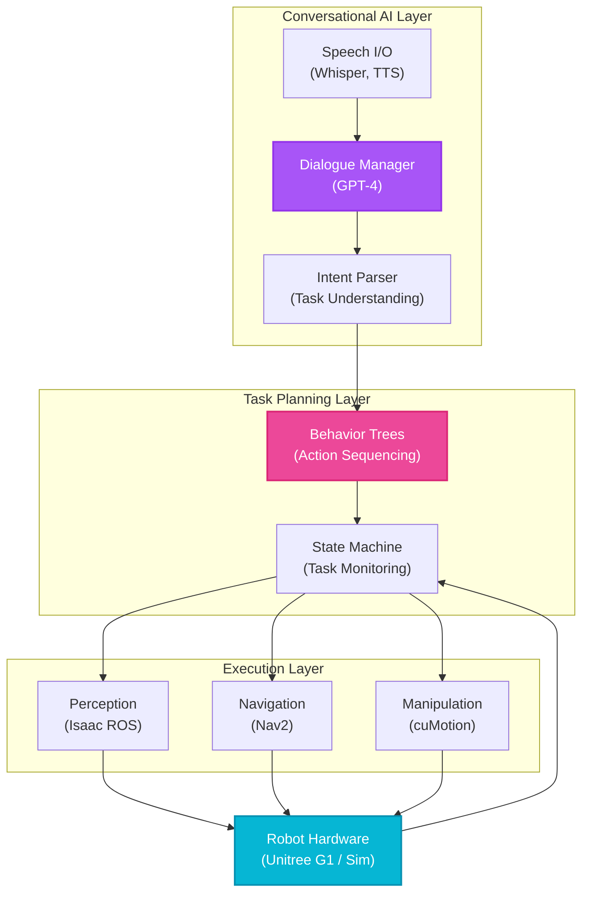

# Week 13: Conversational Robotics + Capstone Project

## Introduction

Welcome to the culmination of your journey into Physical AI and Humanoid Robotics. Over 12 weeks, you've mastered ROS 2, simulation, Isaac perception, and vision-language-action systems. This final week brings it all together in a **capstone project**: a fully autonomous humanoid robot that understands natural language, navigates environments, manipulates objects, and collaborates with humans.

You'll build a conversational robotics system where users interact naturally: "Hey robot, bring me the blue bottle from the kitchen table." The robot will parse the command, plan a multi-step task, execute navigation and manipulation, and provide verbal feedback—all autonomously.

## Learning Objectives

- **Integrate** all course modules (ROS 2, Gazebo, Isaac, VLA) into one system
- **Implement** a conversational AI agent with context-aware dialogue management
- **Deploy** end-to-end task execution from speech input to physical action
- **Demonstrate** robust error handling and recovery behaviors
- **Document** system architecture and present project outcomes

## Capstone Project Specification

### Project Goal

Build an **Intelligent Fetch Robot** that:
1. Accepts natural language commands via speech
2. Understands object references and spatial relationships
3. Navigates to target locations autonomously
4. Manipulates objects (pick and place)
5. Provides spoken feedback during task execution

### Required Capabilities

| Capability | Module Used | Implementation |
|------------|-------------|----------------|
| **Speech Input** | VLA (Week 12) | Whisper + wake word detection |
| **Language Understanding** | VLA (Week 12) | GPT-4 for intent parsing |
| **Visual Perception** | Isaac (Week 9) | CLIP for object detection |
| **Localization** | Isaac (Week 9) | cuVSLAM for mapping |
| **Navigation** | Isaac (Week 10) | Nav2 with behavior trees |
| **Manipulation** | Isaac (Week 10) | cuMotion for motion planning |
| **Simulation** | Gazebo (Weeks 6-7) | Test in virtual environment first |
| **Real Hardware** | Humanoids (Week 11) | Deploy on Unitree G1 / simulation |

### Example Task

**User**: "Hey robot, bring me the red cup from the kitchen counter."

**Robot Execution**:
1. **Parse**: Identify action (fetch), object (red cup), location (kitchen counter), recipient (user)
2. **Plan**: Navigate to kitchen → Detect red cup → Grasp → Navigate to user → Hand over
3. **Execute**: Run Nav2 navigation → Use CLIP to find cup → Execute grasp with cuMotion → Return
4. **Feedback**: "I'm heading to the kitchen... I found the red cup... Bringing it to you now... Here you go!"

## System Architecture

### High-Level Architecture



**Diagram:** Complete conversational robotics system architecture integrating speech, dialogue management, task planning, perception, navigation, and manipulation into a unified autonomous system.

### Data Flow

```
User Speech → Whisper → Text → GPT-4 → Task Plan → Behavior Tree
                                                          ↓
                                         Perception ← Camera/LIDAR
                                              ↓
                                    Object Detection (CLIP)
                                              ↓
                                         Navigation
                                              ↓
                                         Manipulation
                                              ↓
                                      Status → TTS → User
```

## Implementation: Core Components

### 1. Dialogue Manager

```python
#!/usr/bin/env python3

import rclpy
from rclpy.node import Node
from std_msgs.msg import String
import openai


class DialogueManager(Node):
    def __init__(self):
        super().__init__('dialogue_manager')

        openai.api_key = "YOUR_KEY"

        # Conversation history
        self.conversation_history = [
            {"role": "system", "content": """You are a helpful robot assistant.
            You can navigate, pick up objects, and perform household tasks.
            Parse user commands into structured task plans."""}
        ]

        # Subscribers
        self.speech_sub = self.create_subscription(
            String, '/speech/text', self.on_user_speech, 10
        )

        # Publishers
        self.task_plan_pub = self.create_publisher(String, '/task_plan', 10)
        self.tts_pub = self.create_publisher(String, '/robot/speech', 10)

        self.get_logger().info('Dialogue Manager ready')

    def on_user_speech(self, msg):
        """Process user speech and generate task plan"""

        user_input = msg.data
        self.get_logger().info(f'User: {user_input}')

        # Add to conversation
        self.conversation_history.append(
            {"role": "user", "content": user_input}
        )

        # Get LLM response
        response = openai.ChatCompletion.create(
            model="gpt-4",
            messages=self.conversation_history,
            max_tokens=200
        )

        assistant_message = response.choices[0].message.content

        # Add to history
        self.conversation_history.append(
            {"role": "assistant", "content": assistant_message}
        )

        self.get_logger().info(f'Robot: {assistant_message}')

        # Publish task plan
        task_msg = String()
        task_msg.data = assistant_message
        self.task_plan_pub.publish(task_msg)

        # Speak response
        self.speak(assistant_message)

    def speak(self, text):
        """Send text to TTS system"""
        tts_msg = String()
        tts_msg.data = text
        self.tts_pub.publish(tts_msg)


def main():
    rclpy.init()
    manager = DialogueManager()
    rclpy.spin(manager)
    manager.destroy_node()
    rclpy.shutdown()


if __name__ == '__main__':
    main()
```

### 2. Task Executor (Behavior Tree)

```xml
<!-- fetch_object.xml -->

<root main_tree_to_execute="FetchObjectTree">
  <BehaviorTree ID="FetchObjectTree">
    <Sequence name="FetchSequence">

      <!-- Step 1: Navigate to object location -->
      <Action ID="SpeakText" text="I'm heading to the {location}"/>

      <Action ID="NavigateToLocation"
              location="{location}"
              server_name="navigate_to_pose"/>

      <!-- Step 2: Detect object using vision -->
      <Action ID="SpeakText" text="Searching for {object_name}"/>

      <Action ID="DetectObject"
              object_name="{object_name}"
              detection_method="CLIP"/>

      <!-- Step 3: Grasp object -->
      <Action ID="SpeakText" text="I found the {object_name}. Grasping it now."/>

      <Action ID="PlanGrasp"
              object_id="{detected_object_id}"
              planner="cuMotion"/>

      <Action ID="ExecuteGrasp"/>

      <!-- Step 4: Navigate to user -->
      <Action ID="SpeakText" text="Bringing it to you"/>

      <Action ID="NavigateToLocation"
              location="user_location"
              server_name="navigate_to_pose"/>

      <!-- Step 5: Hand over -->
      <Action ID="SpeakText" text="Here you go!"/>

      <Action ID="ReleaseGripper"/>

      <!-- Success -->
      <Action ID="SpeakText" text="Task completed!"/>

    </Sequence>
  </BehaviorTree>

  <!-- Recovery behaviors -->
  <BehaviorTree ID="RecoveryTree">
    <Fallback name="Recovery">
      <Action ID="Spin" angle="360"/>
      <Action ID="Backup" distance="0.5"/>
      <Action ID="SpeakText" text="I need help. Please assist me."/>
    </Fallback>
  </BehaviorTree>
</root>
```

### 3. Text-to-Speech Integration

```python
from gtts import gTTS
import pygame
import tempfile


class TextToSpeech(Node):
    def __init__(self):
        super().__init__('tts')

        pygame.mixer.init()

        self.speech_sub = self.create_subscription(
            String, '/robot/speech', self.speak, 10
        )

    def speak(self, msg):
        """Convert text to speech and play"""

        text = msg.data

        # Generate speech
        tts = gTTS(text=text, lang='en', slow=False)

        # Save to temp file and play
        with tempfile.NamedTemporaryFile(delete=False, suffix='.mp3') as f:
            tts.save(f.name)
            pygame.mixer.music.load(f.name)
            pygame.mixer.music.play()

            # Wait for playback to finish
            while pygame.mixer.music.get_busy():
                pygame.time.Clock().tick(10)
```

### 4. Integration Launch File

```python
# launch/capstone.launch.py

from launch import LaunchDescription
from launch_ros.actions import Node, ComposableNodeContainer
from launch.actions import IncludeLaunchDescription
from launch.launch_description_sources import PythonLaunchDescriptionSource
import os


def generate_launch_description():
    return LaunchDescription([
        # 1. Perception (Isaac ROS)
        IncludeLaunchDescription(
            PythonLaunchDescriptionSource('isaac_perception.launch.py')
        ),

        # 2. Navigation (Nav2)
        IncludeLaunchDescription(
            PythonLaunchDescriptionSource('nav2_bringup.launch.py')
        ),

        # 3. Manipulation (cuMotion via MoveIt)
        Node(
            package='moveit_ros_move_group',
            executable='move_group',
            output='screen'
        ),

        # 4. VLA Components
        Node(
            package='my_robot_pkg',
            executable='whisper_speech',
            name='speech_recognition',
            output='screen'
        ),

        Node(
            package='my_robot_pkg',
            executable='dialogue_manager',
            name='dialogue_manager',
            output='screen'
        ),

        Node(
            package='my_robot_pkg',
            executable='tts',
            name='text_to_speech',
            output='screen'
        ),

        # 5. Behavior Tree Executor
        Node(
            package='nav2_bt_navigator',
            executable='bt_navigator',
            name='bt_navigator',
            parameters=[{
                'default_bt_xml_filename': '/path/to/fetch_object.xml'
            }],
            output='screen'
        ),

        # 6. Task Coordinator
        Node(
            package='my_robot_pkg',
            executable='task_executor',
            name='task_executor',
            output='screen'
        ),
    ])
```

## Testing Strategy

### Phase 1: Simulation Testing

```bash
# 1. Launch Isaac Sim with warehouse environment
./isaac-sim.sh --python warehouse_scene.py

# 2. Launch full stack
ros2 launch my_robot_pkg capstone.launch.py use_sim_time:=true

# 3. Test individual components
ros2 topic echo /speech/text  # Verify speech recognition
ros2 topic echo /detected_objects  # Verify object detection
ros2 topic echo /robot/speech  # Verify TTS

# 4. Send test command
ros2 topic pub /speech/text std_msgs/String "data: 'Bring me the red cup'"

# 5. Verify behavior tree execution
ros2 run nav2_bt_navigator bt_navigator_status

# Expected: Robot navigates, detects cup, grasps, returns
```

### Phase 2: Hardware Deployment

```bash
# 1. Deploy to Jetson Orin Nano (on Unitree G1)
ssh unitree@192.168.123.161

# 2. Launch perception stack
ros2 launch my_robot_pkg jetson_perception.launch.py

# 3. On workstation, launch high-level planning
ros2 launch my_robot_pkg dialogue_manager.launch.py

# 4. Test with real speech
# (Speak into microphone: "Hey robot, pick up the bottle")

# 5. Monitor performance
jtop  # Check Jetson resource usage
ros2 topic hz /camera/image_raw  # Verify 10+ FPS
```

## Evaluation Criteria

### Functionality (60 points)

- [ ] Speech recognition accuracy >90% in quiet environment
- [ ] Intent parsing correctly identifies object + location
- [ ] Navigation reaches target within 0.3m accuracy
- [ ] Object detection finds correct object >80% of time
- [ ] Grasp succeeds without dropping object
- [ ] TTS provides clear, understandable feedback

### Robustness (20 points)

- [ ] Handles "object not found" gracefully
- [ ] Recovers from navigation failures (obstacle avoidance)
- [ ] Provides useful error messages to user
- [ ] Completes task within 5 minutes end-to-end

### Technical Quality (10 points)

- [ ] Code is well-documented with comments
- [ ] ROS 2 best practices (QoS, parameters, launch files)
- [ ] Modular architecture (reusable components)

### Presentation (10 points)

- [ ] Clear system architecture diagram
- [ ] Video demonstration (5-10 minutes)
- [ ] Discussion of challenges and solutions

## Common Challenges & Solutions

### Challenge 1: Speech Recognition in Noisy Environments

**Solution**: Add noise filtering (e.g., `noisereduce` library) before Whisper:

```python
import noisereduce as nr

# Apply noise reduction
reduced_audio = nr.reduce_noise(y=audio, sr=sample_rate)
```

### Challenge 2: Object Detection False Positives

**Solution**: Multi-stage verification:
1. CLIP for initial detection
2. Depth check to confirm object distance
3. Secondary verification with different prompt

### Challenge 3: Manipulation Collisions

**Solution**: Conservative safety margins in cuMotion:

```python
collision_check_distance: 0.05  # 5cm buffer instead of 1cm
```

### Challenge 4: Latency in VLA Pipeline

**Solution**: Pipeline parallelism:

```python
# Start object detection while still navigating
# (Instead of waiting for navigation to complete)
```

## Extensions & Advanced Features

1. **Multi-object fetch**: "Bring me the cup and the book"
2. **Conditional logic**: "If you find the red cup, bring it; otherwise bring the blue one"
3. **Learning from demonstration**: Show robot task once, it learns
4. **Multi-robot coordination**: Two robots collaborate on task
5. **Long-term memory**: Robot remembers object locations across sessions

## Self-Assessment Questions

1. **How would you handle ambiguous commands like "bring me that"?**
   <details>
   <summary>Answer</summary>
   Use multimodal fusion: (1) If user is pointing (gesture recognition), use pointing direction to disambiguate. (2) If no gesture, use dialogue history (what was last discussed?). (3) Ask clarifying question: "Which object do you mean?" with TTS. (4) Use visual saliency (which object is most prominent in view?). Best practice: Always confirm before executing: "I'll bring the red cup. Is that correct?"
   </details>

2. **What is the tradeoff between using GPT-4 vs GPT-2 for intent parsing?**
   <details>
   <summary>Answer</summary>
   **GPT-4**: Higher accuracy, better reasoning, handles complex commands. **Downsides**: 1-3s API latency, costs ($0.01-0.03 per request), requires internet. **GPT-2**: Lower accuracy, simpler reasoning. **Benefits**: &lt;100ms local inference, free, works offline. **Recommendation**: Use GPT-2 for simple commands (detect keywords), fallback to GPT-4 for complex queries. Or fine-tune GPT-2 on robot-specific data for best of both worlds.
   </details>

3. **How would you debug a behavior tree that gets stuck at a particular node?**
   <details>
   <summary>Answer</summary>
   (1) Enable BT logging: `ros2 run nav2_bt_navigator bt_navigator --ros-args -p enable_debug_logging:=true`. (2) Visualize tree state in Groot (BT visualizer): see which node is active/failed. (3) Check node preconditions: Are all required topics publishing? Are action servers responsive? (4) Add timeout guards: If node doesn't complete in N seconds, force failure and trigger recovery. (5) Test node in isolation: Run the action server separately and send test goals.
   </details>

4. **Why is it important to test in simulation before deploying to real hardware?**
   <details>
   <summary>Answer</summary>
   (1) **Safety**: Bugs in control code can damage expensive hardware ($16K+ for Unitree G1) or injure people. (2) **Iteration speed**: Simulation allows 10x faster testing (no robot setup, instant resets). (3) **Edge case coverage**: Test 100+ scenarios (narrow doorways, slippery floors, varied lighting) quickly. (4) **Cost**: Simulation is free; real robot testing wears components (batteries, motors). (5) **Debugging**: Easier to inspect internal state, pause, replay. Always validate core logic in sim before real deployment.
   </details>

5. **What are the ethical considerations when deploying conversational humanoid robots in homes?**
   <details>
   <summary>Answer</summary>
   (1) **Privacy**: Robots with cameras/microphones record private moments—require clear data policies, local processing (no cloud upload). (2) **Trust**: Robots must be predictable; unexpected behaviors erode trust (e.g., moving while family sleeps). (3) **Accessibility**: Ensure speech interfaces work for accented speech, elderly users, people with disabilities. (4) **Safety**: Implement multiple emergency stop mechanisms; robots must never harm humans (even accidentally). (5) **Transparency**: Users should understand what the robot can/cannot do to avoid misplaced trust.
   </details>

## Summary

This capstone integrates everything you've learned:

- **ROS 2** provides the middleware foundation
- **Gazebo/Isaac Sim** enable safe testing environments
- **Isaac ROS** delivers GPU-accelerated perception
- **Nav2 + cuMotion** handle navigation and manipulation
- **VLA** enables natural language interaction

## Congratulations!

You've completed the Physical AI & Humanoid Robotics course. You now possess the skills to:

- Build ROS 2 systems from scratch
- Simulate robots in Gazebo and Isaac Sim
- Deploy perception stacks on NVIDIA hardware
- Create vision-language-action systems
- Work with real humanoid platforms

### Next Steps in Your Journey

1. **Contribute to open source**: Join ROS 2, Isaac ROS, or MoveIt communities
2. **Research**: Explore cutting-edge topics (whole-body MPC, VLA foundation models)
3. **Industry**: Apply skills at robotics companies (Boston Dynamics, Tesla, Agility Robotics)
4. **Entrepreneurship**: Build your own robotics startup
5. **Education**: Teach others and advance the field

**The future of Physical AI is in your hands. Build responsibly, innovate boldly, and shape a world where humans and robots collaborate seamlessly.**

---

## Capstone Submission Checklist

- [ ] Code repository with README (GitHub/GitLab)
- [ ] System architecture diagram
- [ ] Video demonstration (5-10 minutes)
- [ ] Technical report (5-10 pages) covering:
  - System design
  - Implementation challenges
  - Evaluation results
  - Future improvements
- [ ] Optional: Live demo session

**Good luck with your capstone project!**
