# Welcome to Physical AI & Humanoid Robotics

  
  
.

## 🚀 About This Textbook

Welcome to the **Physical AI & Humanoid Robotics** course—an AI-native, interactive textbook designed to take you from foundational concepts to advanced humanoid robot development. This isn't just theory; you'll gain hands-on experience with the cutting-edge technologies shaping the future of intelligent machines.

### 🎯 What You'll Learn

- **ROS 2 Fundamentals**: Master the Robotic Operating System that powers modern robots
- **Robot Simulation**: Build and test robots in Gazebo before deploying to real hardware
- **NVIDIA Isaac Platform**: Leverage GPU-accelerated perception and simulation
- **Vision-Language-Action (VLA)**: Create robots that understand vision, language, and execute actions
- **Humanoid Development**: Design and program bipedal robots like Unitree G1

## 🤖 The Future of Work

  

The future of work involves **partnership between humans, AI agents, and robots**. Physical AI represents the next frontier—where artificial intelligence gains a body, senses, and the ability to interact with the physical world.

:::tip Why Physical AI Matters
Traditional AI lives in the cloud, processing data. **Physical AI** lives in the real world, perceiving environments through sensors, making decisions, and taking actions through actuators. This embodied intelligence is transforming industries from manufacturing to healthcare.
:::

## 📚 Course Structure

This textbook is organized into **4 comprehensive modules** across **13 weeks**:

```mermaid
flowchart LR
    subgraph Module1["Module 1: ROS 2 (Weeks 1-5)"]
        W1["Week 1<br/>Physical AI Intro"]
        W2["Week 2<br/>AI Landscape"]
        W3["Week 3<br/>ROS 2 Architecture"]
        W4["Week 4<br/>Topics & Services"]
        W5["Week 5<br/>Advanced Patterns"]
    end

    subgraph Module2["Module 2: Gazebo (Weeks 6-7)"]
        W6["Week 6<br/>Simulation Fundamentals"]
        W7["Week 7<br/>URDF Modeling"]
    end

    subgraph Module3["Module 3: Isaac (Weeks 8-10)"]
        W8["Week 8<br/>Isaac Platform"]
        W9["Week 9<br/>Isaac SDK & Perception"]
        W10["Week 10<br/>Advanced Features"]
    end

    subgraph Module4["Module 4: VLA (Weeks 11-13)"]
        W11["Week 11<br/>Humanoid Development"]
        W12["Week 12<br/>Multi-modal VLA"]
        W13["Week 13<br/>Capstone Project"]
    end

    W1 --> W2 --> W3 --> W4 --> W5
    W5 --> W6 --> W7
    W7 --> W8 --> W9 --> W10
    W10 --> W11 --> W12 --> W13

    style Module1 fill:#1a1a2e,stroke:#a855f7,stroke-width:2px
    style Module2 fill:#1a1a2e,stroke:#ec4899,stroke-width:2px
    style Module3 fill:#1a1a2e,stroke:#06b6d4,stroke-width:2px
    style Module4 fill:#1a1a2e,stroke:#10b981,stroke-width:2px
```

**Course Roadmap:** Progressive 13-week curriculum from Physical AI fundamentals through ROS 2, simulation, Isaac platform, to advanced Vision-Language-Action systems.

### Module 1: The Robotic Nervous System (ROS 2)
**Weeks 1-5** | Foundation

Learn the core framework that connects sensors, decision-making, and actuators. You'll master ROS 2 architecture, nodes, topics, services, and advanced patterns.

[Start Module 1 →](/docs/Module-1-ROS2/week-01-intro-physical-ai)

---

### Module 2: The Digital Twin (Gazebo & Unity)
**Weeks 6-7** | Simulation

Build virtual replicas of robots to test algorithms safely and cost-effectively. Master URDF modeling, physics simulation, and sensor integration.

[Start Module 2 →](/docs/Module-2-GAZEBO/week-06-gazebo-fundamentals)

---

### Module 3: The AI-Robot Brain (NVIDIA Isaac™)
**Weeks 8-10** | Intelligence

Leverage GPU-accelerated AI for real-time perception, navigation, and manipulation. Deploy models to Jetson edge devices for autonomous operation.

[Start Module 3 →](/docs/Module-3-ISAAC/week-08-isaac-intro)

---

### Module 4: Vision-Language-Action (VLA)
**Weeks 11-13** | Advanced Integration

Create robots that perceive through vision, understand natural language, and execute complex actions. Culminates in a full-stack conversational robot capstone project.

[Start Module 4 →](/docs/Module-4-VLA/week-11-humanoid-development)

---

## 🎓 Learning Approach

This textbook follows **progressive complexity**:

1. **Week 1-2**: Fundamental concepts and embodied intelligence
2. **Weeks 3-10**: Core technical skills (ROS 2, Gazebo, Isaac)
3. **Weeks 11-13**: Advanced integration and capstone project

Each week includes:
- 📖 **Theory**: Clear explanations with real-world context
- 💻 **Runnable Code**: Python and XML examples you can execute
- 🎨 **Visual Aids**: Diagrams and architecture visuals
- ✅ **Self-Assessment**: Questions to validate your understanding

## 🛠️ Prerequisites

To get the most from this course, you should have:

- **Programming**: Basic Python knowledge (loops, functions, classes)
- **Command Line**: Comfortable with terminal/bash commands
- **Mathematics**: High school algebra and basic linear algebra (vectors, matrices)
- **Curiosity**: Passion for robotics and AI!

:::info No Robotics Experience Required
This textbook starts from first principles. Whether you're coming from software engineering, AI/ML, or are completely new to robotics—we'll guide you step by step.
:::

## 🚀 Ready to Begin?

<a href="/docs/module-1-ros2/week-01-intro-physical-ai" className="button button--primary button--lg">
  Start Week 1: Introduction to Physical AI
</a>

<a href="https://github.com/your-org/physical-ai-textbook" className="button button--secondary button--lg">
  View on GitHub
</a>

---

## 💡 Interactive Learning Features

This AI-native textbook includes:

- **📝 Embedded RAG Chatbot**: Ask questions and get answers sourced directly from book content
- **🎯 Text Selection Q&A**: Highlight any text and ask for clarification
- **🌐 Multi-language Support**: Available in English (Urdu translation available)
- **🎨 Personalization**: Content adapts to your skill level (with authentication)

  
  
The convergence of AI, robotics, and human intelligence is creating unprecedented opportunities

---

### 📬 Stay Connected

- **GitHub**: [Physical AI Textbook Repository](https://github.com/your-org/physical-ai-textbook)
- **ROS 2**: [Official Documentation](https://docs.ros.org/)
- **NVIDIA Isaac**: [Developer Resources](https://developer.nvidia.com/isaac)

**Let's build the future of intelligent robotics together!** 🤖✨
