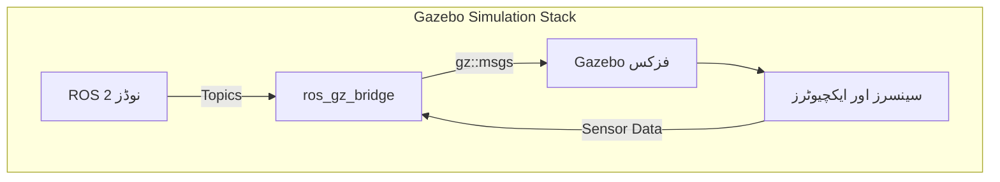

# گیزبو اور URDF کے ساتھ روبوٹ سمولیشن

## تعارف

حقیقی ہارڈویئر پر روبوٹکس الگورتھم کی جانچ کرنا مہنگا، وقت طلب اور خطرناک ہے۔ **سمولیشن** ورچوئل ماحول بنا کر اسے حل کرتی ہے جہاں آپ نتائج کی پرواہ کیے بغیر ٹیسٹ کر سکتے ہیں، اعادہ کر سکتے ہیں اور چیزیں توڑ سکتے ہیں۔ یہ **ڈیجیٹل ٹوئن (Digital Twin)** کا جوہر ہے۔

اس سبق میں، ہم دو اہم مہارتوں کا احاطہ کریں گے:
1.  **گیزبو (Gazebo)**: فزکس انجن اور انوائرمنٹ سمیلیٹر۔
2.  **URDF**: روبوٹ کی طبعی ساخت کو بیان کرنے کا معیاری طریقہ۔

## سیکھنے کے مقاصد

اس سبق کے اختتام تک، آپ اس قابل ہو جائیں گے کہ:
- **سمجھیں** گیزبو آرکیٹیکچر اور فزکس انجن کو۔
- **تخلیق کریں** خطوں اور روشنی کے ساتھ کسٹم گیزبو کی دنیا۔
- **بیان کریں** URDF (لنکس، جوائنٹس، انرشل پراپرٹیز) کا استعمال کرتے ہوئے روبوٹ ماڈلز کو۔
- **استعمال کریں XACRO** کو ماڈیولر، قابل دیکھ بھال روبوٹ کی تفصیل ینانے کے لیے۔
- **ضم کریں** ROS 2 کے ساتھ مصنوعی سینسرز (کیمرے، LIDAR) کو۔

## گیزبو سمولیشن کے بنیادی اصول

**گیزبو** انڈسٹری کا معیاری روبوٹ سمیلیٹر ہے۔ یہ کلائنٹ-سرور آرکیٹیکچر پر کام کرتا ہے:

- **gzserver**: فزکس لوپ اور سینسر جنریشن چلاتا ہے۔
- **gzclient**: گرافیکل انٹرفیس جو منظر پیش کرتا ہے۔

### گیزبو آرکیٹیکچر اور دی برج

گیزبو اپنی ٹرانسپورٹ پرت استعمال کرتا ہے۔ ROS 2 سے بات کرنے کے لیے، ہم `ros_gz_bridge` استعمال کرتے ہیں۔



### فزکس انجن

گیزبو ایک سے زیادہ فزکس بیک اینڈز کو سپورٹ کرتا ہے:
- **ODE**: تیز، مستحکم، عام روبوٹکس کے لیے اچھا (پہلے سے طے شدہ)۔
- **Bullet**: نرم جسموں کے لیے اچھا ہے۔
- **DART**: ہیرا پھیری اور ہیومنائیڈز کے لیے اعلی درستگی۔

:::tip Physics Tuning
`max_step_size` پیرامیٹر تخروپن کی درستگی کی وضاحت کرتا ہے۔ 1ms (0.001s) معیاری ہے۔ تیز روبوٹس کے لیے، 0.5ms استعمال کریں۔
:::

## URDF ماڈلنگ

روبوٹ کی تقلید (simulate) کرنے کے لیے، ہمیں اس کی وضاحت کرنی چاہیے۔ ہم **URDF** (یونیفائیڈ روبوٹ ڈسکشن فارمیٹ) استعمال کرتے ہیں۔ یہ ایک XML فائل ہے جو روبوٹ کی طبعی خصوصیات کی وضاحت کرتی ہے۔


### لنکس اور جوائنٹس

- **لنک (Link)**: ایک سخت جسم (جیسے بازو، پہیہ)۔ اس میں ہونا ضروری ہے:
    - `<visual>`: یہ کیسا لگتا ہے۔
    - `<collision>`: فزکس انجن کے لیے طبعی شکل۔
    - `<inertial>`: ماس اور انرشا ٹینسر۔
- **جوائنٹ (Joint)**: لنکس کے درمیان کنکشن (revolute, continuous, fixed)۔

### کم سے کم URDF مثال

```xml title="simple_bot.urdf"
<robot name="simple_bot">
  <!-- Base Link -->
  <link name="base_link">
    <visual>
      <geometry><box size="0.5 0.3 0.1"/></geometry>
    </visual>
    <collision>
      <geometry><box size="0.5 0.3 0.1"/></geometry>
    </collision>
    <inertial>
      <mass value="5.0"/>
      <inertia ixx="0.1" ixy="0" ixz="0" iyy="0.1" iyz="0" izz="0.1"/>
    </inertial>
  </link>
</robot>
```

:::warning فزکس کے معاملات
اگر آپ `<inertial>` ٹیگز کو چھوڑ دیتے ہیں، تو گیزبو لنکس کو بے وزن سمجھے گا، جس کی وجہ سے روبوٹ تیرنے یا اڑ جائے گا!
:::

## ماڈیولرٹی کے لیے XACRO کا استعمال

خام URDF لکھنے سے ڈپلیکیشن کی اجازت ملتی ہے (مثلاً، 4 ایک جیسے پہیوں کی وضاحت کرنا)۔ **XACRO** (XML میکرو) اسے حل کرتا ہے۔

### مثال: پیرامیٹرائزڈ وہیل میکرو

```xml
<xacro:macro name="wheel" params="prefix reflect">
    <link name="${prefix}_wheel">
        <visual>
            <geometry><cylinder radius="0.1" length="0.05"/></geometry>
        </visual>
        <!-- Collision & Inertial omitted for brevity -->
    </link>
    <joint name="${prefix}_wheel_joint" type="continuous">
        <parent link="base_link"/>
        <child link="${prefix}_wheel"/>
        <origin xyz="0 ${reflect*0.2} 0" rpy="1.57 0 0"/>
    </joint>
</xacro:macro>

<!-- Create two wheels -->
<xacro:wheel prefix="left" reflect="1"/>
<xacro:wheel prefix="right" reflect="-1"/>
```

## سینسرز شامل کرنا

گیزبو میں سینسرز کے لیے دو حصوں کی ضرورت ہوتی ہے:
1.  **URDF تعریف**: بصری/طبعی لنک + جوائنٹ۔
2.  **گیزبو پلگ ان**: ڈیٹا بنانے اور ROS پر شائع کرنے کے لیے منطق۔

### کیمرہ سینسر مثال

```xml
<gazebo reference="camera_link">
  <sensor type="camera" name="front_camera">
    <update_rate>30.0</update_rate>
    <camera>
      <horizontal_fov>1.3962634</horizontal_fov>
      <image>
        <width>800</width>
        <height>600</height>
        <format>R8G8B8</format>
      </image>
    </camera>
    <plugin name="camera_controller" filename="libgazebo_ros_camera.so">
      <ros>
        <remapping>image_raw:=/camera/image_raw</remapping>
      </ros>
    </plugin>
  </sensor>
</gazebo>
```

## تصور کرنا اور تخروپن کرنا

### RViz میں توثیق کرنا
**RViz** تصور کرتا ہے کہ روبوٹ کیا *سوچتا* ہے کہ کیا ہو رہا ہے۔ یہ مخصوص مشترکہ ریاستوں کو پڑھنے کے لیے `robot_state_publisher` کا استعمال کرتا ہے۔

```bash
ros2 launch urdf_tutorial display.launch.py model:=my_robot.urdf
```

### گیزبو میں سپوننگ (Spawning)
فزکس کی تقلید کرنے کے لیے، آپ ماڈل کو گیزبو کی دنیا میں سپون (spawn) کرتے ہیں۔

```bash
ros2 launch gazebo_ros gazebo.launch.py world:=empty_world.world
ros2 run gazebo_ros spawn_entity.py -entity my_bot -file my_robot.urdf
```

## خود تشخیصی سوالات (Self-Assessment)

1.  **ہمیں `<visual>` سے مختلف `<collision>` جیومیٹریز کی ضرورت کیوں ہے؟**
    <details>
    <summary>جواب</summary>
    کارکردگی۔ فزکس انجن پیچیدہ میشز کی نسبت سادہ شکلوں (بکس، سلنڈرز) کے ساتھ تیزی سے کام کرتے ہیں۔ بصری ہائی پولی میچ ہو سکتے ہیں، لیکن تصادم سادہ پرائمیٹوز ہونا چاہیے۔
    </details>

2.  **`ros_gz_bridge` کا کیا کردار ہے؟**
    <details>
    <summary>جواب</summary>
    یہ گیزبو کے اندرونی ٹرانسپورٹ سسٹم اور ROS 2 ٹاپکس کے درمیان پیغامات کا ترجمہ کرتا ہے، جس سے آپ کے ROS نوڈز گیزبو سینسر ڈیٹا کو دیکھ سکتے ہیں۔
    </details>

3.  **URDF کی بجائے XACRO کیوں استعمال کریں؟**
    <details>
    <summary>جواب</summary>
    XACRO متغیرات، میکرو اور ریاضی کے استعمال کی اجازت دیتا ہے تاکہ کوڈ کی نقل کو کم کیا جا سکے اور قابل دیکھ بھال، پیرامیٹرائزڈ روبوٹ کی تفصیلات بنائی جا سکیں۔
    </details>

## خلاصہ

آپ نے سیکھا ہے کہ روبوٹ کا **ڈیجیٹل ٹوئن** کیسے بنایا جائے:
- **گیزبو** طبیعیات اور عالمی تخروپن فراہم کرتا ہے۔
- **URDF** روبوٹ کی طبعی ساخت (لنکس/جوائنٹس) کی وضاحت کرتا ہے۔
- **XACRO** ماڈلنگ کو ماڈیولر بناتا ہے۔
- **سینسرز** ورچوئل دنیا کو آپ کے ROS 2 الگورتھم سے جوڑتے ہیں۔
