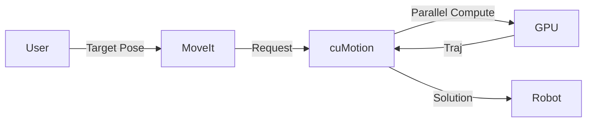

# AI روبوٹ دماغ (NVIDIA Isaac)

## تعارف

جبکہ گیزبو عمومی مقصد کے سمئولیشن میں بہترین ہے، **NVIDIA Isaac** کو خاص طور پر پیمانے پر AI سے چلنے والی روبوٹکس کے لیے بنایا گیا ہے۔ یہ تصویروں کی حقیقت پسندانہ رینڈرنگ (Ray Tracing) اور بڑے پیمانے پر متوازی فزکس سمولیشن فراہم کرنے کے لیے NVIDIA GPUs کی طاقت کا فائدہ اٹھاتا ہے۔

لیکن یہ صرف ایک سمیلیٹر نہیں ہے۔ **Isaac پلیٹ فارم** میں **Isaac ROS** شامل ہے—ہارڈویئر ایکسلریٹڈ پیکجز کا ایک سوٹ جو آپ کے روبوٹ کے NVIDIA Jetson کمپیوٹر پر چلتا ہے، جو اسے بنیادی طور پر "پہیوں پر ایک سپر کمپیوٹر" بنا دیتا ہے۔

## سیکھنے کے مقاصد

اس ماڈیول کے اختتام تک، آپ اس قابل ہو جائیں گے کہ:
- **سمجھیں** Isaac ماحولیاتی نظام (Sim بمقابلہ ROS)۔
- **تخلیق کریں** مصنوعی ڈیٹا (Synthetic Data) دستی لیبلنگ کے بغیر AI ماڈلز کو تربیت دینے کے لیے۔
- **تعینات کریں** GPU-accelerated پرسیپشن پائپ لائنز (VSLAM، آبجیکٹ ڈیٹیکشن)۔
- **استعمال کریں** **cuMotion** کے ساتھ جدید موشن پلاننگ۔

## دی Isaac ماحولیاتی نظام

پلیٹ فارم دو اہم ستونوں پر مشتمل ہے:


1.  **Isaac Sim**: NVIDIA Omniverse پر بنایا گیا۔ استعمال کیا جاتا ہے:
    -   **ڈیجیٹل ٹوئنز**: فوٹو ریئلسٹک دنیا۔
    -   **مصنوعی ڈیٹا جنریشن**: AI ماڈلز کی تربیت۔
    -   **Reinforcement Learning**: روبوٹس کو سم (sim) میں چلنے/پکڑنے کی تربیت دینا۔
2.  **Isaac SDK / Isaac ROS**: ہارڈ ویئر ایکسلریٹڈ ROS 2 پیکجز۔ استعمال کیا جاتا ہے:
    -   **ادراک (Perception)**: VSLAM، گہرائی کا اندازہ، آبجیکٹ کا پتہ لگانا۔
    -   **نیویگیشن**: تیز رفتار راستے کی منصوبہ بندی۔

## Isaac Sim اور مصنوعی ڈیٹا

کمپیوٹر وژن ماڈلز کی تربیت کے لیے ہزاروں لیبل شدہ تصاویر کی ضرورت ہوتی ہے۔ دستی لیبلنگ سست اور مہنگی ہے۔

**مصنوعی ڈیٹا** اسے حل کرتا ہے۔ Isaac Sim فوری طور پر مکمل طور پر لیبل شدہ ڈیٹا (باؤنڈنگ باکسز، سیگمنٹیشن ماسک، ڈیپتھ) تیار کرتا ہے۔

### ڈومین رینڈمائزیشن (Domain Randomization)
AI کو سمولیشن کو "حفظ" کرنے سے روکنے کے لیے، ہم **ڈومین رینڈمائزیشن** کا استعمال کرتے ہیں:
- روشنی کو بے ترتیب کریں (سورج کی پوزیشن، رنگ)۔
- بناوٹ کو بے ترتیب کریں (دیواریں، فرش)۔
- کیمرے کے شور کو بے ترتیب کریں۔

یہ AI کو مضبوط خصوصیات سیکھنے پر مجبور کرتا ہے جو گندی حقیقی دنیا میں کام کرتی ہیں۔

## Isaac ROS: پرسیپشن پائپ لائن

**Isaac ROS** بھاری کام کو CPU سے GPU (CUDA + TensorRT) میں منتقل کرتا ہے۔


### اہم پیکجز
-   **VSLAM (Visual SLAM)**: سٹیریو کیمروں کا استعمال کرتے ہوئے GPU-accelerated لوکلائزیشن۔
-   **Nvblox**: تصادم سے بچنے کے لیے 3D نقشے بناتا ہے۔
-   **TensorRT Inference**: ڈیپ لرننگ ماڈلز (YOLO, PeopleNet) کو CPU سے 10 گنا تیز چلاتا ہے۔

### کوڈ کی مثال: Jetson کے لیے VSLAM ترتیب دینا

```python title="isaac_vslam_launch.py"
from launch import LaunchDescription
from launch_ros.actions import ComposableNodeContainer
from launch_ros.descriptions import ComposableNode

def generate_launch_description():
    vslam_node = ComposableNode(
        package='isaac_ros_visual_slam',
        plugin='nvidia::isaac_ros::visual_slam::VisualSlamNode',
        name='visual_slam_node',
        parameters=[{
            'enable_rectified_pose': True,
            'enable_imu_fusion': True, # Fuse IMU for better accuracy
            'denoise_input_images': False,
        }],
        remappings=[
            ('stereo_camera/left/image_rect', '/camera/left/image_rect'),
            ('stereo_camera/right/image_rect', '/camera/right/image_rect'),
        ]
    )
    # ... container setup ...
    return LaunchDescription([container])
```

## جدید خصوصیات (Advanced Features)

### TensorRT آپٹیمائزیشن
نیورل نیٹ ورکس اکثر PyTorch یا TensorFlow میں تربیت یافتہ ہوتے ہیں۔ **TensorRT** انہیں NVIDIA ہارڈویئر کے لیے بہتر بناتا ہے:
-   تہوں (layers) کو ملا کر۔
-   درستگی (precision) کو کیلیبریٹ کر کے (FP16 یا INT8)۔
-   مخصوص GPUs کے لیے دانا (kernels) کو ٹیون کر کے۔

### cuMotion: تیز موشن پلاننگ
روایتی منصوبہ ساز (MoveIt/OMPL) CPU پر چلتے ہیں اور پیچیدہ بازوؤں کے لیے سست ہو سکتے ہیں۔ **cuMotion** GPU پر چلتا ہے، متوازی طور پر ہزاروں تصادم کے راستوں کی جانچ پڑتال کرتا ہے۔ یہ ملی سیکنڈ میں 7-DOF بازو کے لیے محفوظ رفتار کی منصوبہ بندی کر سکتا ہے۔



## خود تشخیصی سوالات (Self-Assessment)

1.  **گیزبو پر Isaac Sim کیوں استعمال کریں؟**
    <details>
    <summary>جواب</summary>
    Isaac Sim فوٹو ریئلسٹک رینڈرنگ (بصری تربیت کے لیے اہم) اور GPU ایکسلریٹڈ فزکس (100+ روبوٹس کی تقلید) پیش چلتا ہے۔ گیزبو عمومی، کم مخلصانہ تخروپن کے لیے بہتر ہے۔
    </details>

2.  **"Sim-to-Real" فرق کیا ہے؟**
    <details>
    <summary>جواب</summary>
    سمولیشن اور حقیقت کے درمیان فرق۔ سمولیشن میں تربیت یافتہ ماڈلز حقیقی زندگی میں کامل طبیعیات/روشنی کی وجہ سے ناکام ہو جاتے ہیں۔ ہم اس فرق کو ختم کرنے کے لیے ڈومین رینڈمائزیشن کا استعمال کرتے ہیں۔
    </details>

3.  **روبوٹس کے لیے TensorRT کیوں اہم ہے؟**
    <details>
    <summary>جواب</summary>
    روبوٹس میں محدود کمپیوٹ/بیٹری ہوتی ہے (جیسے جیٹسن نینو)۔ TensorRT تیز چلانے اور کم طاقت استعمال کرنے کے لیے AI ماڈلز کو بہتر بناتا ہے، جو ریئل ٹائم ادراک کو ممکن بناتا ہے۔
    </details>

## خلاصہ

**AI روبوٹ دماغ** اعلی کارکردگی والے کمپیوٹ پر انحصار کرتا ہے:
-   **Isaac Sim** ورچوئل دنیا میں دماغ کو تربیت دیتا ہے۔
-   **Isaac ROS** GPU ایکسلریشن کا استعمال کرتے ہوئے فزیکل روبوٹ پر دماغ چلاتا ہے۔
-   **مصنوعی ڈیٹا** سیکھنے کے لیے ایندھن (لیبل شدہ تصاویر) فراہم کرتا ہے۔
