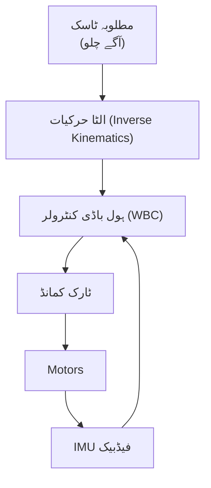

# ہیومنائیڈ روبوٹ ڈویلپمنٹ

## تعارف

ایک ہیومنائیڈ روبوٹ بنانا روبوٹکس کے عظیم چیلنجوں میں سے ایک ہے۔ پہیوں والے روبوٹس کے برعکس، دو پیروں والے (bipeds) فطری طور پر غیر مستحکم ہوتے ہیں۔ انہیں سیدھے رہنے کے لیے کشش ثقل سے مسلسل لڑنا پڑتا ہے۔

اس سبق میں، ہم **Unitree G1** پر توجہ مرکوز کریں گے، جو ایک جدید ہیومنائیڈ تحقیقی پلیٹ فارم ہے، اور اس سافٹ ویئر اسٹیک پر جو اسے چلنے، متوازن رہنے اور تعامل کرنے کے لیے درکار ہے۔

## سیکھنے کے مقاصد

اس سبق کے اختتام تک، آپ اس قابل ہو جائیں گے کہ:
- **سمجھیں** ہیومنائیڈ فن تعمیرات (23+ DoF)۔
- **لاگو کریں** توازن کے لیے ہول باڈی کنٹرول (WBC)۔
- **تخلیق کریں** مستحکم چلنے کے انداز (gaits)۔
- **ترتیب دیں** حقیقی دنیا کی جانچ کے لیے حفاظتی نظام۔

## Unitree G1 پلیٹ فارم کا جائزہ

Unitree G1 ایک قابل ہیومنائیڈ پلیٹ فارم ہے جس کی تفصیلات درج ذیل ہیں:

- **اونچائی**: 130 سینٹی میٹر
- **DoF**: 23-43 (قابل ترتیب)
- **کمپیوٹ**: NVIDIA Jetson Orin (Perception) + Real-time Microcontrollers (Control)
- **سینسرز**: 3D LIDAR, Depth Cameras, IMU, Force Sensors.

### سافٹ ویئر اسٹیک

کنٹرول اسٹیک کی تہیں ہیں:

1.  **ہائی لیول**: ROS 2 (Navigation, VLA) جیٹسن پر چل رہا ہے۔
2.  **مڈ لیول**: ہول باڈی کنٹرولر (چلنا، توازن) ریئل ٹائم پی سی پر چل رہا ہے۔
3.  **لو لیول**: MCUs پر چلنے والی موٹر برجنگ (ٹارک کنٹرول)۔

## دو پیروں والی حرکت (Bipedal Locomotion)

چلنا بنیادی طور پر "کنٹرولڈ گرنا (controlled falling)" ہے۔ ہم استحکام برقرار رکھنے کے لیے **زیرو مومنٹ پوائنٹ (ZMP)** تصور کا استعمال کرتے ہیں۔


### کنٹرول لوپ آرکیٹیکچر



### کوڈ کی مثال: بیلنس کنٹرولر

ایک سادہ PID کنٹرولر مکمل ہیومنائیڈ کے لیے کافی نہیں ہے، لیکن یہ پچ (pitch) کی غلطیوں کو درست کرنے کے تصور کی وضاحت کرتا ہے۔

```python title="balance_controller.py"
import rclpy
from rclpy.node import Node
from sensor_msgs.msg import Imu
from std_msgs.msg import Float64MultiArray
import numpy as np

class BalanceController(Node):
    def __init__(self):
        super().__init__('balance_controller')
        self.imu_sub = self.create_subscription(Imu, '/imu/data', self.imu_cb, 10)
        self.cmd_pub = self.create_publisher(Float64MultiArray, '/joint_commands', 10)
        
        self.kp = 50.0  # Proportional Limit
        self.kd = 10.0  # Damping
        self.target_pitch = 0.0

    def imu_cb(self, msg):
        # Extract pitch (simplified)
        current_pitch = 2 * np.arcsin(msg.orientation.y)
        pitch_rate = msg.angular_velocity.y

        # PD Control
        error = self.target_pitch - current_pitch
        torque = (self.kp * error) + (self.kd * (-pitch_rate))
        
        # Publish torque to ankles
        self.publish_torque(torque)

    def publish_torque(self, torque):
        msg = Float64MultiArray()
        msg.data = [0.0] * 23 # Initialize all joints
        msg.data[12] = torque # Left Ankle
        msg.data[18] = torque # Right Ankle
        self.cmd_pub.publish(msg)
```

## حفاظتی نظام (Safety Systems)

حقیقی روبوٹ خطرناک ہوتے ہیں۔ آپ کو حفاظت کی تہوں کی ضرورت ہے:

1.  **گرنے کا پتہ لگانا**: اگر پچ > 30 ڈگری ہو، تو موٹروں کو فوراً بند کر دیں۔
2.  **خود سے تصادم**: یہ چیک کرنے کے لیے URDF کا استعمال کریں کہ آیا بازو ٹانگوں سے ٹکرائیں گے۔
3.  **ایمرجنسی اسٹاپ**: فزیکل بٹن اور سافٹ ویئر سروس۔

:::warning پہلے حفاظت
ہیومنائیڈ روبوٹ بھاری ہوتے ہیں اور غیر متوقع طور پر گر سکتے ہیں۔ اصلی ہارڈویئر پر بیلنس الگورتھم کی جانچ کرتے وقت ہمیشہ گینٹری یا حفاظتی ہارنس کا استعمال کریں۔
:::

## خلاصہ

ہیومنائیڈ ڈویلپمنٹ اعلی سطح کے AI کو نچلی سطح کی طبیعیات کے ساتھ جوڑتی ہے:
-   **WBC** روبوٹ کو سیدھا رکھتا ہے۔
-   **ZMP** چلنے کے دوران متحرک استحکام کو یقینی بناتا ہے۔
-   **حفاظت** سب سے اہم ہے جب کوڈ 35 کلوگرام دھات سے ملتا ہے۔
