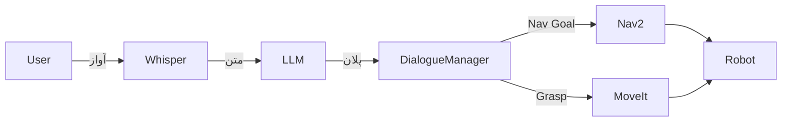

# گفتگو کرنے والی روبوٹکس (VLA)

## تعارف

فزیکل AI کی آخری سرحد **لارج لینگویج ماڈلز (LLMs)** کا روبوٹک کنٹرول کے ساتھ انضمام ہے۔ ہم اسے **وژن-لینگویج-ایکشن (VLA)** کہتے ہیں۔ یہ ہمیں روبوٹس سے سادہ انگریزی (یا اردو) میں بات کرنے کی اجازت دیتا ہے، اور انہیں دنیا کو بصری طور پر سمجھنے اور اس پر عمل کرنے کی اجازت دیتا ہے۔

یہ سبق **کورس کیپ اسٹون پروجیکٹ** کے لیے رہنما کے طور پر بھی کام کرتا ہے: ایک ذہین فیچ (Intelligent Fetch) روبوٹ بنانا۔

## VLA آرکیٹیکچر

ایک VLA سسٹم قدرتی زبان کا روبوٹ ایکشنز میں ترجمہ کرتا ہے (مثلاً، ROS 2 سروس کالز)۔


### بنیادی اجزاء

1.  **کان (Whisper)**: OpenAI کا Whisper ماڈل تقریر کو متن میں تقریباً انسانی درستگی کے ساتھ تبدیل کرتا ہے۔
2.  **آنکھیں (CLIP / GPT-4 Vision)**: بصری منظر کو سمجھتا ہے۔ "کیا یہ سرخ سیب ہے یا گیند؟"
3.  **دماغ (LLM)**: GPT-4 یا مقامی Llama ماڈلز صارف کے ارادے کا تجزیہ کرتے ہیں اور ایک منصوبہ تیار کرتے ہیں۔
4.  **جسم (ROS 2)**: منصوبہ بند اعمال (نیویگیٹ، گرفت) پر عمل کرتا ہے۔

## نفاذ کی تفصیلات (Implementation Details)

### 1. تقریر کی شناخت (Whisper)
روایتی تقریر کی شناخت شور والے ماحول میں ناکام ہو جاتی ہے۔ Whisper مضبوطی سے کام کرتا ہے۔

```python
import whisper
model = whisper.load_model("base")
result = model.transcribe("audio.wav")
print(result["text"])
```

### 2. وژن (CLIP)
**CLIP** متن اور تصاویر کو جوڑتا ہے۔ آپ اس سے تصویر میں "سرخ کپ" تلاش کرنے کے لیے کہہ سکتے ہیں، اور یہ امکانات واپس کرتا ہے۔ یہ **زیرو شاٹ ڈیٹیکشن** کو فعال کرتا ہے۔

## کیپ اسٹون پروجیکٹ: ذہین فیچ روبوٹ

**مقصد**: ایک ایسا روبوٹ بنائیں جو اس حکم کی تعمیل کرے: *"ارے روبوٹ، مجھے کچن سے نیلی بوتل لا دو۔"*

### سسٹم آرکیٹیکچر



### ڈائیلاگ مینیجر نوڈ

یہ ROS 2 نوڈ آرکسٹرا کا موصل ہے۔ یہ متن لیتا ہے، LLM سے پلان (JSON) مانگتا ہے، اور ROS 2 ایکشنز کو متحرک کرتا ہے۔

```python title="dialogue_manager.py"
import rclpy
from rclpy.node import Node
import openai
import json
from std_msgs.msg import String

class DialogueManager(Node):
    def __init__(self):
        super().__init__('dialogue_manager')
        self.speech_sub = self.create_subscription(String, '/speech/text', self.handle_speech, 10)
        
        # System prompt defines the robot's API
        self.system_prompt = """
        You are a robot assistant. Convert commands into JSON.
        Available actions:
        - navigate(location_name)
        - pick_up(object_name)
        Example: {"actions": [{"cmd": "navigate", "arg": "kitchen"}]}
        """

    def handle_speech(self, msg):
        self.get_logger().info(f"User said: {msg.data}")
        
        # Call LLM
        response = openai.ChatCompletion.create(
            model="gpt-4",
            messages=[
                {"role": "system", "content": self.system_prompt},
                {"role": "user", "content": msg.data}
            ]
        )
        
        plan_json = response.choices[0].message.content
        self.execute_plan(json.loads(plan_json))

    def execute_plan(self, plan):
        for action in plan['actions']:
            cmd = action['cmd']
            arg = action['arg']
            self.get_logger().info(f"Executing: {cmd} -> {arg}")
            # Trigger ROS 2 Action Clients here...

def main():
    rclpy.init()
    node = DialogueManager()
    rclpy.spin(node)
    rclpy.shutdown()
```

## کام کا مستقبل

ہم روبوٹس کو "پروگرامنگ" (ہر قدم کی وضاحت کرنے) سے "سکھانے" کی طرف بڑھ رہے ہیں۔ VLA ماڈلز روبوٹس کو مظاہرے اور قدرتی زبان کی ہدایت سے سیکھنے کے قابل بناتے ہیں۔ یہ وہ مہارت کا سیٹ ہے جس میں اب آپ نے مہارت حاصل کر لی ہے۔

## خلاصہ

مبارک ہو! آپ کورس کے اختتام پر پہنچ گئے ہیں۔ اب آپ سمجھتے ہیں:
-   **اعصابی نظام**: ROS 2۔
-   **جسم**: ڈیجیٹل ٹوئنز اور URDF۔
-   **دماغ**: Isaac AI اور ادراک۔
-   **روح**: VLA اور انسانی-روبوٹ تعامل۔

جاؤ اور مستقبل بناؤ۔
